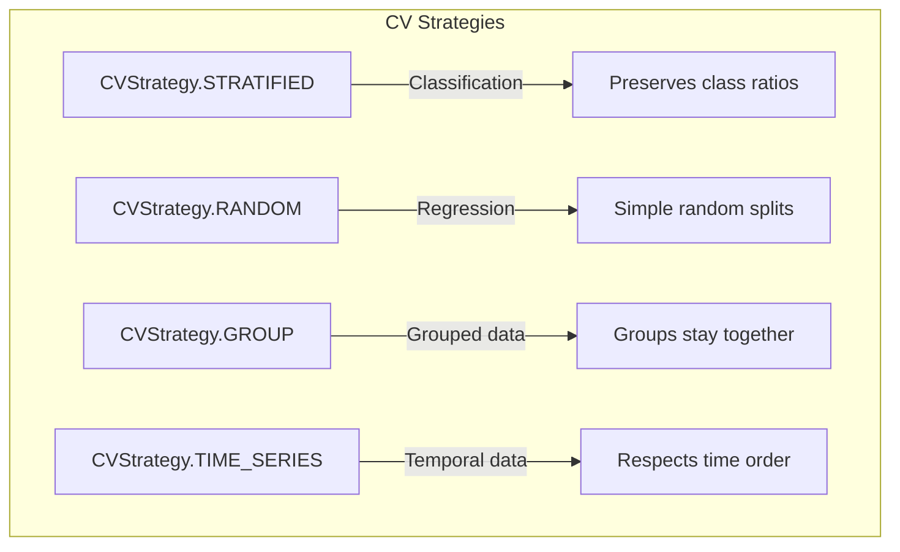
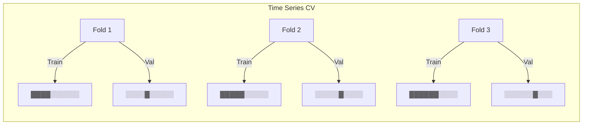
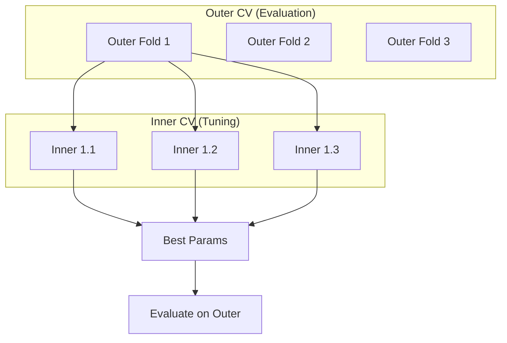

# Cross-Validation

sklearn-meta provides flexible CV strategies that integrate with hyperparameter tuning and model stacking. This page covers strategy selection, configuration, and nested CV.

---

## CV Strategies



### Stratified K-Fold

Preserves class distribution in each fold. **Recommended for classification.**

```python
from sklearn_meta import CVConfig, CVStrategy

cv_config = CVConfig(
    n_splits=5,
    strategy=CVStrategy.STRATIFIED,
    random_state=42,
)
```

**When to use:** Classification problems, especially with imbalanced classes.

### Random K-Fold

Simple random splits without stratification.

```python
cv_config = CVConfig(
    n_splits=5,
    strategy=CVStrategy.RANDOM,
    random_state=42,
)
```

**When to use:** Regression problems.

### Group K-Fold

Ensures samples from the same group stay together (all in train OR all in validation).

```python
cv_config = CVConfig(
    n_splits=5,
    strategy=CVStrategy.GROUP,
    random_state=42,
)

# Pass groups to DataView
data = DataView.from_Xy(X=X, y=y, groups=group_labels)
```

**When to use:** When samples are not independent (e.g., multiple samples per patient, user, or session).

### Time Series Split

Respects temporal ordering -- always train on past, validate on future.

```python
cv_config = CVConfig(
    n_splits=5,
    strategy=CVStrategy.TIME_SERIES,
)
```



**When to use:** Financial data, sensor data, any time-dependent predictions.

---

## Strategy Selection Guide

| Problem Type | Recommended Strategy |
|-------------|---------------------|
| Classification | `STRATIFIED` |
| Classification (imbalanced) | `STRATIFIED` |
| Regression | `RANDOM` |
| Grouped data | `GROUP` |
| Time series | `TIME_SERIES` |

---

## Configuration Options

### Basic Configuration

```python
cv_config = CVConfig(
    n_splits=5,              # Number of folds
    strategy=CVStrategy.STRATIFIED,
    shuffle=True,            # Shuffle before splitting
    random_state=42,         # For reproducibility
)
```

### Repeated CV

Run CV multiple times with different random splits for more stable estimates:

```python
cv_config = CVConfig(
    n_splits=5,
    n_repeats=3,             # 5x3 = 15 total folds
    strategy=CVStrategy.STRATIFIED,
    random_state=42,
)
```

Repeated CV reduces variance from unlucky splits. Recommended for small datasets.

---

## Nested Cross-Validation

Nested CV provides unbiased performance estimates when doing hyperparameter tuning. Without it, evaluation on the same folds used for tuning is optimistically biased.



- **Outer loop:** Splits data into train/test for evaluation
- **Inner loop:** Tunes hyperparameters on train only
- **Result:** Unbiased performance estimate on the outer held-out fold

### Configuration

Use `.with_inner_cv()` to add an inner loop:

```python
from sklearn_meta import CVConfig, CVStrategy

cv_config = CVConfig(
    n_splits=5,
    strategy=CVStrategy.STRATIFIED,
    random_state=42,
).with_inner_cv(n_splits=3, strategy=CVStrategy.STRATIFIED)
```

Or set the `inner_cv` field directly:

```python
inner = CVConfig(n_splits=3, strategy=CVStrategy.STRATIFIED)

outer = CVConfig(
    n_splits=5,
    strategy=CVStrategy.STRATIFIED,
    random_state=42,
    inner_cv=inner,
)
```

With `RunConfigBuilder`:

```python
from sklearn_meta import RunConfigBuilder

config = (
    RunConfigBuilder()
    .cv(
        n_splits=5,
        strategy="stratified",
        random_state=42,
        inner_cv=3,
    )
    .tuning(n_trials=50, metric="roc_auc")
    .build()
)
```

For full control over the inner loop, pass a pre-built `CVConfig` instead of an integer:

```python
config = (
    RunConfigBuilder()
    .cv(
        n_splits=5,
        strategy="stratified",
        random_state=42,
        inner_cv=CVConfig(n_splits=3, strategy=CVStrategy.RANDOM, random_state=99),
    )
    .tuning(n_trials=50, metric="roc_auc")
    .build()
)
```

---

## Data Leakage Prevention

sklearn-meta enforces several guarantees to prevent data leakage:

- **OOF predictions:** Each sample's out-of-fold prediction comes from a model that did not train on it. See [Stacking](stacking.md) for details on how OOF predictions are used.
- **Nested CV separation:** Inner CV folds never include outer validation samples.
- **Group integrity:** Group CV ensures all samples from a group are either entirely in train or entirely in validation -- never split across both.

---

## Best Practices

1. **Set `random_state`** for reproducibility.
2. **Use at least 5 folds.** For small datasets, use 10 folds or repeated CV.
3. **Use nested CV for final reported results.** Simple CV is fine during development.
4. **Match strategy to the problem** using the selection guide above.

---

## Next Steps

- [Stacking](stacking.md) -- Out-of-fold predictions and stacking ensembles
- [Tuning](tuning.md) -- Hyperparameter optimization settings
- [Search Spaces](search-spaces.md) -- Advanced parameter definitions
- [API Reference](api-reference.md) -- `CVConfig`, `CVEngine`, and other low-level details
