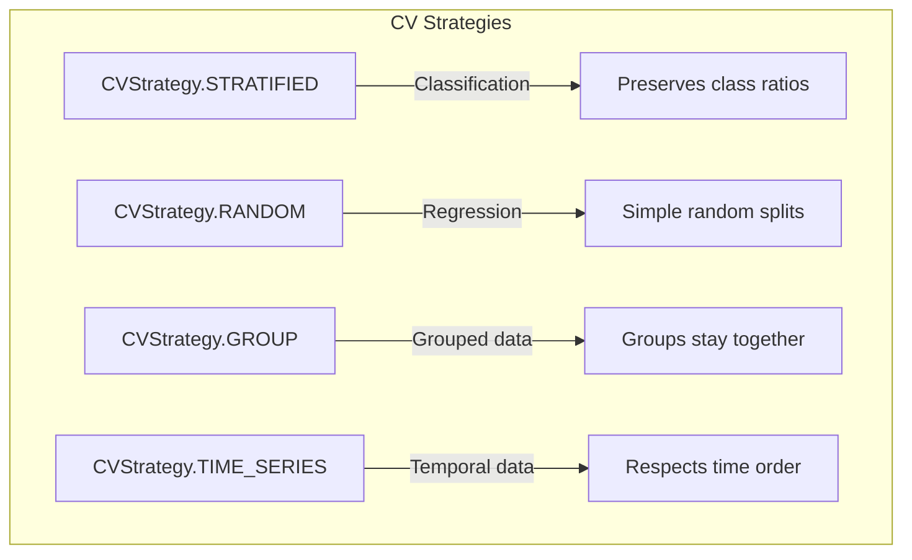
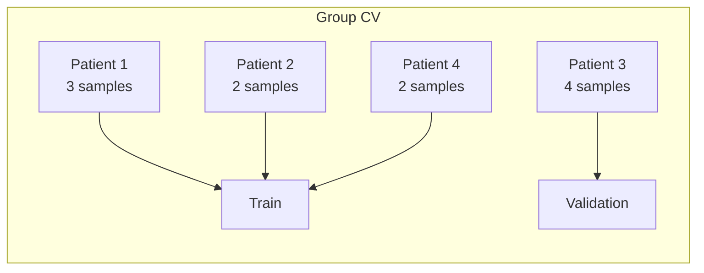
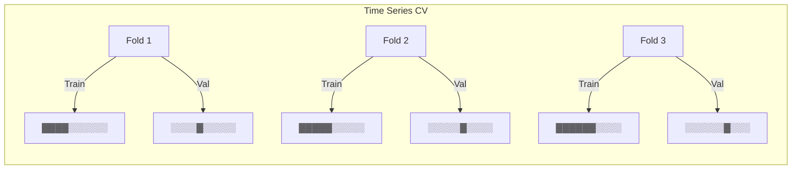
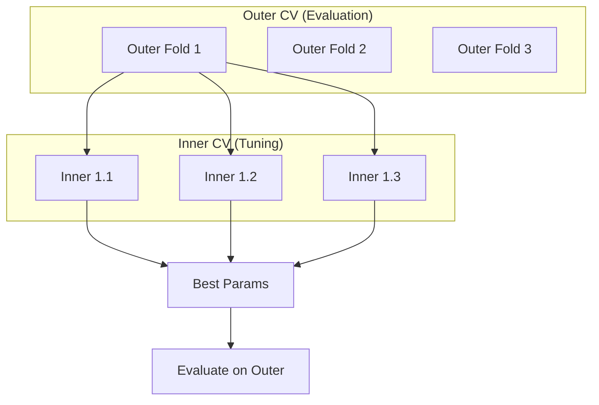
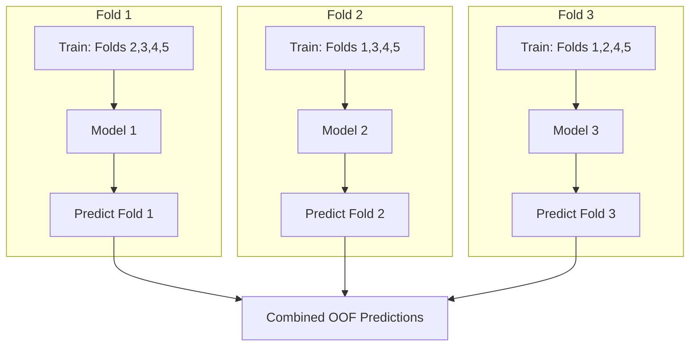
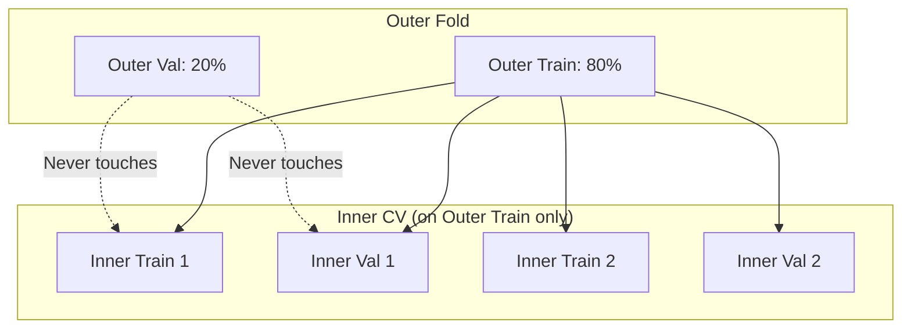

# Cross-Validation

Cross-validation is essential for reliable model evaluation and preventing overfitting. sklearn-meta provides flexible CV strategies that integrate seamlessly with hyperparameter tuning and model stacking.

---

## CV Strategies



### Stratified K-Fold

Preserves class distribution in each fold. **Recommended for classification.**

```python
from sklearn_meta import CVConfig, CVStrategy

cv_config = CVConfig(
    n_splits=5,
    strategy=CVStrategy.STRATIFIED,
    random_state=42,
)
```

**When to use:** Classification problems, especially with imbalanced classes.

### Random K-Fold

Simple random splits without stratification.

```python
cv_config = CVConfig(
    n_splits=5,
    strategy=CVStrategy.RANDOM,
    random_state=42,
)
```

**When to use:** Regression problems.

### Group K-Fold

Ensures samples from the same group stay together (all in train OR all in validation).

```python
cv_config = CVConfig(
    n_splits=5,
    strategy=CVStrategy.GROUP,
    random_state=42,
)

# Pass groups to DataView
data = DataView.from_Xy(X=X, y=y, groups=group_labels)
```

**When to use:** When samples are not independent (e.g., multiple samples per patient, user, or session).



### Time Series Split

Respects temporal ordering -- always train on past, validate on future.

```python
cv_config = CVConfig(
    n_splits=5,
    strategy=CVStrategy.TIME_SERIES,
)
```



**When to use:** Financial data, sensor data, any time-dependent predictions.

---

## Configuration Options

### Basic Configuration

```python
cv_config = CVConfig(
    n_splits=5,              # Number of folds
    strategy=CVStrategy.STRATIFIED,
    shuffle=True,            # Shuffle before splitting
    random_state=42,         # For reproducibility
)
```

### Repeated CV

Run CV multiple times with different random splits:

```python
cv_config = CVConfig(
    n_splits=5,
    n_repeats=3,             # 5x3 = 15 total folds
    strategy=CVStrategy.STRATIFIED,
    random_state=42,
)
```

**Benefits:**
- More stable performance estimates
- Better for small datasets
- Reduces variance from unlucky splits

---

## Nested Cross-Validation

Nested CV provides unbiased performance estimates when doing hyperparameter tuning.



### Why Nested CV?

Without nested CV:
1. Tune hyperparameters using CV
2. Evaluate on same CV folds
3. **Problem:** Evaluation is optimistically biased!

With nested CV:
1. **Outer loop:** Splits data into train/test
2. **Inner loop:** Tunes hyperparameters on train only
3. **Evaluation:** Test on held-out outer fold
4. **Result:** Unbiased performance estimate

### Configuration

Nested CV is configured using the `inner_cv` field on `CVConfig` or the `.with_inner_cv()` convenience method. There is no separate `NestedCVConfig` class.

**Using `.with_inner_cv()` (recommended):**

```python
from sklearn_meta import CVConfig, CVStrategy

# Outer CV for evaluation, with nested inner CV for tuning
cv_config = CVConfig(
    n_splits=5,
    strategy=CVStrategy.STRATIFIED,
    random_state=42,
).with_inner_cv(n_splits=3, strategy=CVStrategy.STRATIFIED)
```

**Using the `inner_cv` field directly:**

```python
inner = CVConfig(
    n_splits=3,
    strategy=CVStrategy.STRATIFIED,
)

outer = CVConfig(
    n_splits=5,
    strategy=CVStrategy.STRATIFIED,
    random_state=42,
    inner_cv=inner,
)
```

**Using RunConfig:**

```python
from sklearn_meta import RunConfig, CVConfig, CVStrategy, TuningConfig

config = RunConfig(
    cv=CVConfig(
        n_splits=5,
        strategy=CVStrategy.STRATIFIED,
        random_state=42,
    ).with_inner_cv(n_splits=3),
    tuning=TuningConfig(n_trials=50, metric="roc_auc"),
)
```

---

## Out-of-Fold Predictions

OOF predictions are crucial for model stacking -- they provide predictions for training data without data leakage.



### How OOF Works

1. For each fold, train model on other folds
2. Predict on the held-out fold
3. Combine predictions to get OOF for all training samples
4. Each sample's OOF prediction comes from a model that never saw it

### OOF for Stacking

**Using GraphBuilder (recommended):**

```python
from sklearn_meta import GraphBuilder, RunConfigBuilder

graph = (
    GraphBuilder("stacking")
    .add_model("base", RandomForestClassifier)
    .int_param("n_estimators", 50, 200)
    .add_model("meta", LogisticRegression)
    .stacks("base")
    .compile()
)

config = (
    RunConfigBuilder()
    .cv(n_splits=5, strategy="stratified")
    .tuning(n_trials=50, metric="roc_auc")
    .build()
)
# CVEngine routes OOF predictions automatically during fit
```

**Using low-level API:**

```python
from sklearn_meta import DependencyEdge, DependencyType

# Base model produces OOF predictions
# Meta-learner trains on OOF predictions (no leakage!)
graph.add_edge(
    DependencyEdge(source="base", target="meta", dep_type=DependencyType.PREDICTION)
)
# CVEngine routes OOF predictions automatically during fit
```

### Accessing OOF Predictions

```python
from sklearn_meta.engine.cv import CVEngine

cv_engine = CVEngine(cv_config)
folds = cv_engine.create_folds(data)

# After fitting all folds, route OOF predictions
oof_predictions = cv_engine.route_oof_predictions(data, fold_results)
```

---

## CVEngine

The `CVEngine` coordinates CV operations:

```python
from sklearn_meta.engine.cv import CVEngine

cv_engine = CVEngine(cv_config)

# Create CV folds
folds = cv_engine.create_folds(data)

# Each fold contains train/validation indices
for fold in folds:
    train_idx = fold.train_indices
    val_idx = fold.val_indices

    # Get train/val DataView slices for this fold
    train_view, val_view = cv_engine.split_for_fold(data, fold)
```

### Splitting Data for Folds

`split_for_fold` returns a tuple of `(train_view, val_view)`:

```python
# Get both train and validation DataViews for a specific fold
train_view, val_view = cv_engine.split_for_fold(data, fold)
```

### Aggregating CV Results

```python
result = cv_engine.aggregate_cv_result(node_name="rf", fold_results=fold_results, data=data)
```

---

## Data Leakage Prevention

sklearn-meta prevents common data leakage scenarios:

### 1. OOF Predictions

Each sample's OOF prediction comes from a model that didn't train on it.

```python
# Guaranteed: sample i was NOT in training for its OOF prediction
```

### 2. Nested CV Separation

Inner CV folds never include outer validation samples.



### 3. Group Integrity

Group CV ensures related samples stay together:

```python
# All samples from group_id=5 are either ALL in train or ALL in validation
# Never split across train/validation
```

---

## Best Practices

### 1. Match Strategy to Problem

| Problem Type | Recommended Strategy |
|-------------|---------------------|
| Classification | `STRATIFIED` |
| Classification (imbalanced) | `STRATIFIED` |
| Regression | `RANDOM` |
| Grouped data | `GROUP` |
| Time series | `TIME_SERIES` |

### 2. Use Enough Folds

```python
# Minimum: 3 folds
# Recommended: 5 folds
# Small datasets: 10 folds or leave-one-out
```

### 3. Use Nested CV for Final Evaluation

```python
# During development: simple CV is fine
# For final reported results: nested CV
```

### 4. Set Random State

```python
cv_config = CVConfig(
    n_splits=5,
    strategy=CVStrategy.STRATIFIED,
    random_state=42,  # Always set for reproducibility
)
```

### 5. Consider Repeated CV for Small Datasets

```python
# More stable estimates
cv_config = CVConfig(
    n_splits=5,
    n_repeats=3,
    strategy=CVStrategy.STRATIFIED,
)
```

---

## Complete Example

### Using GraphBuilder (Recommended)

```python
from sklearn.datasets import make_classification
from sklearn.ensemble import RandomForestClassifier
import pandas as pd

from sklearn_meta import (
    GraphBuilder, RunConfigBuilder, DataView, fit,
)

# Generate data
X, y = make_classification(n_samples=1000, n_features=20, random_state=42)
X = pd.DataFrame(X)
y = pd.Series(y)

# Build the graph spec
graph = (
    GraphBuilder("quick_start")
    .add_model("rf", RandomForestClassifier)
    .int_param("n_estimators", 50, 200)
    .compile()
)

# Configure the run
config = (
    RunConfigBuilder()
    .cv(n_splits=5, strategy="stratified", random_state=42)
    .tuning(n_trials=20, metric="roc_auc")
    .build()
)

# Fit
data = DataView.from_Xy(X, y)
result = fit(graph, data, config)
```

### Using Low-Level API

```python
from sklearn.datasets import make_classification
from sklearn.ensemble import RandomForestClassifier
import pandas as pd

from sklearn_meta import (
    NodeSpec, GraphSpec, DataView, RunConfig, CVConfig, CVStrategy, TuningConfig,
    GraphRunner, RuntimeServices,
)
from sklearn_meta.search.space import SearchSpace

# Generate data
X, y = make_classification(n_samples=1000, n_features=20, random_state=42)
X = pd.DataFrame(X)
y = pd.Series(y)

# Define CV strategy
cv_config = CVConfig(
    n_splits=5,
    strategy=CVStrategy.STRATIFIED,
    random_state=42,
)

# Create model
space = SearchSpace()
space.add_int("n_estimators", 50, 200)
node = NodeSpec(
    name="rf",
    estimator_class=RandomForestClassifier,
    search_space=space,
    fixed_params={"random_state": 42},
)
graph = GraphSpec()
graph.add_node(node)

# Configure run
config = RunConfig(
    cv=cv_config,
    tuning=TuningConfig(
        n_trials=20,
        metric="roc_auc",
        greater_is_better=True,
    ),
)

# Run
data = DataView.from_Xy(X=X, y=y)
services = RuntimeServices.default()
runner = GraphRunner(services)
result = runner.fit(graph, data, config)
```

---

## Next Steps

- [Stacking](stacking.md) -- How OOF predictions enable stacking
- [Tuning](tuning.md) -- CV in hyperparameter optimization
- [Model Graphs](model-graphs.md) -- Building multi-model pipelines
