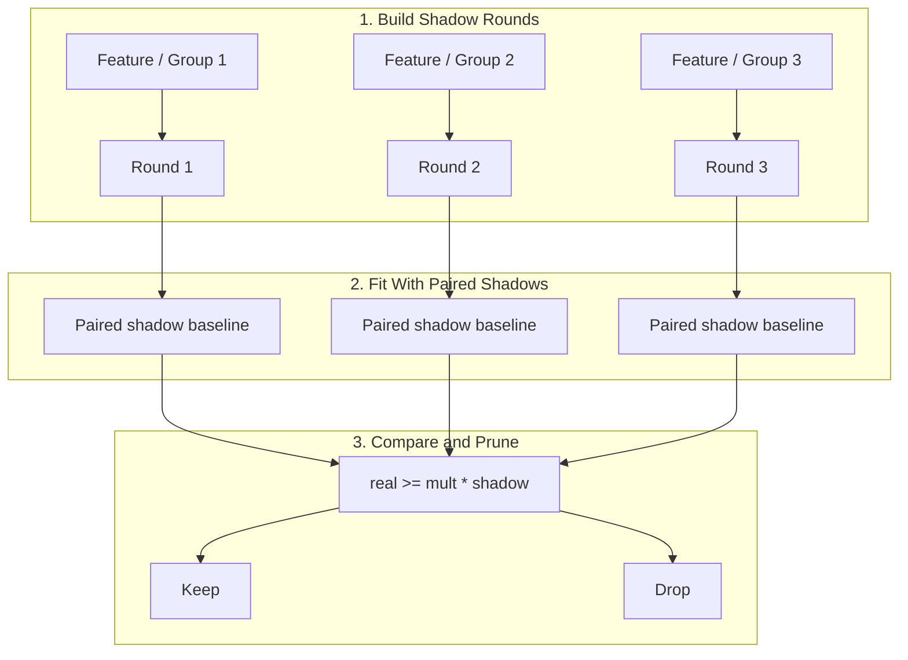
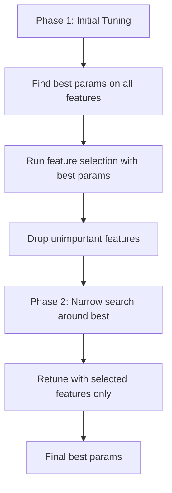
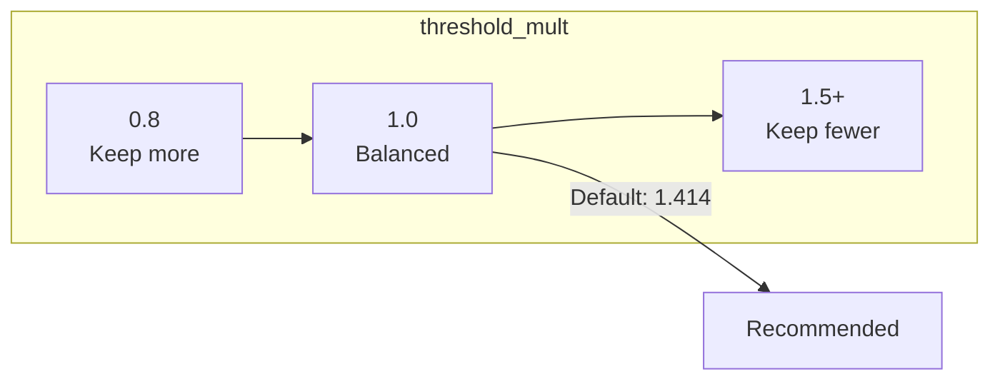

# Feature Selection

sklearn-meta provides automated feature selection using shadow features, permutation importance, and importance thresholds. The shadow feature method is a statistically robust approach that identifies genuinely important features while controlling for random chance.

---

## Quick Start

In v2, the graph structure is defined separately from the runtime configuration. Feature selection is configured via `FeatureSelectionConfig` inside `RunConfig`, rather than a `.with_feature_selection()` builder method.

```python
from sklearn_meta import GraphBuilder, GraphRunner, DataView, RunConfig, FeatureSelectionConfig
from sklearn_meta.runtime.config import CVConfig, TuningConfig
from sklearn.ensemble import RandomForestClassifier
import pandas as pd

# 1. Prepare data
data = DataView.from_Xy(X=pd.DataFrame(X), y=pd.Series(y))

# 2. Build graph spec (structure only)
graph = (
    GraphBuilder("my_pipeline")
    .add_model("rf", RandomForestClassifier)
        .int_param("n_estimators", 50, 500)
        .int_param("max_depth", 3, 20)
    .compile()
)

# 3. Configure the run with feature selection
config = RunConfig(
    cv=CVConfig(n_splits=5),
    tuning=TuningConfig(n_trials=50, metric="roc_auc", greater_is_better=True),
    feature_selection=FeatureSelectionConfig(
        method="shadow",
        n_shadows=5,
        threshold_mult=1.414,
        retune_after_pruning=True,
        feature_groups={
            "gender_ohe": ["gender_f", "gender_m"],
            "state_ohe": ["state_ca", "state_ny", "state_tx"],
        },
    ),
)

# 4. Run
run = GraphRunner.from_config(config).fit(graph, data, config)

# 5. Access selected features from NodeRunResult
node_result = run.node_results["rf"]
print(f"Selected features: {node_result.selected_features}")
```

---

## Selection Methods

### Shadow Features (default)

Shadow selection uses paired synthetic noise baselines. Across `n_shadows`
rounds, each real feature (or explicit feature group) is compared against a
paired shadow baseline. If the real signal cannot beat its paired shadow, it is
unlikely to generalize.

```python
FeatureSelectionConfig(
    method="shadow",
    n_shadows=5,            # Number of shadow rounds
    threshold_mult=1.414,   # Feature must beat threshold_mult * its shadow's importance
)
```


```mermaid
graph TB
    subgraph "1. Build Shadow Rounds"
        F1[Feature / Group 1] --> R1[Round 1]
        F2[Feature / Group 2] --> R2[Round 2]
        F3[Feature / Group 3] --> R3[Round 3]
    end

    subgraph "2. Fit With Paired Shadows"
        R1 --> S1[Paired shadow baseline]
        R2 --> S2[Paired shadow baseline]
        R3 --> S3[Paired shadow baseline]
    end

    subgraph "3. Compare and Prune"
        S1 --> C[real >= mult * shadow]
        S2 --> C
        S3 --> C
        C --> K[Keep]
        C --> D[Drop]
    end
```

### Permutation Importance

Measures feature importance by shuffling each feature and observing the drop in model performance. Features whose permutation has little effect on score are dropped.

```python
FeatureSelectionConfig(
    method="permutation",
    threshold_mult=1.414,
)
```

Features below `threshold_percentile` (default 10th percentile) of the permutation importance distribution are dropped.

### Importance Threshold

A simpler method that fits the model once and drops features below a percentile threshold of the model's native feature importances (e.g., `feature_importances_` for tree models).

```python
FeatureSelectionConfig(
    method="threshold",
    threshold_mult=1.414,
)
```

---

## Feature Groups

Use `feature_groups` when multiple columns should be treated as one logical feature (for example, one-hot encoded categories, target-encoded variants, or related interaction bundles).

```python
FeatureSelectionConfig(
    method="threshold",
    threshold_percentile=20,
    feature_groups={
        "city_ohe": ["city_sf", "city_ny", "city_la"],
        "device_ohe": ["device_mobile", "device_desktop"],
    },
)
```

With groups enabled:

- Importances are averaged within each group.
- Selection thresholds are applied at group level.
- Groups are added or removed atomically (never partially selected).
- `min_features` and `max_features` constraints still apply, but groups are never split.

---

## How Shadow Features Work

### Step 1: Build Round Plan

`n_shadows` controls the number of rounds. Each round shadows approximately
`1 / n_shadows` of active candidates so every candidate gets repeated paired
comparisons without exploding feature count.

### Step 2: Generate Paired Shadows

For a selected candidate in a round, sklearn-meta samples latent correlated
noise and then rank-maps it to the candidate's empirical distribution. This
keeps the shadow baseline realistic for that candidate.

### Step 3: Fit on Augmented Data Per Round

Each round fits the model on:

```python
X_augmented = [original_features | round_shadow_features]
model.fit(X_augmented, y)
```

Real and paired-shadow importances are collected round by round and averaged.

### Step 4: Compare Against Paired Shadow Threshold

```python
threshold = threshold_mult * paired_shadow_importance
keep_if_real_ge_threshold = real_importance >= threshold
```

Candidates that fail this paired baseline are dropped.

### Grouped Cutover Behavior

When explicit `feature_groups` are provided, the shadow selection switches to **grouped cutover mode**, which differs from per-feature shadow selection in important ways:

1. **One shadow per group, not per member.** Each feature group gets a single shadow representative column. This shadow is generated to match the group's aggregate statistical profile rather than any individual member's distribution.

2. **Group importance = mean of member importances.** After fitting the model with shadows, the real importance of a group is computed by averaging the importances of all member features in that group (e.g., if `gender_ohe` has members `gender_f` and `gender_m`, the group importance is `mean(imp_gender_f, imp_gender_m)`).

3. **Threshold comparison uses the group's paired shadow.** The group's averaged real importance is compared against `threshold_mult * shadow_importance` where `shadow_importance` is from the single paired shadow for that group.

4. **Atomic keep/drop.** If the group passes its threshold, all member features are kept. If it fails, all are dropped. Groups are never partially selected.

This approach is more efficient and statistically appropriate for one-hot encoded categoricals, target-encoded variants, and other feature bundles where individual member importances are not meaningful in isolation.

---

## Retune After Pruning

When `retune_after_pruning=True` (the default), sklearn-meta performs a two-phase optimization:


```mermaid
graph TB
    A[Phase 1: Initial Tuning] --> B[Find best params on all features]
    B --> C[Run feature selection with best params]
    C --> D[Drop unimportant features]
    D --> E[Phase 2: Narrow search around best]
    E --> F[Retune with selected features only]
    F --> G[Final best params]
```

### How the narrowed search space works

After feature selection, the search space is narrowed using `SearchSpace.narrow_around()`:

1. **Center on previous best**: The new search space is centered on the best parameters found in Phase 1.
2. **Reduce range by 50%**: Each parameter's range is narrowed by a factor of 0.5 around the best value.
3. **Bias toward less regularization**: Since removing features is itself a form of regularization, the narrowed space is biased (with `regularization_bias=0.25`) toward less regularization to compensate.
4. **Re-optimize**: A fresh round of optimization runs within this narrowed space using only the selected features.

This approach recognizes that the optimal hyperparameters may shift after features are pruned -- typically the model can afford to be slightly less regularized when noise features have been removed.

---

## FeatureSelectionConfig

`FeatureSelectionConfig` lives in `sklearn_meta.runtime.config` and is also re-exported from the top-level `sklearn_meta` package:

```python
from sklearn_meta import FeatureSelectionConfig

# Or equivalently:
from sklearn_meta.runtime.config import FeatureSelectionConfig

config = FeatureSelectionConfig(
    enabled=True,
    method="shadow",           # "shadow", "permutation", or "threshold"
    n_shadows=5,               # Number of shadow rounds
    threshold_mult=1.414,      # Multiplier for paired shadow threshold
    threshold_percentile=10.0, # Percentile cutoff (permutation/threshold methods)
    retune_after_pruning=True, # Re-tune after feature pruning
    min_features=1,            # Minimum features to keep
    max_features=None,         # Maximum features to keep (None = no limit)
    feature_groups={           # Optional grouped feature selection
        "city_ohe": ["city_sf", "city_ny", "city_la"],
    },
    random_state=42,
)
```

| Parameter | Description | Default |
|-----------|-------------|---------|
| `enabled` | Whether feature selection is active | `True` |
| `method` | Selection method: `"shadow"`, `"permutation"`, `"threshold"` | `"shadow"` |
| `n_shadows` | Number of shadow rounds | `5` |
| `threshold_mult` | Multiplier for paired shadow threshold | `1.414` |
| `threshold_percentile` | Percentile cutoff for permutation/threshold methods | `10.0` |
| `retune_after_pruning` | Whether to retune hyperparameters after selection | `True` |
| `min_features` | Minimum number of features to keep | `1` |
| `max_features` | Maximum number of features to keep (`None` = unlimited) | `None` |
| `feature_groups` | Optional `{group_name: [feature, ...]}` map for atomic grouped selection | `None` |
| `random_state` | Random seed for reproducibility | `42` |

Feature selection is passed to `RunConfig` as an optional field:

```python
from sklearn_meta import RunConfig, FeatureSelectionConfig
from sklearn_meta.runtime.config import CVConfig, TuningConfig

run_config = RunConfig(
    cv=CVConfig(n_splits=5),
    tuning=TuningConfig(n_trials=50, metric="roc_auc", greater_is_better=True),
    feature_selection=FeatureSelectionConfig(
        method="shadow",
        n_shadows=5,
        threshold_mult=1.414,
    ),
)
```

### Using RunConfigBuilder

You can also use the fluent `RunConfigBuilder`:

```python
from sklearn_meta.runtime.config import RunConfigBuilder

config = (
    RunConfigBuilder()
    .cv(n_splits=5)
    .tuning(n_trials=50, metric="roc_auc", greater_is_better=True)
    .feature_selection(method="shadow", n_shadows=5, threshold_mult=1.414)
    .build()
)
```

### Tuning the Threshold Multiplier


```mermaid
graph LR
    subgraph "threshold_mult"
        LOW[0.8<br/>Keep more] --> MED[1.0<br/>Balanced] --> HIGH[1.5+<br/>Keep fewer]
    end

    MED --> |Default: 1.414| R[Recommended]
```

---

## Accessing Results

After fitting, the `NodeRunResult` object contains the selected features:

```python
graph = (
    GraphBuilder("pipeline")
    .add_model("xgb", XGBClassifier)
        .param("learning_rate", 0.01, 0.3, log=True)
        .int_param("max_depth", 3, 10)
    .compile()
)

config = RunConfig(
    cv=CVConfig(n_splits=5),
    tuning=TuningConfig(n_trials=50, metric="roc_auc", greater_is_better=True),
    feature_selection=FeatureSelectionConfig(method="shadow"),
)

run = GraphRunner.from_config(config).fit(graph, data, config)

# Access selected features
node_result = run.node_results["xgb"]
selected = node_result.selected_features  # List[str] or None
print(f"Selected {len(selected)} features: {selected}")
```

---

## Advanced: Using FeatureSelector Directly

For programmatic control outside the `GraphBuilder`/`GraphRunner` workflow, you can use the `FeatureSelector` class directly:

```python
from sklearn_meta.runtime.config import FeatureSelectionConfig
from sklearn_meta.selection.selector import FeatureSelector
from sklearn_meta import DataView

config = FeatureSelectionConfig(
    method="shadow",
    n_shadows=5,
    threshold_mult=1.414,
    feature_groups={"city_ohe": ["city_sf", "city_ny", "city_la"]},
)

selector = FeatureSelector(config)

# Select features using raw data
from sklearn.ensemble import RandomForestClassifier

result = selector.select(
    model=RandomForestClassifier(n_estimators=100),
    X=X_train,
    y=y_train,
    feature_cols=list(X_train.columns),
)

# result is a FeatureSelectionResult:
print(result.selected_features)   # List[str] - features to keep
print(result.dropped_features)    # List[str] - features removed
print(result.importances)         # Dict[str, float] - importance scores
print(result.method_used)         # str - which method was used
```

You can also use the engine-level `FeatureSelectionService` which works with `DataView` and `NodeSpec`:

```python
from sklearn_meta.engine.selection import FeatureSelectionService

service = FeatureSelectionService(config)
result, updated_view = service.apply(node_spec, data_view, best_params)
```

---

## Complete Example

```python
from sklearn.datasets import make_classification
from sklearn.ensemble import RandomForestClassifier
import pandas as pd
import numpy as np

from sklearn_meta import (
    GraphBuilder, GraphRunner, DataView, RunConfig, FeatureSelectionConfig,
)
from sklearn_meta.runtime.config import CVConfig, TuningConfig

# Generate data with known informative/noise structure
X, y = make_classification(
    n_samples=1000,
    n_features=50,
    n_informative=10,
    n_redundant=10,
    n_clusters_per_class=2,
    random_state=42,
)

# Add feature names
feature_names = (
    [f"informative_{i}" for i in range(10)]
    + [f"redundant_{i}" for i in range(10)]
    + [f"noise_{i}" for i in range(30)]
)
X = pd.DataFrame(X, columns=feature_names)
y = pd.Series(y)

# Create data view
data = DataView.from_Xy(X=X, y=y)

# Build graph spec
graph = (
    GraphBuilder("feature_selection_demo")
    .add_model("rf", RandomForestClassifier)
        .int_param("n_estimators", 50, 500)
        .int_param("max_depth", 3, 20)
        .int_param("min_samples_split", 2, 20)
    .compile()
)

# Configure the run with feature selection
config = RunConfig(
    cv=CVConfig(n_splits=5),
    tuning=TuningConfig(n_trials=30, metric="roc_auc", greater_is_better=True),
    feature_selection=FeatureSelectionConfig(
        method="shadow",
        n_shadows=5,
        threshold_mult=1.414,
        retune_after_pruning=True,
        min_features=5,
    ),
)

# Execute
run = GraphRunner.from_config(config).fit(graph, data, config)

# Inspect results
node_result = run.node_results["rf"]
selected = node_result.selected_features

print(f"Selected {len(selected)} of {len(feature_names)} features:")

informative_kept = sum(1 for f in selected if "informative" in f)
redundant_kept = sum(1 for f in selected if "redundant" in f)
noise_kept = sum(1 for f in selected if "noise" in f)

print(f"  Informative features kept: {informative_kept}/10")
print(f"  Redundant features kept: {redundant_kept}/10")
print(f"  Noise features kept: {noise_kept}/30")
print(f"  Best params: {node_result.best_params}")
print(f"  Mean CV score: {node_result.mean_score:.4f}")

# Build inference graph for prediction
inference = run.compile_inference()
predictions = inference.predict(X)
```

---

## Best Practices

### 1. Start with Shadow Features

The shadow method is the most statistically principled. It controls for chance importance automatically:

```python
FeatureSelectionConfig(method="shadow", n_shadows=5)
```

### 2. Enable Retune After Pruning

Hyperparameters tuned on all features may not be optimal for the selected subset. Retuning compensates:

```python
FeatureSelectionConfig(retune_after_pruning=True)  # default
```

### 3. Set Feature Constraints for Safety

Prevent over-pruning or under-pruning with min/max bounds:

```python
FeatureSelectionConfig(
    min_features=5,       # Never drop below 5 features
    max_features=30,      # Cap at 30 even if more pass threshold
)
```

### 4. Group Related Columns

For encoded categoricals or engineered bundles, configure `feature_groups` so related columns move together:

```python
FeatureSelectionConfig(
    method="shadow",
    feature_groups={
        "state_ohe": ["state_ca", "state_ny", "state_tx"],
        "device_ohe": ["device_mobile", "device_desktop"],
    },
)
```

### 5. Match Method to Use Case

- **Shadow** (default): Best for tree-based models with native feature importances. Most statistically rigorous.
- **Permutation**: Model-agnostic. Works with any estimator. Better for models without `feature_importances_`.
- **Threshold**: Fastest. Good for quick exploration when you trust the model's native importances.

### 6. Validate Selection

Always compare model performance with and without selection to confirm the pruning helps:

```python
# Without selection
config_all = RunConfig(
    cv=CVConfig(n_splits=5),
    tuning=TuningConfig(n_trials=50, metric="roc_auc", greater_is_better=True),
)

# With selection
config_selected = RunConfig(
    cv=CVConfig(n_splits=5),
    tuning=TuningConfig(n_trials=50, metric="roc_auc", greater_is_better=True),
    feature_selection=FeatureSelectionConfig(method="shadow"),
)

run_all = GraphRunner.from_config(config_all).fit(graph, data, config_all)
run_selected = GraphRunner.from_config(config_selected).fit(graph, data, config_selected)

# Compare CV scores
print(f"Without selection: {run_all.node_results['rf'].mean_score:.4f}")
print(f"With selection:    {run_selected.node_results['rf'].mean_score:.4f}")
```

---

## Next Steps

- [Model Graphs](model-graphs.md) -- Integrate selection into pipelines
- [Tuning](tuning.md) -- Optimization configuration
- [Reparameterization](reparameterization.md) -- Orthogonal hyperparameter search
