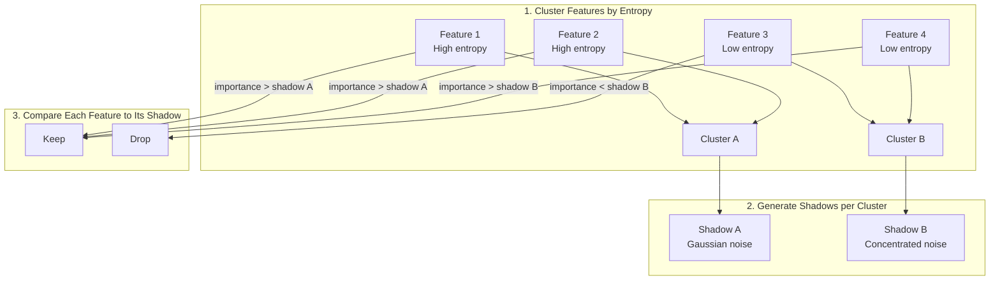

# Feature Selection

sklearn-meta provides automated feature selection using shadow features, permutation importance, and importance thresholds. The shadow feature method is a statistically robust approach that identifies genuinely important features while controlling for random chance.

---

## Quick Start

The recommended way to use feature selection is through the `GraphBuilder` fluent API:

```python
from sklearn_meta.api import GraphBuilder
from sklearn_meta.core.data.context import DataContext
from sklearn.ensemble import RandomForestClassifier
import pandas as pd

# Prepare data
ctx = DataContext.from_Xy(X=pd.DataFrame(X), y=pd.Series(y))

# Build pipeline with feature selection
result = (
    GraphBuilder("my_pipeline")
    .add_model("rf", RandomForestClassifier)
    .with_search_space(
        n_estimators=(50, 500),
        max_depth=(3, 20),
    )
    .with_feature_selection(
        method="shadow",
        n_shadows=5,
        threshold_mult=1.414,
        retune_after_pruning=True,
    )
    .with_tuning(n_trials=50, metric="roc_auc", greater_is_better=True)
    .with_cv(n_splits=5)
    .fit(ctx)
)

# Access selected features from FittedNode
fitted_node = result.fitted_nodes["rf"]
print(f"Selected features: {fitted_node.selected_features}")
```

---

## Selection Methods

### Shadow Features (default)

Shadow features are synthetic noise columns whose information structure (entropy) is matched to the real features. Features are grouped by entropy into clusters, and a fixed number of shadow features are generated per cluster -- not one per real feature. If a real feature can't beat its entropy-matched shadow, it's likely not generalizing.

```python
.with_feature_selection(
    method="shadow",
    n_shadows=5,            # Number of shadow features per entropy cluster
    threshold_mult=1.414,   # Feature must beat threshold_mult * its shadow's importance
)
```



### Permutation Importance

Measures feature importance by shuffling each feature and observing the drop in model performance. Features whose permutation has little effect on score are dropped.

```python
.with_feature_selection(
    method="permutation",
    threshold_mult=1.414,
)
```

Features below `threshold_percentile` (default 10th percentile) of the permutation importance distribution are dropped.

### Importance Threshold

A simpler method that fits the model once and drops features below a percentile threshold of the model's native feature importances (e.g., `feature_importances_` for tree models).

```python
.with_feature_selection(
    method="threshold",
    threshold_mult=1.414,
)
```

---

## How Shadow Features Work

### Step 1: Compute Entropy and Cluster Features

Each feature's entropy is estimated using quantile-based discretization (256 quantiles). Features are then grouped into `n_clusters` clusters using KMeans on their entropy values, so features with similar information structure end up together.

```
Feature entropies:
  feature_A: 5.2  (high entropy)  ─┐
  feature_B: 4.8  (high entropy)  ─┤── Cluster 1
  feature_C: 1.1  (low entropy)   ─┐
  feature_D: 0.9  (low entropy)   ─┤── Cluster 2
```

### Step 2: Generate Shadow Features per Cluster

For each cluster, `n_shadows` synthetic noise features are created with a distribution that matches the cluster's mean entropy:

- **High entropy** (>4): Gaussian noise
- **Medium entropy** (2-4): Exponential noise
- **Low entropy** (<2): Concentrated categorical noise

This is different from Boruta-style approaches that shuffle each real feature. Here, a fixed number of calibrated noise columns are created per entropy group, keeping the augmented dataset compact.

### Step 3: Fit Model on Augmented Data

Train the model on original features + shadow features together:

```python
X_augmented = [original_features | shadow_features]
model.fit(X_augmented, y)
```

### Step 4: Compare Each Feature to Its Matched Shadow

Each real feature is compared against the first shadow in its entropy cluster:

```python
for feature in real_features:
    shadow = feature_to_shadow[feature]  # matched by entropy cluster
    threshold = threshold_mult * shadow_importance[shadow]
    if feature_importance[feature] >= threshold:
        keep(feature)
    else:
        drop(feature)
```

The key insight: random noise with similar entropy provides a calibrated baseline. A feature that can't beat calibrated noise at its own entropy level is likely not contributing real signal.

---

## Entropy Matching

### Why Entropy Matters

Shadow features should have the **same entropy** (information content) as original features. Otherwise, comparison is unfair.


### Entropy Computation

The implementation uses quantile-based entropy estimation with 256 quantile levels:

```python
# Quantile-based entropy estimation
qs = np.linspace(0, 1, 256)
q_values = col.quantile(q=qs)
_, counts = np.unique(q_values, return_counts=True)
p = counts / counts.sum()

# Shannon entropy
entropy = -sum(p * log2(p) for p in probs if p > 0)
```

---

## Retune After Pruning

When `retune_after_pruning=True` (the default), sklearn-meta performs a two-phase optimization:


### How the narrowed search space works

After feature selection, the search space is narrowed using `SearchSpace.narrow_around()`:

1. **Center on previous best**: The new search space is centered on the best parameters found in Phase 1.
2. **Reduce range by 50%**: Each parameter's range is narrowed by a factor of 0.5 around the best value.
3. **Bias toward less regularization**: Since removing features is itself a form of regularization, the narrowed space is biased (with `regularization_bias=0.25`) toward less regularization to compensate.
4. **Re-optimize**: A fresh round of optimization runs within this narrowed space using only the selected features.

This approach recognizes that the optimal hyperparameters may shift after features are pruned -- typically the model can afford to be slightly less regularized when noise features have been removed.

---

## FeatureSelectionConfig

For advanced usage, you can create a `FeatureSelectionConfig` directly:

```python
from sklearn_meta.selection.selector import FeatureSelectionConfig

config = FeatureSelectionConfig(
    enabled=True,
    method="shadow",           # "shadow", "permutation", or "threshold"
    n_shadows=5,               # Number of shadow copies (shadow method)
    threshold_mult=1.414,      # Multiplier for shadow max threshold
    threshold_percentile=10.0, # Percentile cutoff (permutation/threshold methods)
    retune_after_pruning=True, # Re-tune after feature pruning
    min_features=1,            # Minimum features to keep
    max_features=None,         # Maximum features to keep (None = no limit)
    random_state=42,
)
```

| Parameter | Description | Default |
|-----------|-------------|---------|
| `enabled` | Whether feature selection is active | `True` |
| `method` | Selection method: `"shadow"`, `"permutation"`, `"threshold"` | `"shadow"` |
| `n_shadows` | Number of shadow features per real feature | `5` |
| `threshold_mult` | Multiplier for shadow max threshold | `1.414` |
| `threshold_percentile` | Percentile cutoff for permutation/threshold methods | `10.0` |
| `retune_after_pruning` | Whether to retune hyperparameters after selection | `True` |
| `min_features` | Minimum number of features to keep | `1` |
| `max_features` | Maximum number of features to keep (`None` = unlimited) | `None` |
| `random_state` | Random seed for reproducibility | `42` |

### Tuning the Threshold Multiplier


---

## Accessing Results

After fitting, the `FittedNode` object contains the selected features:

```python
result = (
    GraphBuilder("pipeline")
    .add_model("xgb", XGBClassifier)
    .with_search_space(...)
    .with_feature_selection(method="shadow")
    .with_tuning(n_trials=50, metric="roc_auc", greater_is_better=True)
    .with_cv(n_splits=5)
    .fit(ctx)
)

# Access selected features
fitted_node = result.fitted_nodes["xgb"]
selected = fitted_node.selected_features  # List[str] or None
print(f"Selected {len(selected)} features: {selected}")
```

---

## Advanced: Using FeatureSelector Directly

For programmatic control outside the `GraphBuilder`, you can use the `FeatureSelector` class directly:

```python
from sklearn_meta.selection.selector import FeatureSelector, FeatureSelectionConfig
from sklearn_meta.core.data.context import DataContext

config = FeatureSelectionConfig(
    method="shadow",
    n_shadows=5,
    threshold_mult=1.414,
)

selector = FeatureSelector(config)

# Select features for a model node
result = selector.select_for_node(node, ctx, best_params)

# result is a FeatureSelectionResult:
print(result.selected_features)   # List[str] - features to keep
print(result.dropped_features)    # List[str] - features removed
print(result.importances)         # Dict[str, float] - importance scores
print(result.method_used)         # str - which method was used
```

You can also call `select()` directly with raw data:

```python
from sklearn.ensemble import RandomForestClassifier

result = selector.select(
    model=RandomForestClassifier(n_estimators=100),
    X=X_train,
    y=y_train,
    feature_cols=list(X_train.columns),
)
```

---

## Complete Example

```python
from sklearn.datasets import make_classification
from sklearn.ensemble import RandomForestClassifier
import pandas as pd
import numpy as np

from sklearn_meta.api import GraphBuilder
from sklearn_meta.core.data.context import DataContext

# Generate data with known informative/noise structure
X, y = make_classification(
    n_samples=1000,
    n_features=50,
    n_informative=10,
    n_redundant=10,
    n_clusters_per_class=2,
    random_state=42,
)

# Add feature names
feature_names = (
    [f"informative_{i}" for i in range(10)]
    + [f"redundant_{i}" for i in range(10)]
    + [f"noise_{i}" for i in range(30)]
)
X = pd.DataFrame(X, columns=feature_names)
y = pd.Series(y)

# Create data context
ctx = DataContext.from_Xy(X=X, y=y)

# Build and fit with feature selection
result = (
    GraphBuilder("feature_selection_demo")
    .add_model("rf", RandomForestClassifier)
    .with_search_space(
        n_estimators=(50, 500),
        max_depth=(3, 20),
        min_samples_split=(2, 20),
    )
    .with_feature_selection(
        method="shadow",
        n_shadows=5,
        threshold_mult=1.414,
        retune_after_pruning=True,
        min_features=5,
    )
    .with_tuning(n_trials=30, metric="roc_auc", greater_is_better=True)
    .with_cv(n_splits=5)
    .fit(ctx)
)

# Inspect results
fitted = result.fitted_nodes["rf"]
selected = fitted.selected_features

print(f"Selected {len(selected)} of {len(feature_names)} features:")

informative_kept = sum(1 for f in selected if "informative" in f)
redundant_kept = sum(1 for f in selected if "redundant" in f)
noise_kept = sum(1 for f in selected if "noise" in f)

print(f"  Informative features kept: {informative_kept}/10")
print(f"  Redundant features kept: {redundant_kept}/10")
print(f"  Noise features kept: {noise_kept}/30")
print(f"  Best params: {fitted.best_params}")
```

---

## Best Practices

### 1. Start with Shadow Features

The shadow method is the most statistically principled. It controls for chance importance automatically:

```python
.with_feature_selection(method="shadow", n_shadows=5)
```

### 2. Enable Retune After Pruning

Hyperparameters tuned on all features may not be optimal for the selected subset. Retuning compensates:

```python
.with_feature_selection(retune_after_pruning=True)  # default
```

### 3. Set Feature Constraints for Safety

Prevent over-pruning or under-pruning with min/max bounds:

```python
.with_feature_selection(
    min_features=5,       # Never drop below 5 features
    max_features=30,      # Cap at 30 even if more pass threshold
)
```

### 4. Match Method to Use Case

- **Shadow** (default): Best for tree-based models with native feature importances. Most statistically rigorous.
- **Permutation**: Model-agnostic. Works with any estimator. Better for models without `feature_importances_`.
- **Threshold**: Fastest. Good for quick exploration when you trust the model's native importances.

### 5. Validate Selection

Always compare model performance with and without selection to confirm the pruning helps:

```python
# Without selection
result_all = builder.fit(ctx)

# With selection
result_selected = builder.with_feature_selection(method="shadow").fit(ctx)

# Compare CV scores
```

---

## Next Steps

- [Model Graphs](model-graphs.md) -- Integrate selection into pipelines
- [Tuning](tuning.md) -- Optimization configuration
- [Reparameterization](reparameterization.md) -- Orthogonal hyperparameter search
