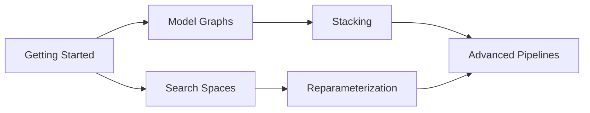

# Getting Started

Get up and running with sklearn-meta in minutes.

---

## Installation

### Basic Installation

```bash
pip install -e .
```

### With Optional Dependencies

```bash
# XGBoost support
pip install xgboost

# On macOS, XGBoost requires OpenMP
brew install libomp

# LightGBM support
pip install lightgbm

# CatBoost support
pip install catboost

# All optional dependencies
pip install xgboost lightgbm catboost
```

---

## Your First Pipeline

Let's build a simple hyperparameter-tuned classifier.

---

### Using the Fluent API (Recommended)

The `GraphBuilder` fluent API is the easiest way to use sklearn-meta. You only need three steps: add models, configure tuning, and fit.

#### Step 1: Prepare Your Data

```python
import pandas as pd
from sklearn.datasets import make_classification
from sklearn.model_selection import train_test_split

# Generate sample data
X, y = make_classification(
    n_samples=1000,
    n_features=20,
    n_informative=10,
    random_state=42
)

# Split into train/test
X_train, X_test, y_train, y_test = train_test_split(
    X, y, test_size=0.2, random_state=42
)
```

#### Step 2: Build and Configure the Pipeline

```python
from sklearn.ensemble import RandomForestClassifier
from sklearn_meta.api import GraphBuilder

builder = (
    GraphBuilder("my_classifier")
    .add_model("rf", RandomForestClassifier)
    .with_search_space(
        n_estimators=(50, 300),
        max_depth=(3, 15),
        min_samples_split=(0.01, 0.2),
    )
    .with_fixed_params(random_state=42, n_jobs=-1)
    .with_cv(n_splits=5, strategy="stratified", random_state=42)
    .with_tuning(
        n_trials=50,
        metric="roc_auc",
        greater_is_better=True,
    )
)
```

#### Step 3: Fit and Predict

```python
from sklearn.metrics import accuracy_score

# Fit the pipeline (builds graph, runs tuning, trains final model)
fitted = builder.fit(X_train, y_train)

# Predict on test data
predictions = fitted.predict(X_test)

# Evaluate
print(f"Accuracy: {accuracy_score(y_test, predictions):.4f}")
```

#### Complete Fluent API Example

Here is the full code in one block:

```python
import pandas as pd
from sklearn.datasets import make_classification
from sklearn.model_selection import train_test_split
from sklearn.ensemble import RandomForestClassifier
from sklearn.metrics import accuracy_score

from sklearn_meta.api import GraphBuilder

# Data
X, y = make_classification(n_samples=1000, n_features=20, random_state=42)
X_train, X_test, y_train, y_test = train_test_split(X, y, test_size=0.2, random_state=42)

# Build, tune, and fit
fitted = (
    GraphBuilder("my_classifier")
    .add_model("rf", RandomForestClassifier)
    .with_search_space(
        n_estimators=(50, 300),
        max_depth=(3, 15),
    )
    .with_fixed_params(random_state=42, n_jobs=-1)
    .with_cv(n_splits=5, strategy="stratified")
    .with_tuning(n_trials=50, metric="roc_auc", greater_is_better=True)
    .fit(X_train, y_train)
)

# Evaluate
predictions = fitted.predict(X_test)
print(f"Accuracy: {accuracy_score(y_test, predictions):.4f}")
```

---

### Using the Low-Level API

For more control over individual components, you can use the core classes directly.

#### Step 1: Prepare Your Data

```python
import pandas as pd
from sklearn.datasets import make_classification
from sklearn.model_selection import train_test_split

# Generate sample data
X, y = make_classification(
    n_samples=1000,
    n_features=20,
    n_informative=10,
    random_state=42
)

# Split into train/test
X_train, X_test, y_train, y_test = train_test_split(
    X, y, test_size=0.2, random_state=42
)

# Convert to DataFrames (recommended for the low-level API)
X_train = pd.DataFrame(X_train)
X_test = pd.DataFrame(X_test)
y_train = pd.Series(y_train)
y_test = pd.Series(y_test)
```

#### Step 2: Define a Search Space

```python
from sklearn_meta.search.space import SearchSpace

space = SearchSpace()
space.add_int("n_estimators", 50, 300)
space.add_int("max_depth", 3, 15)
space.add_float("min_samples_split", 0.01, 0.2)
space.add_categorical("criterion", ["gini", "entropy"])
```

#### Step 3: Create a Model Node

```python
from sklearn.ensemble import RandomForestClassifier
from sklearn_meta.core.model.node import ModelNode

node = ModelNode(
    name="rf",
    estimator_class=RandomForestClassifier,
    search_space=space,
    fixed_params={"random_state": 42, "n_jobs": -1},
)
```

#### Step 4: Build the Model Graph

```python
from sklearn_meta.core.model.graph import ModelGraph

graph = ModelGraph()
graph.add_node(node)
```

#### Step 5: Configure and Run Tuning

```python
from sklearn_meta.core.data.context import DataContext
from sklearn_meta.core.data.cv import CVConfig, CVStrategy
from sklearn_meta.core.data.manager import DataManager
from sklearn_meta.core.tuning.orchestrator import TuningConfig, TuningOrchestrator
from sklearn_meta.core.tuning.strategy import OptimizationStrategy
from sklearn_meta.search.backends.optuna import OptunaBackend

# Create data context
ctx = DataContext.from_Xy(X=X_train, y=y_train)

# Configure cross-validation
cv_config = CVConfig(
    n_splits=5,
    strategy=CVStrategy.STRATIFIED,
    random_state=42
)

# Configure tuning
tuning_config = TuningConfig(
    strategy=OptimizationStrategy.LAYER_BY_LAYER,
    n_trials=50,
    cv_config=cv_config,
    metric="roc_auc",
    greater_is_better=True,
)

# Create required components
data_manager = DataManager(cv_config)
backend = OptunaBackend()

# Build and run orchestrator
orchestrator = TuningOrchestrator(
    graph=graph,
    data_manager=data_manager,
    search_backend=backend,
    tuning_config=tuning_config,
)

fitted_graph = orchestrator.fit(ctx)
```

#### Step 6: Make Predictions

```python
from sklearn.metrics import accuracy_score

# Predict classes
predictions = fitted_graph.predict(X_test)

# Evaluate
print(f"Accuracy: {accuracy_score(y_test, predictions):.4f}")
```

---

## Stacking Example

Build a multi-layer stacking pipeline with the fluent API:

```python
from sklearn.ensemble import RandomForestClassifier, GradientBoostingClassifier
from sklearn.linear_model import LogisticRegression
from sklearn_meta.api import GraphBuilder

fitted = (
    GraphBuilder("stacking_pipeline")
    # Layer 1: Base models
    .add_model("rf", RandomForestClassifier)
    .with_search_space(n_estimators=(50, 500), max_depth=(3, 20))
    .with_fixed_params(random_state=42, n_jobs=-1)
    .add_model("gbm", GradientBoostingClassifier)
    .with_search_space(
        learning_rate=(0.01, 0.3, "log"),
        max_depth=(3, 10),
        n_estimators=(50, 300),
    )
    # Layer 2: Meta-learner that stacks base model predictions
    .add_model("meta", LogisticRegression)
    .stacks("rf", "gbm")
    # Tuning configuration
    .with_cv(n_splits=5, strategy="stratified")
    .with_tuning(
        n_trials=100,
        metric="roc_auc",
        greater_is_better=True,
        strategy="layer_by_layer",
    )
    .fit(X_train, y_train)
)

predictions = fitted.predict(X_test)
```

---

## What's Next?

Now that you have a basic pipeline working, explore these topics:



- **[Model Graphs](model-graphs.md)** -- Build complex multi-model pipelines
- **[Search Spaces](search-spaces.md)** -- Advanced parameter definitions
- **[Cross-Validation](cross-validation.md)** -- Different CV strategies
- **[Stacking](stacking.md)** -- Combine multiple models
- **[Reparameterization](reparameterization.md)** -- Faster hyperparameter search
