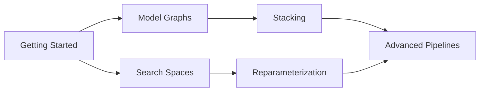

# Getting Started

Get up and running with sklearn-meta in minutes.

---

## Installation

### Basic Installation

```bash
pip install -e .
```

### With Optional Dependencies

```bash
# XGBoost support
pip install xgboost

# On macOS, XGBoost requires OpenMP
brew install libomp

# LightGBM support
pip install lightgbm

# CatBoost support
pip install catboost

# All optional dependencies
pip install xgboost lightgbm catboost
```

---

## Your First Pipeline

Let's build a simple hyperparameter-tuned classifier.

---

### Using the Fluent API (Recommended)

The fluent API splits the workflow into three phases: **define** the model graph, **configure** the training run, and **fit**. This separation keeps your model topology independent of runtime settings like CV and tuning.

#### Step 1: Prepare Your Data

```python
import pandas as pd
from sklearn.datasets import make_classification
from sklearn.model_selection import train_test_split

# Generate sample data
X, y = make_classification(
    n_samples=1000,
    n_features=20,
    n_informative=10,
    random_state=42
)

# Split into train/test
X_train, X_test, y_train, y_test = train_test_split(
    X, y, test_size=0.2, random_state=42
)

# Convert to DataFrames (required by DataView)
X_train = pd.DataFrame(X_train)
X_test = pd.DataFrame(X_test)
```

#### Step 2: Build the Model Graph

Use `GraphBuilder` to define models and their search spaces, then call `.compile()` to produce an immutable `GraphSpec`.

```python
from sklearn.ensemble import RandomForestClassifier
from sklearn_meta import GraphBuilder

graph = (
    GraphBuilder("my_classifier")
    .add_model("rf", RandomForestClassifier)
    .int_param("n_estimators", 50, 300)
    .int_param("max_depth", 3, 15)
    .param("min_samples_split", 0.01, 0.2)
    .fixed_params(random_state=42, n_jobs=-1)
    .compile()
)
```

#### Step 3: Configure the Training Run

Runtime concerns -- cross-validation, tuning, and verbosity -- live in a `RunConfig`, separate from the graph definition. Use `RunConfigBuilder` to construct one fluently.

```python
from sklearn_meta import RunConfigBuilder

config = (
    RunConfigBuilder()
    .cv(n_splits=5, strategy="stratified", random_state=42)
    .tuning(n_trials=50, metric="roc_auc")
    .build()
)
```

#### Step 4: Fit, Predict, and Evaluate

Pass the graph, data, and config to `GraphRunner` to produce a `TrainingRun`. Then compile a lightweight `InferenceGraph` for predictions.

```python
from sklearn.metrics import accuracy_score
from sklearn_meta import GraphRunner, RuntimeServices, DataView

# Wrap training data in a DataView
data = DataView.from_Xy(X_train, y_train)

# Fit the pipeline (runs tuning + CV training)
run = GraphRunner(RuntimeServices.default()).fit(graph, data, config)

# Compile an inference graph and predict on test data
inference = run.compile_inference()
predictions = inference.predict(X_test)

# Evaluate
print(f"Accuracy: {accuracy_score(y_test, predictions):.4f}")
```

#### Complete Fluent API Example

Here is the full code in one block:

```python
import pandas as pd
from sklearn.datasets import make_classification
from sklearn.model_selection import train_test_split
from sklearn.ensemble import RandomForestClassifier
from sklearn.metrics import accuracy_score

from sklearn_meta import (
    GraphBuilder,
    RunConfigBuilder,
    GraphRunner, RuntimeServices, DataView,
)

# Data
X, y = make_classification(n_samples=1000, n_features=20, random_state=42)
X_train, X_test, y_train, y_test = train_test_split(X, y, test_size=0.2, random_state=42)
X_train, X_test = pd.DataFrame(X_train), pd.DataFrame(X_test)

# 1. Define model graph
graph = (
    GraphBuilder("my_classifier")
    .add_model("rf", RandomForestClassifier)
    .int_param("n_estimators", 50, 300)
    .int_param("max_depth", 3, 15)
    .fixed_params(random_state=42, n_jobs=-1)
    .compile()
)

# 2. Configure runtime
config = (
    RunConfigBuilder()
    .cv(n_splits=5, strategy="stratified")
    .tuning(n_trials=50, metric="roc_auc")
    .build()
)

# 3. Fit and predict
run = GraphRunner(RuntimeServices.default()).fit(graph, DataView.from_Xy(X_train, y_train), config)
inference = run.compile_inference()
predictions = inference.predict(X_test)
print(f"Accuracy: {accuracy_score(y_test, predictions):.4f}")
```

---

### Inspecting Results

A `TrainingRun` stores per-node results, including best hyperparameters and out-of-fold predictions.

```python
# Best hyperparameters found for the "rf" node
print(run.node_results["rf"].best_params)

# Out-of-fold predictions (useful for stacking diagnostics)
oof = run.node_results["rf"].oof_predictions

# Mean CV score
print(f"Mean CV score: {run.node_results['rf'].mean_score:.4f}")
```

---

### Saving and Loading

#### Save/Load a Full Training Run

A `TrainingRun` can be saved and restored, preserving fold models, OOF predictions, and configuration.

```python
# Save
run.save("./my_run")

# Load
from sklearn_meta import TrainingRun
restored_run = TrainingRun.load("./my_run")
```

#### Save/Load an Inference-Only Graph

For deployment, save just the lightweight `InferenceGraph` (fold models and graph topology, no training artifacts).

```python
# Save
inference = run.compile_inference()
inference.save("./my_model")

# Load
from sklearn_meta import InferenceGraph
loaded = InferenceGraph.load("./my_model")
predictions = loaded.predict(X_test)
```

---

### RunConfigBuilder: Additional Options

The `RunConfigBuilder` supports additional configuration beyond CV and tuning, such as feature selection and verbosity:

```python
from sklearn_meta import RunConfigBuilder

config = (
    RunConfigBuilder()
    .cv(n_splits=5, strategy="stratified", random_state=42)
    .tuning(n_trials=50, metric="roc_auc")
    .feature_selection(method="shadow")
    .verbosity(2)
    .build()
)
```

---

### Using the Convenience Function

For the most concise workflow, use the top-level `sklearn_meta.fit()` helper:

```python
import sklearn_meta

run = sklearn_meta.fit(graph, DataView.from_Xy(X_train, y_train), config)
```

---

## Stacking Example

Build a multi-layer stacking pipeline with the fluent API:

```python
import pandas as pd
from sklearn.datasets import make_classification
from sklearn.model_selection import train_test_split
from sklearn.ensemble import RandomForestClassifier, GradientBoostingClassifier
from sklearn.linear_model import LogisticRegression

from sklearn_meta import (
    GraphBuilder,
    RunConfigBuilder,
    GraphRunner, RuntimeServices, DataView,
)

X, y = make_classification(n_samples=1000, n_features=20, random_state=42)
X_train, X_test, y_train, y_test = train_test_split(X, y, test_size=0.2, random_state=42)
X_train, X_test = pd.DataFrame(X_train), pd.DataFrame(X_test)

# Define a two-layer stacking graph
graph = (
    GraphBuilder("stacking_pipeline")
    # Layer 1: Base models
    .add_model("rf", RandomForestClassifier)
    .int_param("n_estimators", 50, 500)
    .int_param("max_depth", 3, 20)
    .fixed_params(random_state=42, n_jobs=-1)
    .add_model("gbm", GradientBoostingClassifier)
    .param("learning_rate", 0.01, 0.3, log=True)
    .int_param("max_depth", 3, 10)
    .int_param("n_estimators", 50, 300)
    # Layer 2: Meta-learner that stacks base model predictions
    .add_model("meta", LogisticRegression)
    .stacks("rf", "gbm")
    .compile()
)

# Configure and fit
config = (
    RunConfigBuilder()
    .cv(n_splits=5, strategy="stratified")
    .tuning(n_trials=100, metric="roc_auc")
    .build()
)

run = GraphRunner(RuntimeServices.default()).fit(
    graph, DataView.from_Xy(X_train, y_train), config
)

# Predict with the full stacking graph
inference = run.compile_inference()
predictions = inference.predict(X_test)
```

---

## What's Next?

Now that you have a basic pipeline working, explore these topics:


```mermaid
graph LR
    A[Getting Started] --> B[Model Graphs]
    A --> C[Search Spaces]
    B --> D[Stacking]
    C --> E[Reparameterization]
    D --> F[Advanced Pipelines]
    E --> F
```

- **[Model Graphs](model-graphs.md)** -- Build complex multi-model pipelines
- **[Search Spaces](search-spaces.md)** -- Advanced parameter definitions
- **[Cross-Validation](cross-validation.md)** -- Different CV strategies
- **[Stacking](stacking.md)** -- Combine multiple models
- **[Reparameterization](reparameterization.md)** -- Faster hyperparameter search
