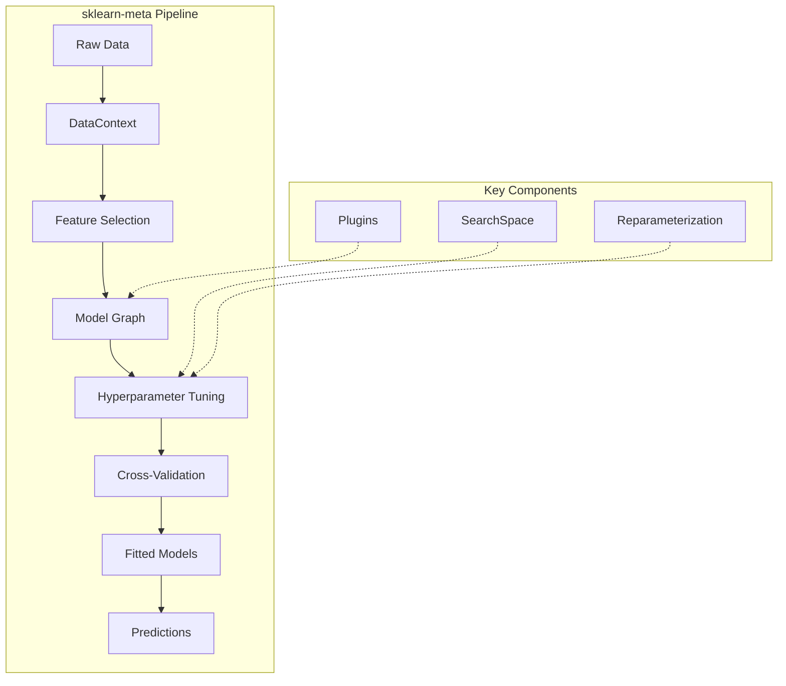
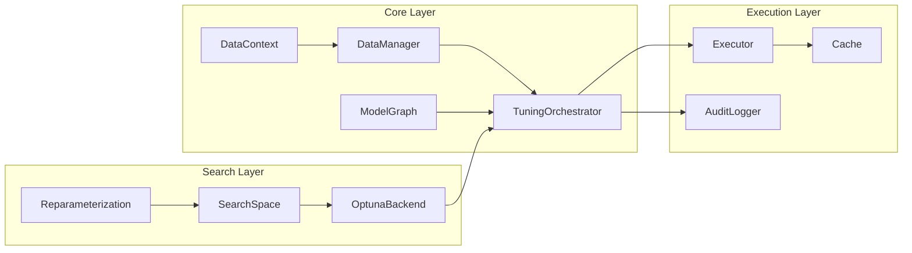

# sklearn-meta Documentation

> A Python library for automated machine learning with meta-learning capabilities, hyperparameter optimization, and model stacking.

---

## Overview

sklearn-meta provides a powerful framework for building automated machine learning pipelines. It combines hyperparameter optimization with advanced techniques like reparameterization, feature selection, knowledge distillation, and model stacking to achieve state-of-the-art results with minimal configuration.



---

## Key Features

| Feature | Description |
|---------|-------------|
| **Model Graphs** | Define complex pipelines as directed acyclic graphs (DAGs) |
| **GraphBuilder Fluent API** | Build pipelines with a chainable, readable API |
| **Hyperparameter Optimization** | Backend-agnostic search with Optuna integration |
| **Reparameterization** | Orthogonal parameter transformations for faster convergence |
| **Cross-Validation** | Stratified, grouped, random, and time-series strategies |
| **Feature Selection** | Shadow feature-based selection with entropy matching |
| **Model Stacking** | Multi-layer stacking with out-of-fold predictions |
| **Knowledge Distillation** | Teacher-student training with KL-divergence loss |
| **Estimator Scaling** | Scale n_estimators for boosting models with learning rate adjustment |
| **Joint Quantile Regression** | Model correlated targets with uncertainty quantification |
| **Plugin System** | Extensible plugins for model-specific behavior |
| **Caching** | Hash-based caching for expensive operations |

---

## Documentation

### Getting Started
- [Installation & Quickstart](getting-started.md) -- Get up and running in minutes

### Core Concepts
- [Model Graphs](model-graphs.md) -- Building ML pipelines as DAGs
- [Search Spaces](search-spaces.md) -- Defining hyperparameter search spaces
- [Cross-Validation](cross-validation.md) -- CV strategies and configuration

### Advanced Topics
- [Tuning & Optimization](tuning.md) -- Hyperparameter optimization strategies
- [Reparameterization](reparameterization.md) -- Meta-learning parameter transforms
- [Model Stacking](stacking.md) -- Multi-layer ensemble methods
- [Feature Selection](feature-selection.md) -- Automated feature selection
- [Plugins](plugins.md) -- Extending functionality with plugins

### Specialized Topics
- [Joint Quantile Regression](joint-quantile-regression.md) -- Multivariate target modeling with uncertainty

### Reference
- [API Reference](api-reference.md) -- Complete API documentation

---

## Architecture



---

## Quick Example

### Using the GraphBuilder Fluent API (Recommended)

The `GraphBuilder` is the recommended way to build and run pipelines:

```python
from sklearn.ensemble import RandomForestClassifier, GradientBoostingClassifier
from sklearn.linear_model import LogisticRegression
from sklearn_meta.api import GraphBuilder

# Build a stacking pipeline and fit in one step
fitted = (
    GraphBuilder("my_pipeline")
    .add_model("rf", RandomForestClassifier)
    .with_search_space(
        n_estimators=(50, 500),
        max_depth=(3, 20),
    )
    .with_fixed_params(random_state=42, n_jobs=-1)
    .add_model("gbm", GradientBoostingClassifier)
    .with_search_space(
        learning_rate=(0.01, 0.3, "log"),
        max_depth=(3, 10),
        n_estimators=(50, 300),
    )
    .add_model("meta", LogisticRegression)
    .stacks("rf", "gbm")
    .with_cv(n_splits=5, strategy="stratified")
    .with_tuning(n_trials=50, metric="roc_auc", greater_is_better=True)
    .fit(X_train, y_train)
)

predictions = fitted.predict(X_test)
```

### Using the Low-Level API

For more control, you can use the core classes directly:

```python
from sklearn.ensemble import RandomForestClassifier
from sklearn_meta.core.data.context import DataContext
from sklearn_meta.core.data.cv import CVConfig, CVStrategy
from sklearn_meta.core.data.manager import DataManager
from sklearn_meta.core.model.node import ModelNode
from sklearn_meta.core.model.graph import ModelGraph
from sklearn_meta.core.tuning.orchestrator import TuningConfig, TuningOrchestrator
from sklearn_meta.core.tuning.strategy import OptimizationStrategy
from sklearn_meta.search.backends.optuna import OptunaBackend
from sklearn_meta.search.space import SearchSpace

# Define search space
space = SearchSpace()
space.add_int("n_estimators", 50, 200)
space.add_int("max_depth", 3, 15)
space.add_float("min_samples_split", 0.01, 0.3)

# Create model node (keyword-only arguments)
node = ModelNode(
    name="random_forest",
    estimator_class=RandomForestClassifier,
    search_space=space,
    fixed_params={"random_state": 42, "n_jobs": -1},
)

# Build graph
graph = ModelGraph()
graph.add_node(node)

# Configure and run tuning
ctx = DataContext.from_Xy(X=X_train, y=y_train)
cv_config = CVConfig(n_splits=5, strategy=CVStrategy.STRATIFIED)
tuning_config = TuningConfig(
    strategy=OptimizationStrategy.LAYER_BY_LAYER,
    n_trials=50,
    metric="roc_auc",
    greater_is_better=True,
    cv_config=cv_config,
)
data_manager = DataManager(cv_config)
backend = OptunaBackend()

orchestrator = TuningOrchestrator(
    graph=graph,
    data_manager=data_manager,
    search_backend=backend,
    tuning_config=tuning_config,
)

fitted = orchestrator.fit(ctx)
predictions = fitted.predict(X_test)
```

---

## License

MIT License -- see [LICENSE](../LICENSE) for details.
