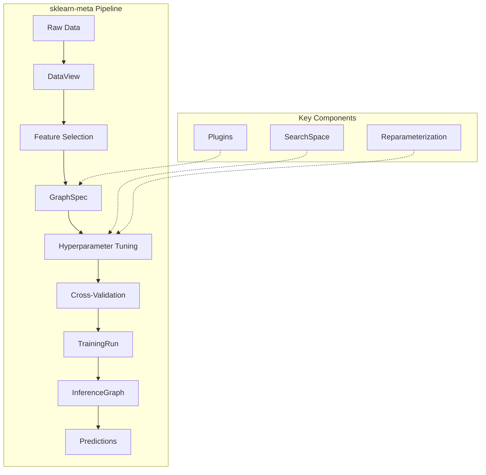
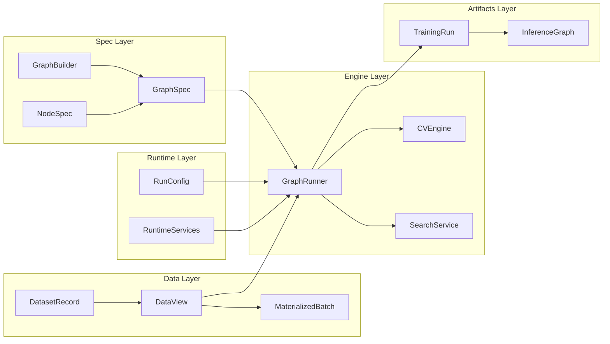

# sklearn-meta Documentation

> A Python library for automated machine learning with meta-learning capabilities, hyperparameter optimization, and model stacking.

---

## Overview

sklearn-meta provides a powerful framework for building automated machine learning pipelines. It combines hyperparameter optimization with advanced techniques like reparameterization, feature selection, knowledge distillation, and model stacking to achieve state-of-the-art results with minimal configuration.


```mermaid
graph TB
    subgraph "sklearn-meta Pipeline"
        A[Raw Data] --> B[DataView]
        B --> C[Feature Selection]
        C --> D[GraphSpec]
        D --> E[Hyperparameter Tuning]
        E --> F[Cross-Validation]
        F --> G[TrainingRun]
        G --> H[InferenceGraph]
        H --> I[Predictions]
    end

    subgraph "Key Components"
        J[SearchSpace] -.-> E
        K[Reparameterization] -.-> E
        L[Plugins] -.-> D
    end
```

---

## Key Features

| Feature | Description |
|---------|-------------|
| **Graph Specs** | Define complex pipelines as directed acyclic graphs (DAGs) |
| **GraphBuilder Fluent API** | Build pipelines with a chainable, readable API |
| **Hyperparameter Optimization** | Backend-agnostic search with Optuna integration |
| **Reparameterization** | Orthogonal parameter transformations for faster convergence |
| **Cross-Validation** | Stratified, grouped, random, and time-series strategies |
| **Feature Selection** | Shadow feature-based selection with entropy matching |
| **Model Stacking** | Multi-layer stacking with out-of-fold predictions |
| **Knowledge Distillation** | Teacher-student training with KL-divergence loss |
| **Estimator Scaling** | Scale n_estimators for boosting models with learning rate adjustment |
| **Joint Quantile Regression** | Model correlated targets with uncertainty quantification |
| **Plugin System** | Extensible plugins for model-specific behavior |
| **Caching** | Hash-based caching for expensive operations |

---

## Documentation

### Getting Started
- [Installation & Quickstart](getting-started.md) -- Get up and running in minutes

### Core Concepts
- [Model Graphs](model-graphs.md) -- Building ML pipelines as DAGs
- [Search Spaces](search-spaces.md) -- Defining hyperparameter search spaces
- [Cross-Validation](cross-validation.md) -- CV strategies and configuration

### Advanced Topics
- [Tuning & Optimization](tuning.md) -- Hyperparameter optimization strategies
- [Reparameterization](reparameterization.md) -- Meta-learning parameter transforms
- [Model Stacking](stacking.md) -- Multi-layer ensemble methods
- [Feature Selection](feature-selection.md) -- Automated feature selection
- [Plugins](plugins.md) -- Extending functionality with plugins

### Specialized Topics
- [Joint Quantile Regression](joint-quantile-regression.md) -- Multivariate target modeling with uncertainty
- [Correlation Analysis](api-reference.md#correlationanalyzer) -- Discover hyperparameter correlations post-optimization

### Reference
- [API Reference](api-reference.md) -- Complete API documentation

---

## Architecture


```mermaid
graph LR
    subgraph "Spec Layer"
        GS[GraphSpec]
        NS[NodeSpec]
        GB[GraphBuilder]
    end

    subgraph "Data Layer"
        DV[DataView]
        DR[DatasetRecord]
        MB[MaterializedBatch]
    end

    subgraph "Runtime Layer"
        RC[RunConfig]
        RS[RuntimeServices]
    end

    subgraph "Engine Layer"
        GR[GraphRunner]
        CV[CVEngine]
        SS[SearchService]
    end

    subgraph "Artifacts Layer"
        TR[TrainingRun]
        IG[InferenceGraph]
    end

    GB --> GS
    NS --> GS
    DR --> DV
    DV --> MB
    GS --> GR
    DV --> GR
    RC --> GR
    RS --> GR
    GR --> CV
    GR --> SS
    GR --> TR
    TR --> IG
```

---

## Quick Example

### Using the GraphBuilder Fluent API (Recommended)

The `GraphBuilder` produces a pure `GraphSpec`. Runtime concerns (CV, tuning, fitting) are configured separately via `RunConfig` and executed by `GraphRunner`.

```python
from sklearn.ensemble import RandomForestClassifier, GradientBoostingClassifier
from sklearn.linear_model import LogisticRegression
from sklearn_meta import GraphBuilder, RunConfigBuilder, DataView, GraphRunner, RuntimeServices

# 1. Build a graph spec
graph = (
    GraphBuilder("my_pipeline")
    .add_model("rf", RandomForestClassifier)
        .param("n_estimators", 50, 500)
        .param("max_depth", 3, 20)
        .fixed_params(random_state=42, n_jobs=-1)
    .add_model("gbm", GradientBoostingClassifier)
        .param("learning_rate", 0.01, 0.3, log=True)
        .param("max_depth", 3, 10)
        .int_param("n_estimators", 50, 300)
    .add_model("meta", LogisticRegression)
        .stacks("rf", "gbm")
    .compile()
)

# 2. Configure the run
config = (
    RunConfigBuilder()
    .cv(n_splits=5, strategy="stratified")
    .tuning(n_trials=50, metric="roc_auc")
    .build()
)

# 3. Wrap data in a DataView
data = DataView.from_Xy(X_train, y_train)

# 4. Fit with GraphRunner
runner = GraphRunner(RuntimeServices.default())
training_run = runner.fit(graph, data, config)

# 5. Compile to an inference graph and predict
inference = training_run.compile_inference()
predictions = inference.predict(X_test)
```

### Using the Convenience Function

For quick experiments, `sklearn_meta.fit()` wraps the runner in a single call:

```python
import sklearn_meta
from sklearn_meta import GraphBuilder, RunConfigBuilder, DataView

graph = (
    GraphBuilder()
    .add_model("rf", RandomForestClassifier)
        .param("n_estimators", 50, 500)
        .param("max_depth", 3, 20)
        .fixed_params(random_state=42, n_jobs=-1)
    .compile()
)

config = (
    RunConfigBuilder()
    .cv(n_splits=5, strategy="stratified")
    .tuning(n_trials=50, metric="roc_auc")
    .build()
)

data = DataView.from_Xy(X_train, y_train)

training_run = sklearn_meta.fit(graph, data, config)
predictions = training_run.compile_inference().predict(X_test)
```

### Using RunConfigBuilder

For more readable configuration, use the fluent `RunConfigBuilder`:

```python
from sklearn_meta import RunConfigBuilder

config = (
    RunConfigBuilder()
    .cv(n_splits=5, strategy="stratified")
    .tuning(n_trials=50, metric="roc_auc")
    .feature_selection(method="shadow", n_shadows=5)
    .reparameterization(enabled=True, use_prebaked=True)
    .verbosity(2)
    .build()
)
```

### Using the Low-Level API

For full control, construct `NodeSpec` and `GraphSpec` objects directly:

```python
from sklearn.ensemble import RandomForestClassifier
from sklearn_meta import (
    DataView,
    NodeSpec,
    GraphSpec,
    RunConfig,
    CVConfig,
    CVStrategy,
    TuningConfig,
    RuntimeServices,
    GraphRunner,
    SearchSpace,
)

# Define search space
space = SearchSpace()
space.add_int("n_estimators", 50, 200)
space.add_int("max_depth", 3, 15)
space.add_float("min_samples_split", 0.01, 0.3)

# Create node spec (keyword-only arguments)
node = NodeSpec(
    name="random_forest",
    estimator_class=RandomForestClassifier,
    search_space=space,
    fixed_params={"random_state": 42, "n_jobs": -1},
)

# Build graph
graph = GraphSpec()
graph.add_node(node)
graph.validate()

# Configure the run
config = RunConfig(
    cv=CVConfig(n_splits=5, strategy=CVStrategy.STRATIFIED),
    tuning=TuningConfig(
        n_trials=50,
        metric="roc_auc",
        greater_is_better=True,
    ),
)

# Wrap data
data = DataView.from_Xy(X=X_train, y=y_train)

# Fit
services = RuntimeServices.default()
runner = GraphRunner(services)
training_run = runner.fit(graph, data, config)

# Predict
inference = training_run.compile_inference()
predictions = inference.predict(X_test)
```

---

## License

MIT License -- see [LICENSE](../LICENSE) for details.
