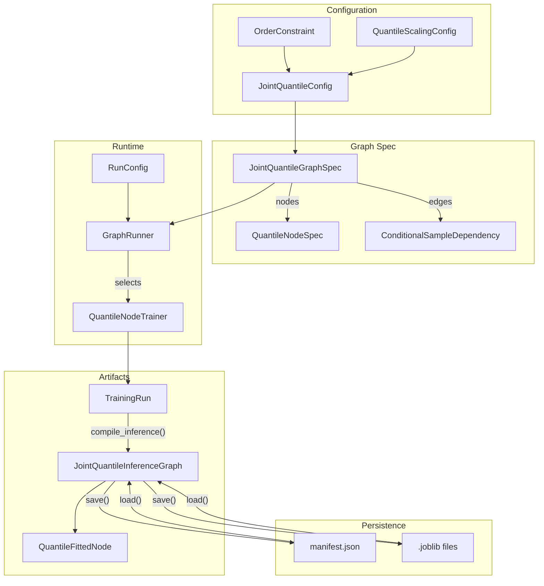
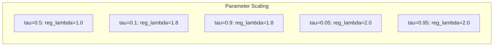
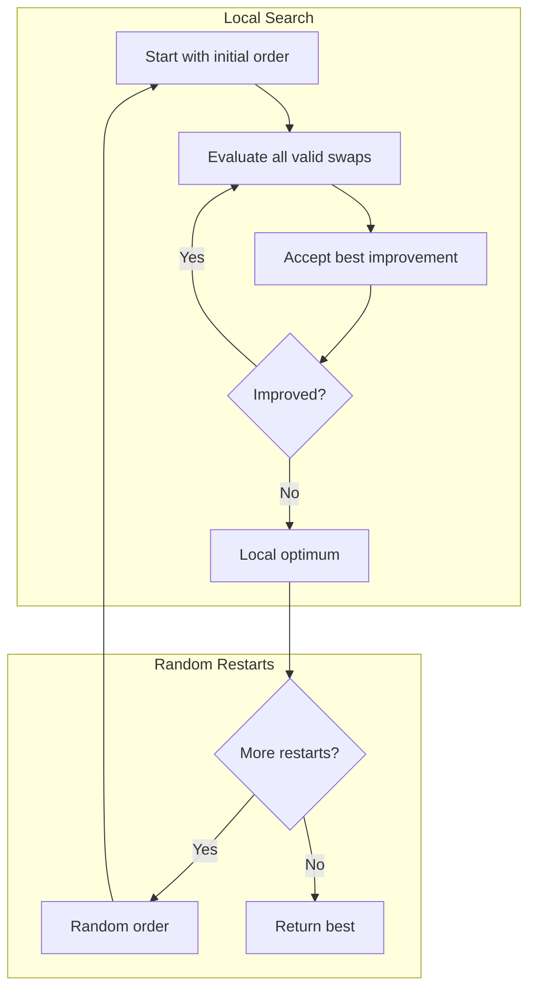
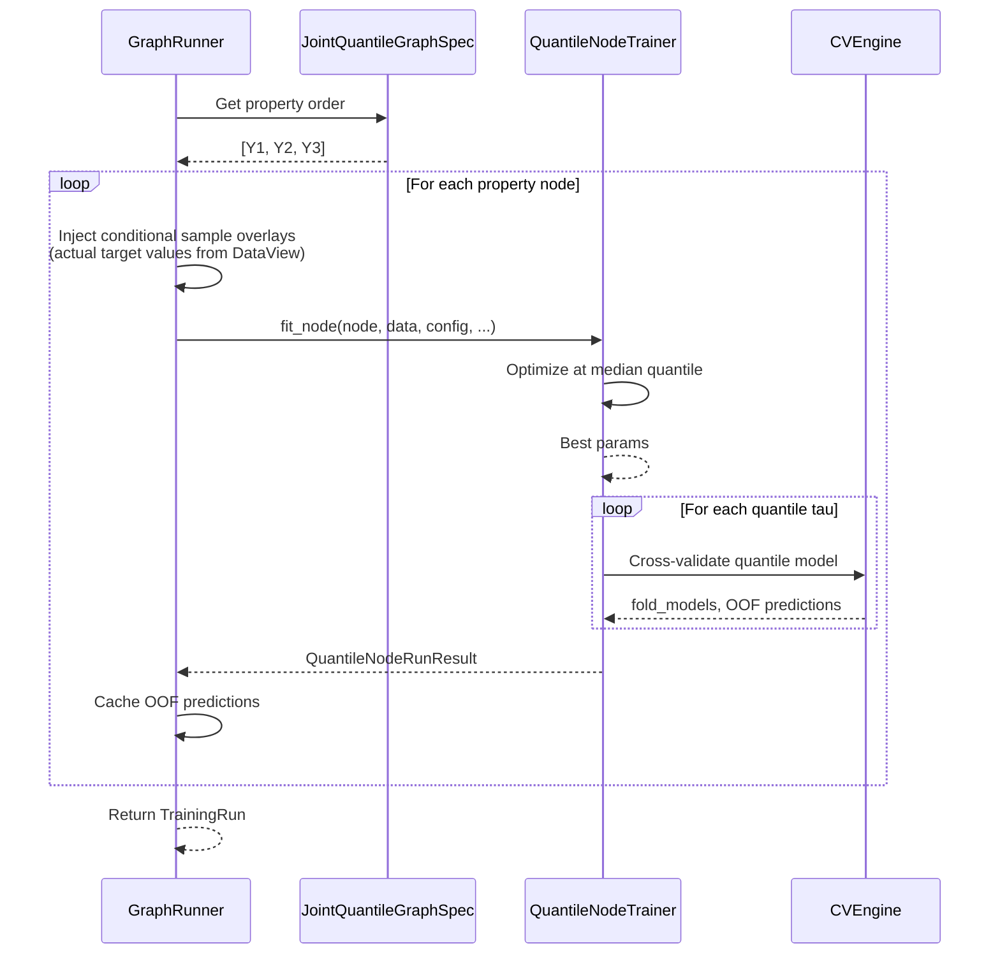
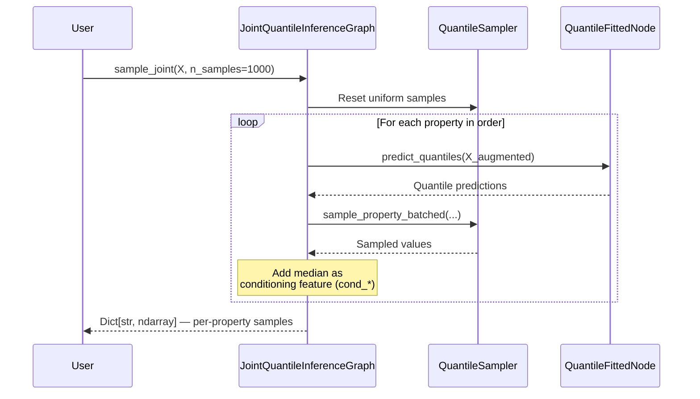

# Joint Quantile Regression

Joint quantile regression models multiple correlated target properties using sequential quantile regression via chain rule decomposition. This enables uncertainty quantification and joint sampling from the multivariate distribution.

---

## What is Joint Quantile Regression?

Instead of predicting point estimates for multiple targets, joint quantile regression models the full conditional distribution:

```
P(Y1, Y2, ..., Yn | X) = P(Y1|X) * P(Y2|X,Y1) * P(Y3|X,Y1,Y2) * ...
```

Each conditional is modeled with quantile regression (typically 10-20 quantile levels) using XGBoost.

```mermaid
graph TB
    subgraph "Chain Rule Decomposition"
        X[Features X] --> Q1[P(Y1|X)]
        X --> Q2[P(Y2|X,Y1)]
        X --> Q3[P(Y3|X,Y1,Y2)]
        Q1 --> |"condition"| Q2
        Q1 --> |"condition"| Q3
        Q2 --> |"condition"| Q3
    end

    subgraph "Quantile Models"
        Q1 --> |"tau=0.1,0.5,0.9"| D1[Distribution Y1]
        Q2 --> |"tau=0.1,0.5,0.9"| D2[Distribution Y2]
        Q3 --> |"tau=0.1,0.5,0.9"| D3[Distribution Y3]
    end
```

**Why use joint quantile regression:**
- Model uncertainty in predictions
- Capture correlations between target variables
- Sample from the joint distribution
- Get prediction intervals, not just point estimates

---

## Key Concepts

### Training vs Inference

**During Training:**
- Condition on **actual Y values** from upstream properties
- This ensures proper density estimation

**During Inference:**
- Sample from the quantile distribution of Y1
- Use sampled values to condition Y2, Y3, etc.
- Maintain consistent sampling paths for correlation

```mermaid
graph LR
    subgraph "Training"
        T1[Actual Y1] --> T2[Train P(Y2|X,Y1)]
        T1 --> T3[Train P(Y3|X,Y1,Y2)]
        T4[Actual Y2] --> T3
    end

    subgraph "Inference"
        I1[Sample Y-hat-1] --> I2[Predict P(Y2|X,Y-hat-1)]
        I1 --> I3[Predict P(Y3|X,Y-hat-1,Y-hat-2)]
        I2 --> |"Sample Y-hat-2"| I3
    end
```

### Consistent Sampling Paths

To preserve correlations, the same uniform random samples are used across all properties:

```python
# Pre-generate uniform samples
uniforms = [0.3, 0.7, 0.1, ...]  # n_samples values in [0,1]

# For each sample path i:
#   Y1[i] = Q_Y1(uniforms[i])  # Sample from Y1 distribution
#   Y2[i] = Q_Y2(uniforms[i])  # Sample from Y2|Y1 distribution
#   ...
```

This ensures that if sample i is at the 30th percentile of Y1, it's also at the 30th percentile of Y2|Y1.

---

## Architecture



---

## Quick Start

### Basic Usage

```python
from sklearn_meta.spec.quantile import (
    JointQuantileGraphSpec, JointQuantileConfig, OrderConstraint,
    QuantileScalingConfig,
)
from sklearn_meta.artifacts.inference import JointQuantileInferenceGraph
from sklearn_meta.engine.runner import GraphRunner
from sklearn_meta.data.view import DataView
from sklearn_meta.runtime.config import RunConfig, CVConfig, CVStrategy, TuningConfig
from sklearn_meta.runtime.services import RuntimeServices
from sklearn_meta.search.backends.optuna import OptunaBackend
from xgboost import XGBRegressor

# 1. Configure
config = JointQuantileConfig(
    property_names=["price", "volume", "volatility"],
    quantile_levels=[0.1, 0.25, 0.5, 0.75, 0.9],
    estimator_class=XGBRegressor,
    n_inference_samples=1000,
)

# 2. Build graph spec
graph = JointQuantileGraphSpec(config)

# 3. Create RunConfig (CV + tuning are separate sub-configs)
run_config = RunConfig(
    cv=CVConfig(n_splits=5, strategy=CVStrategy.RANDOM),
    tuning=TuningConfig(n_trials=50),
)

# 4. Create DataView with named targets
view = (
    DataView.from_Xy(X=X_train, y=y_price)
    .bind_target(y_price, name="price")
    .bind_target(y_volume, name="volume")
    .bind_target(y_volatility, name="volatility")
)

# 5. Fit via GraphRunner (QuantileNodeTrainer is selected automatically)
services = RuntimeServices(search_backend=OptunaBackend())
runner = GraphRunner(services)
training_run = runner.fit(graph, view, run_config)

print(f"Fitting completed in {training_run.total_time:.1f}s")

# 6. Compile to inference graph
inference = training_run.compile_inference()

# For joint quantile specifically, build the JointQuantileInferenceGraph
from sklearn_meta.artifacts.inference import (
    JointQuantileInferenceGraph, QuantileFittedNode,
)

fitted_nodes = {}
for prop_name in graph.property_order:
    node_name = f"quantile_{prop_name}"
    result = training_run.node_results[node_name]
    fitted_nodes[prop_name] = QuantileFittedNode(
        quantile_models=result.quantile_models,
        quantile_levels=list(graph.quantile_levels),
        selected_features=result.selected_features,
    )

jq_inference = JointQuantileInferenceGraph(
    graph=graph,
    fitted_nodes=fitted_nodes,
    quantile_sampler=graph.create_quantile_sampler(),
)

# 7. Sample from joint distribution
samples = jq_inference.sample_joint(X_test, n_samples=1000)
# Returns: Dict[str, np.ndarray] — each value has shape (n_test, 1000)

# 8. Point predictions
medians = jq_inference.predict_median(X_test)  # Dict[str, np.ndarray]
q90 = jq_inference.predict_quantile(X_test, q=0.9)

# 9. Save and reload
jq_inference.save("./models/joint_quantile/")
loaded = JointQuantileInferenceGraph.load("./models/joint_quantile/")
```

---

## Feature Selection

Joint quantile training supports feature selection through `RunConfig.feature_selection`.

```python
from sklearn_meta.runtime.config import (
    RunConfig, CVConfig, CVStrategy, TuningConfig,
    FeatureSelectionConfig, FeatureSelectionMethod,
)

run_config = RunConfig(
    cv=CVConfig(n_splits=5, strategy=CVStrategy.RANDOM),
    tuning=TuningConfig(n_trials=50),
    feature_selection=FeatureSelectionConfig(
        enabled=True,
        method=FeatureSelectionMethod.SHADOW,
        n_shadows=5,
        threshold_mult=1.414,
        retune_after_pruning=True,
        min_features=3,
        # Optional: grouped selection
        # feature_groups={"group_name": ["feature_a", "feature_b"]},
    ),
)
```

Behavior notes:
- Feature selection runs per property node (after median-quantile tuning).
- Downstream nodes can select conditional features (for example `cond_price`).
- In fixed-parameter / no-search-space mode, feature selection is skipped.

---

## Configuration Options

### JointQuantileConfig

| Parameter | Type | Default | Description |
|-----------|------|---------|-------------|
| `property_names` | `List[str]` | required | Names of target properties |
| `quantile_levels` | `List[float]` | 19 levels (0.05-0.95) | Quantile levels to model |
| `estimator_class` | `Type` | None | XGBoost-compatible estimator |
| `search_space` | `SearchSpace` | None | Hyperparameter search space |
| `quantile_scaling` | `QuantileScalingConfig` | None | Parameter scaling by quantile |
| `order_constraints` | `OrderConstraint` | None | Constraints on property order |
| `sampling_strategy` | `SamplingStrategy` | LINEAR_INTERPOLATION | How to sample from quantiles |
| `n_inference_samples` | `int` | 1000 | Samples per prediction |
| `random_state` | `int` | None | Random seed |
| `fixed_params` | `Dict[str, Any]` | `{}` | Fixed estimator parameters |

### QuantileScalingConfig

Scale hyperparameters based on distance from median (tau=0.5):

```python
from sklearn_meta.spec.quantile import QuantileScalingConfig

scaling = QuantileScalingConfig(
    base_params={"n_estimators": 100, "max_depth": 6},
    scaling_rules={
        "reg_lambda": {"base": 1.0, "tail_multiplier": 2.0},
        "reg_alpha": {"base": 0.1, "tail_multiplier": 1.5},
    }
)
```

At extreme quantiles (tau=0.05 or tau=0.95), regularization is increased to prevent overfitting where data is sparse.



### OrderConstraint

Control the ordering of properties in the chain:

```python
from sklearn_meta.spec.quantile import OrderConstraint

constraint = OrderConstraint(
    # Price must always be first
    fixed_positions={"price": 0},

    # Volume must come before volatility
    must_precede=[("volume", "volatility")],

    # Don't try swapping these during order search
    no_swap=[("price", "volume")],
)
```

---

## Sampling Strategies

### Linear Interpolation (Default)

Interpolate linearly between quantile predictions:

```python
config = JointQuantileConfig(
    ...,
    sampling_strategy=SamplingStrategy.LINEAR_INTERPOLATION,
)
```

**Pros:** Fast, simple, always works
**Cons:** May not capture distribution shape accurately

### Parametric Fitting

Fit a parametric distribution to quantiles:

```python
from sklearn_meta.spec.quantile_sampler import SamplingStrategy

# Normal distribution
config = JointQuantileConfig(
    ...,
    sampling_strategy=SamplingStrategy.NORMAL,
)

# Skew-normal for asymmetric distributions
config = JointQuantileConfig(
    ...,
    sampling_strategy=SamplingStrategy.SKEW_NORMAL,
)

# Johnson SU distribution (handles heavy tails and skewness)
config = JointQuantileConfig(
    ...,
    sampling_strategy=SamplingStrategy.JOHNSON_SU,
)

# Auto-select best fitting distribution
config = JointQuantileConfig(
    ...,
    sampling_strategy=SamplingStrategy.AUTO,
)
```

---

## Order Search

The order of properties affects model quality. Use `OrderSearchPlugin` to find a good ordering:

```python
from sklearn_meta.plugins.joint_quantile.order_search import (
    OrderSearchPlugin, OrderSearchConfig
)

# Configure search
search_config = OrderSearchConfig(
    max_iterations=20,      # Max iterations per local search
    n_random_restarts=3,    # Random restarts to escape local optima
    verbose=1,
)

# Run search
plugin = OrderSearchPlugin(config=search_config)
result = plugin.search_order(
    graph=graph,
    data=view,
    run_config=run_config,
    runner=runner,
)

print(f"Best order: {result.best_order}")
print(f"Best score: {result.best_score}")
print(f"Converged: {result.converged}")
```

### How Order Search Works



---

## Data Flow

### Training Flow



### Inference Flow



---

## Complete Example

```python
import numpy as np
import pandas as pd
from xgboost import XGBRegressor

from sklearn_meta.spec.quantile import (
    JointQuantileGraphSpec, JointQuantileConfig, OrderConstraint,
    QuantileScalingConfig,
)
from sklearn_meta.artifacts.inference import (
    JointQuantileInferenceGraph, QuantileFittedNode,
)
from sklearn_meta.engine.runner import GraphRunner
from sklearn_meta.data.view import DataView
from sklearn_meta.runtime.config import RunConfig, CVConfig, CVStrategy, TuningConfig
from sklearn_meta.runtime.services import RuntimeServices
from sklearn_meta.search.backends.optuna import OptunaBackend
from sklearn_meta.search.space import SearchSpace

# === Generate Synthetic Correlated Data ===
np.random.seed(42)
n_samples = 2000

X = np.random.randn(n_samples, 10)
X_df = pd.DataFrame(X, columns=[f"f{i}" for i in range(10)])

# Correlated targets
y_price = 2*X[:, 0] + X[:, 1] + np.random.randn(n_samples) * 0.5
y_volume = X[:, 2] + 0.5*y_price + np.random.randn(n_samples) * 0.3
y_volatility = 0.3*y_price + 0.4*y_volume + np.random.randn(n_samples) * 0.2

# Split
train_idx = np.arange(1500)
test_idx = np.arange(1500, 2000)
X_train, X_test = X_df.iloc[train_idx], X_df.iloc[test_idx]

targets_train = {
    "price": pd.Series(y_price[train_idx]),
    "volume": pd.Series(y_volume[train_idx]),
    "volatility": pd.Series(y_volatility[train_idx]),
}
targets_test = {
    "price": pd.Series(y_price[test_idx]),
    "volume": pd.Series(y_volume[test_idx]),
    "volatility": pd.Series(y_volatility[test_idx]),
}

# === Configure Joint Quantile Model ===
search_space = SearchSpace()
search_space.add_int("n_estimators", 50, 200)
search_space.add_int("max_depth", 3, 8)
search_space.add_float("learning_rate", 0.01, 0.3, log=True)

scaling = QuantileScalingConfig(
    base_params={"reg_lambda": 1.0},
    scaling_rules={
        "reg_lambda": {"base": 1.0, "tail_multiplier": 2.0},
    }
)

jq_config = JointQuantileConfig(
    property_names=["price", "volume", "volatility"],
    quantile_levels=[0.1, 0.25, 0.5, 0.75, 0.9],
    estimator_class=XGBRegressor,
    search_space=search_space,
    quantile_scaling=scaling,
    order_constraints=OrderConstraint(
        fixed_positions={"price": 0},  # Price first (independent)
    ),
    n_inference_samples=1000,
    random_state=42,
)

# === Build Graph Spec ===
graph = JointQuantileGraphSpec(jq_config)
print(f"Property order: {graph.property_order}")
print(f"Quantile levels: {graph.quantile_levels}")

# === Create RunConfig ===
run_config = RunConfig(
    cv=CVConfig(n_splits=5, strategy=CVStrategy.RANDOM, random_state=42),
    tuning=TuningConfig(n_trials=20),
)

# === Create DataView with named targets ===
view = (
    DataView.from_Xy(X=X_train, y=targets_train["price"])
    .bind_target(targets_train["price"], name="price")
    .bind_target(targets_train["volume"], name="volume")
    .bind_target(targets_train["volatility"], name="volatility")
)

# === Fit via GraphRunner ===
services = RuntimeServices(search_backend=OptunaBackend())
runner = GraphRunner(services)
training_run = runner.fit(graph, view, run_config)

print(f"\nFitting completed in {training_run.total_time:.1f}s")

# === Build JointQuantileInferenceGraph ===
fitted_nodes = {}
for prop_name in graph.property_order:
    node_name = f"quantile_{prop_name}"
    result = training_run.node_results[node_name]
    fitted_nodes[prop_name] = QuantileFittedNode(
        quantile_models=result.quantile_models,
        quantile_levels=list(graph.quantile_levels),
        selected_features=result.selected_features,
    )

jq_inference = JointQuantileInferenceGraph(
    graph=graph,
    fitted_nodes=fitted_nodes,
    quantile_sampler=graph.create_quantile_sampler(),
)

# === Sample from Joint Distribution ===
samples = jq_inference.sample_joint(X_test, n_samples=1000)
# samples["price"].shape == (500, 1000)
print(f"\nSample shapes: { {k: v.shape for k, v in samples.items()} }")

# === Point Predictions ===
medians = jq_inference.predict_median(X_test)
# medians["price"].shape == (500,)

# === Prediction Intervals ===
q10 = jq_inference.predict_quantile(X_test, 0.1)
q90 = jq_inference.predict_quantile(X_test, 0.9)

print("\n=== Prediction Intervals ===")
for prop in ["price", "volume", "volatility"]:
    y_true = targets_test[prop].values
    coverage = np.mean((y_true >= q10[prop]) & (y_true <= q90[prop]))
    print(f"{prop}: 80% interval coverage = {coverage:.1%}")

# === Save and Reload ===
jq_inference.save("./models/joint_quantile/")
loaded = JointQuantileInferenceGraph.load("./models/joint_quantile/")

# Verify loaded model produces same predictions
loaded_medians = loaded.predict_median(X_test)
for prop in ["price", "volume", "volatility"]:
    assert np.allclose(medians[prop], loaded_medians[prop])

# === Analyze Correlations ===
print("\n=== Sample Correlations (should match data) ===")
# True correlations
true_corr = np.corrcoef([targets_test[p].values for p in ["price", "volume", "volatility"]])

# Sample correlations (average over test points)
sample_corrs = []
for i in range(len(X_test)):
    row_samples = np.column_stack([samples[p][i] for p in ["price", "volume", "volatility"]])
    corr = np.corrcoef(row_samples.T)
    sample_corrs.append(corr)
sample_corr = np.mean(sample_corrs, axis=0)

print(f"True price-volume correlation:   {true_corr[0, 1]:.3f}")
print(f"Sample price-volume correlation: {sample_corr[0, 1]:.3f}")
```

---

## Saving and Loading Models

Each property's fitted models are saved as independent `.joblib` files, with a JSON manifest capturing the graph structure. This enables retraining individual properties without touching others, swapping nodes for experimentation, and cleaner deployment artifacts.

### Save and Load

```python
# Save inference graph to a directory
jq_inference.save("./models/joint_quantile/")
# Creates:
#   models/joint_quantile/manifest.json
#   models/joint_quantile/nodes/price/q0.1000_fold_0.joblib
#   models/joint_quantile/nodes/price/q0.5000_fold_0.joblib
#   ... (one file per quantile per fold per property)

# Load from directory
loaded = JointQuantileInferenceGraph.load("./models/joint_quantile/")
medians = loaded.predict_median(X_test)
```

### TrainingRun Artifacts

`TrainingRun.save()` can include or strip training-only data (OOF predictions, optimization results):

```python
# Full training artifacts (for diagnostics, retraining)
training_run.save("./models/dev/", include_training_artifacts=True)

# Reload the full training run
from sklearn_meta.artifacts.training import TrainingRun
reloaded_run = TrainingRun.load("./models/dev/")

# Or compile a lightweight InferenceGraph from a TrainingRun
inference_graph = training_run.compile_inference()
inference_graph.save("./models/prod/")
```

### Swapping Individual Nodes

Since each property's model is independent, you can retrain one and swap it in:

```python
from sklearn_meta.artifacts.inference import QuantileFittedNode

# Load existing inference graph
loaded = JointQuantileInferenceGraph.load("./models/v1/")

# Replace a node with a retrained one
loaded.fitted_nodes["volume"] = QuantileFittedNode(
    quantile_models=new_volume_models,
    quantile_levels=loaded.graph.quantile_levels,
)

# Save updated version
loaded.save("./models/v2/")
```

### Manifest Schema

The `manifest.json` records graph structure and sampling configuration:

```json
{
  "version": 3,
  "type": "joint_quantile_inference",
  "property_order": ["price", "volume", "volatility"],
  "quantile_levels": [0.1, 0.25, 0.5, 0.75, 0.9],
  "sampler": {
    "strategy": "linear_interpolation",
    "n_samples": 1000,
    "random_state": 42
  },
  "nodes": {
    "price": {
      "quantile_levels": [0.1, 0.25, 0.5, 0.75, 0.9],
      "n_folds": 5,
      "selected_features": null
    },
    "volume": {
      "quantile_levels": [0.1, 0.25, 0.5, 0.75, 0.9],
      "n_folds": 5,
      "selected_features": null
    },
    "volatility": {
      "quantile_levels": [0.1, 0.25, 0.5, 0.75, 0.9],
      "n_folds": 5,
      "selected_features": null
    }
  }
}
```

---

## Best Practices

### 1. Choose Property Order Wisely

```python
# Good: Independent or causal variables first
order = ["price", "volume", "volatility"]  # price -> volume -> volatility

# Less effective: Random order may miss dependencies
order = ["volatility", "price", "volume"]
```

### 2. Use Appropriate Quantile Levels

```python
# For uncertainty quantification (prediction intervals)
quantile_levels = [0.1, 0.5, 0.9]  # 80% interval

# For detailed distribution modeling
quantile_levels = [0.05, 0.1, 0.25, 0.5, 0.75, 0.9, 0.95]

# For smooth sampling
quantile_levels = np.linspace(0.05, 0.95, 19).tolist()
```

### 3. Scale Parameters for Tail Quantiles

```python
from sklearn_meta.spec.quantile import QuantileScalingConfig

# Increase regularization at extremes
scaling = QuantileScalingConfig(
    base_params={"reg_lambda": 1.0, "reg_alpha": 0.1},
    scaling_rules={
        "reg_lambda": {"base": 1.0, "tail_multiplier": 2.0},
        "reg_alpha": {"base": 0.1, "tail_multiplier": 1.5},
    }
)
```

### 4. Use Enough Inference Samples

```python
# For point estimates
n_samples = 100  # Sufficient

# For distribution analysis
n_samples = 1000  # Recommended

# For rare event analysis
n_samples = 10000  # May be needed
```

### 5. Validate Interval Coverage

```python
# Check that 80% prediction intervals actually contain 80% of true values
for tau_low, tau_high in [(0.1, 0.9), (0.25, 0.75)]:
    q_low = jq_inference.predict_quantile(X_test, tau_low)
    q_high = jq_inference.predict_quantile(X_test, tau_high)
    for prop in jq_config.property_names:
        coverage = np.mean((y_true[prop] >= q_low[prop]) & (y_true[prop] <= q_high[prop]))
        expected = tau_high - tau_low
        print(f"{prop}: Expected {expected:.0%}, Actual {coverage:.0%}")
```

---

## API Reference

### JointQuantileGraphSpec

```python
class JointQuantileGraphSpec(GraphSpec):
    def __init__(self, config: JointQuantileConfig)
    def set_order(self, new_order: List[str])
    def swap_adjacent(self, position: int)
    def get_valid_swaps(self) -> List[Tuple[int, int]]
    def get_quantile_node(self, property_name: str) -> QuantileNodeSpec
    def get_conditioning_properties(self, property_name: str) -> List[str]
    def create_quantile_sampler(self) -> QuantileSampler

    @property
    def property_order(self) -> List[str]
    @property
    def n_properties(self) -> int
    @property
    def quantile_levels(self) -> List[float]
```

### JointQuantileInferenceGraph

```python
class JointQuantileInferenceGraph:
    graph: JointQuantileGraphSpec
    fitted_nodes: Dict[str, QuantileFittedNode]
    quantile_sampler: QuantileSampler

    def sample_joint(self, X: pd.DataFrame, n_samples: int = None) -> Dict[str, np.ndarray]
    def predict_median(self, X: pd.DataFrame) -> Dict[str, np.ndarray]
    def predict_quantile(self, X: pd.DataFrame, q: float) -> Dict[str, np.ndarray]
    def save(self, path: str | Path)
    @classmethod
    def load(cls, path: str | Path) -> JointQuantileInferenceGraph
```

### QuantileFittedNode

```python
class QuantileFittedNode:
    quantile_models: Dict[float, List[Any]]
    quantile_levels: List[float]
    selected_features: Optional[List[str]]

    def predict_quantiles(self, X: pd.DataFrame) -> np.ndarray
```

### QuantileNodeSpec

```python
class QuantileNodeSpec(NodeSpec):
    property_name: str
    quantile_levels: List[float]
    quantile_scaling: Optional[QuantileScalingConfig]

    def create_estimator_for_quantile(self, tau: float, params: Dict = None) -> Any
    def get_params_for_quantile(self, tau: float, tuned_params: Dict = None) -> Dict[str, Any]

    @property
    def median_quantile(self) -> float
    @property
    def n_quantiles(self) -> int
```

### QuantileSampler

```python
class QuantileSampler:
    def __init__(self, strategy: SamplingStrategy, n_samples: int, random_state: int = None)
    def sample_property_batched(self, property_name: str, quantile_levels, quantile_predictions) -> np.ndarray
    def get_median(self, quantile_levels, quantile_predictions) -> np.ndarray
    def get_quantile(self, q: float, quantile_levels, quantile_predictions) -> np.ndarray
    def reset_samples(self)
```

### RunConfig (for joint quantile)

```python
run_config = RunConfig(
    cv=CVConfig(n_splits=5, strategy=CVStrategy.RANDOM, random_state=42),
    tuning=TuningConfig(n_trials=50),
    feature_selection=FeatureSelectionConfig(enabled=True, method=FeatureSelectionMethod.SHADOW),
)
```

---

## Next Steps

- [Model Graphs](model-graphs.md) -- How graphs and dependencies work
- [Tuning](tuning.md) -- Hyperparameter optimization strategies
- [Plugins](plugins.md) -- Extending with OrderSearchPlugin
- [Cross-Validation](cross-validation.md) -- OOF prediction handling
