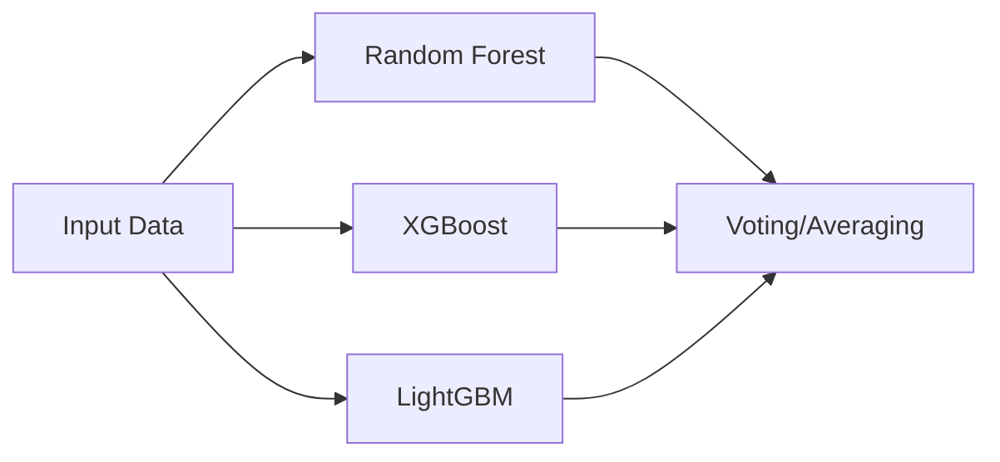
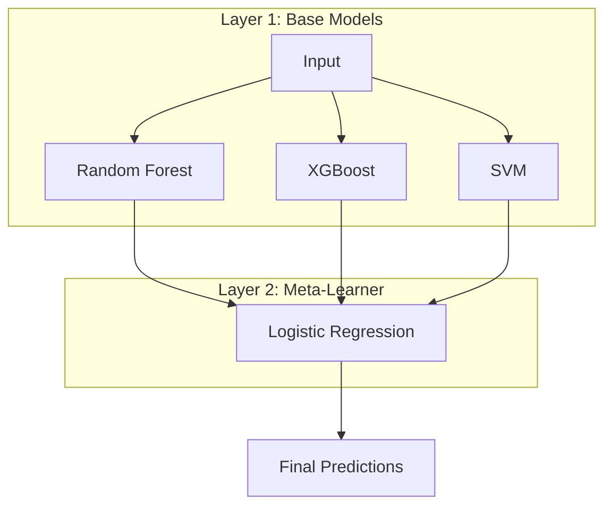
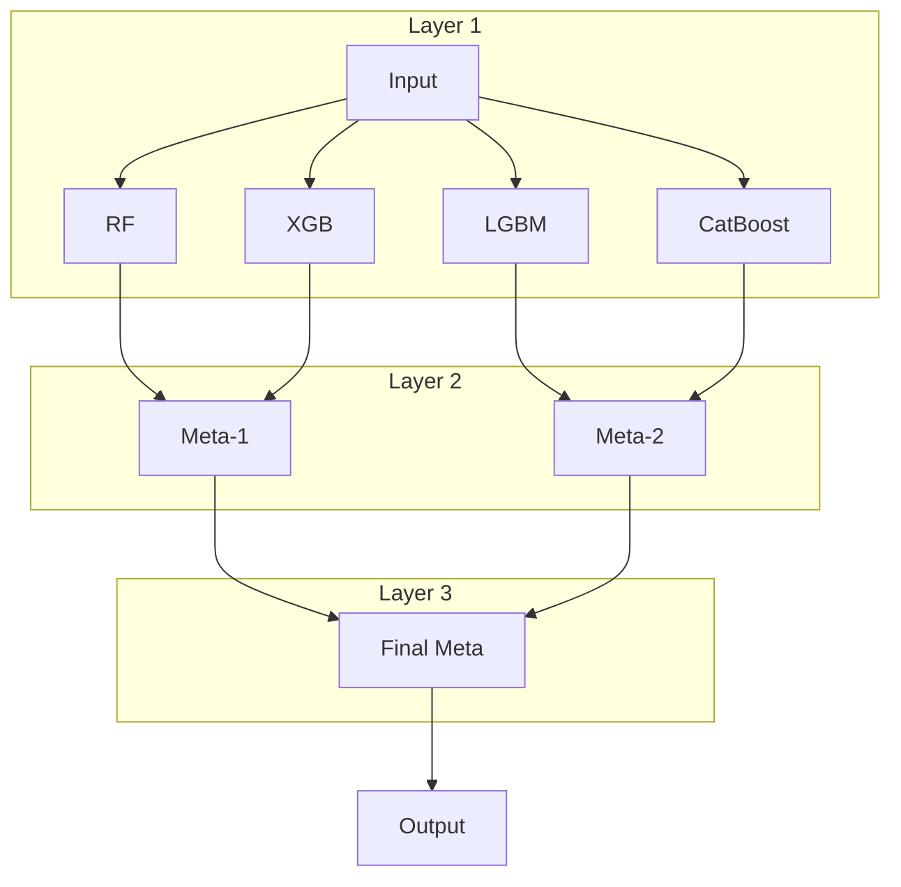
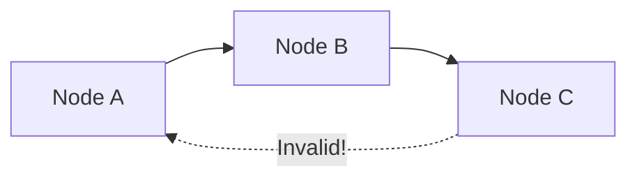
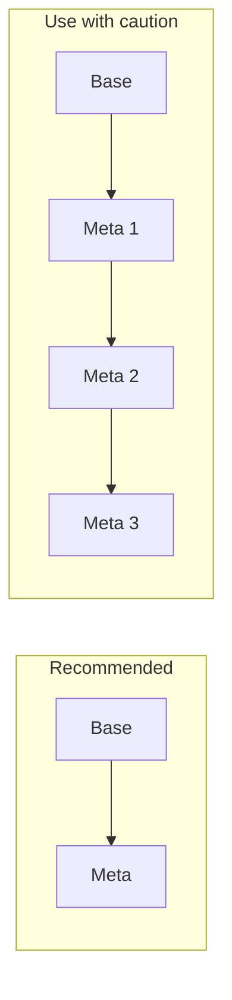

# Model Graphs

Model graphs allow you to define complex machine learning pipelines as directed acyclic graphs (DAGs). This enables sophisticated architectures like model stacking, parallel ensembles, and feature transformations.

---

## Quick Start with GraphBuilder

The `GraphBuilder` fluent API is the recommended way to build model graphs:

```python
from sklearn_meta.api import GraphBuilder
from sklearn.ensemble import RandomForestClassifier, GradientBoostingClassifier
from sklearn.linear_model import LogisticRegression

pipeline = (
    GraphBuilder("stacking_pipeline")
    .add_model("rf", RandomForestClassifier)
    .with_search_space(n_estimators=(50, 200), max_depth=(3, 15))
    .add_model("gb", GradientBoostingClassifier)
    .with_search_space(n_estimators=(50, 200), learning_rate=(0.01, 0.3))
    .add_model("meta", LogisticRegression)
    .with_search_space(C=(0.01, 10.0))
    .stacks_proba("rf")
    .stacks_proba("gb")
    .with_cv(n_splits=5, strategy="stratified")
    .with_tuning(n_trials=50, metric="roc_auc", greater_is_better=True)
    .fit(X_train, y_train)
)
```

---

## Concepts

### ModelNode

A `ModelNode` represents a single model in your pipeline:

```python
from sklearn_meta.core.model.node import ModelNode
from sklearn_meta.search.space import SearchSpace
from sklearn.ensemble import RandomForestClassifier

space = SearchSpace()
space.add_int("n_estimators", 50, 200)

node = ModelNode(
    name="rf",                              # Unique identifier
    estimator_class=RandomForestClassifier, # sklearn-compatible estimator
    search_space=space,                     # Hyperparameters to tune
    fixed_params={"random_state": 42},      # Fixed parameters
)
```

### ModelGraph

A `ModelGraph` contains nodes and their dependencies:

```python
from sklearn_meta.core.model.graph import ModelGraph

graph = ModelGraph()
graph.add_node(rf_node)
graph.add_node(xgb_node)
```

### Dependencies

Dependencies define how nodes connect. All dependency types use the `DependencyEdge` class with a `DependencyType` enum:

```python
from sklearn_meta.core.model.dependency import DependencyEdge, DependencyType

# Meta-learner uses predictions from base models
graph.add_edge(
    DependencyEdge(source="rf", target="meta", dep_type=DependencyType.PREDICTION)
)
```

---

## Graph Architectures

### Single Model

The simplest architecture -- one model with hyperparameter tuning:


**Using GraphBuilder (recommended):**

```python
pipeline = (
    GraphBuilder("single_model")
    .add_model("rf", RandomForestClassifier)
    .with_search_space(n_estimators=(50, 200))
    .with_tuning(n_trials=20, metric="roc_auc", greater_is_better=True)
    .fit(X_train, y_train)
)
```

**Using low-level API:**

```python
graph = ModelGraph()
graph.add_node(rf_node)
```

### Parallel Ensemble

Multiple independent models that can be trained in parallel:



```python
graph = ModelGraph()
graph.add_node(rf_node)
graph.add_node(xgb_node)
graph.add_node(lgbm_node)
# No dependencies = parallel execution
```

### Two-Level Stacking

Base models feed predictions to a meta-learner:



**Using GraphBuilder (recommended):**

```python
pipeline = (
    GraphBuilder("two_level_stack")
    .add_model("rf", RandomForestClassifier)
    .with_search_space(n_estimators=(50, 200))
    .add_model("xgb", XGBClassifier)
    .with_search_space(n_estimators=(50, 200))
    .add_model("svm", SVC)
    .with_search_space(C=(0.1, 10.0))
    .add_model("meta", LogisticRegression)
    .stacks_proba("rf")
    .stacks_proba("xgb")
    .stacks_proba("svm")
    .with_cv(n_splits=5, strategy="stratified")
    .with_tuning(n_trials=50, metric="roc_auc", greater_is_better=True)
    .fit(X_train, y_train)
)
```

**Using low-level API:**

```python
from sklearn_meta.core.model.dependency import DependencyEdge, DependencyType

# Base models
graph.add_node(rf_node)
graph.add_node(xgb_node)
graph.add_node(svm_node)

# Meta-learner
graph.add_node(meta_node)

# Dependencies
graph.add_edge(DependencyEdge(source="rf", target="meta", dep_type=DependencyType.PREDICTION))
graph.add_edge(DependencyEdge(source="xgb", target="meta", dep_type=DependencyType.PREDICTION))
graph.add_edge(DependencyEdge(source="svm", target="meta", dep_type=DependencyType.PREDICTION))
```

### Three-Level Stacking

Deep stacking with multiple meta-learner layers:



---

## Dependency Types

All dependency types are expressed using `DependencyEdge` with a `DependencyType` enum value:

```python
from sklearn_meta.core.model.dependency import DependencyEdge, DependencyType
```

### PREDICTION

Passes class predictions (or regression values) to downstream nodes:

```python
graph.add_edge(
    DependencyEdge(source="base", target="meta", dep_type=DependencyType.PREDICTION)
)
```

**Use case:** Standard stacking where meta-learner sees predicted classes.

**GraphBuilder shorthand:** `.stacks("base")`

### PROBA

Passes probability predictions to downstream nodes:

```python
graph.add_edge(
    DependencyEdge(source="base", target="meta", dep_type=DependencyType.PROBA)
)
```

**Use case:** Stacking with probability calibration or when confidence matters.

**GraphBuilder shorthand:** `.stacks_proba("base")`

### TRANSFORM

Passes transformed features (e.g., from a transformer):

```python
graph.add_edge(
    DependencyEdge(source="pca", target="classifier", dep_type=DependencyType.TRANSFORM)
)
```

**Use case:** Dimensionality reduction or feature engineering steps.

**GraphBuilder shorthand:** `.depends_on("pca", dep_type=DependencyType.TRANSFORM)`

### FEATURE

Passes selected or engineered features:

```python
graph.add_edge(
    DependencyEdge(source="selector", target="classifier", dep_type=DependencyType.FEATURE)
)
```

**Use case:** Feature selection steps where a subset of features is passed downstream.

### BASE_MARGIN

Passes raw margin values (pre-sigmoid/softmax) for boosting models:

```python
graph.add_edge(
    DependencyEdge(source="xgb_stage1", target="xgb_stage2", dep_type=DependencyType.BASE_MARGIN)
)
```

**Use case:** Incremental boosting where one model's raw output initializes another.

### CONDITIONAL_SAMPLE

Passes conditional samples for downstream processing:

```python
graph.add_edge(
    DependencyEdge(source="sampler", target="model", dep_type=DependencyType.CONDITIONAL_SAMPLE)
)
```

**Use case:** Conditional data augmentation or sampling strategies.

### DISTILL

Passes soft targets from a teacher model for knowledge distillation:

```python
graph.add_edge(
    DependencyEdge(source="teacher", target="student", dep_type=DependencyType.DISTILL)
)
```

**Use case:** Knowledge distillation where a large teacher model trains a smaller student model using soft probability targets.

---

## Graph Operations

### Topological Order

Get nodes in execution order (dependencies first):

```python
order = graph.topological_order()
# ['rf', 'xgb', 'svm', 'meta']
```

### Get Layers

Group nodes by their depth in the graph. Returns a `List[List[str]]` where each inner list contains the node names at that depth:

```python
layers = graph.get_layers()
# [
#     ['rf', 'xgb', 'svm'],  # Layer 0: Base models
#     ['meta']                # Layer 1: Meta-learner
# ]
```

### Root and Leaf Nodes

```python
roots = graph.get_root_nodes()    # Nodes with no incoming edges
leaves = graph.get_leaf_nodes()   # Nodes with no outgoing edges
```

### Upstream and Downstream

```python
upstream = graph.get_upstream("meta")      # DependencyEdge list: edges into 'meta'
downstream = graph.get_downstream("rf")    # DependencyEdge list: edges from 'rf'
```

### Ancestors and Descendants

```python
ancestors = graph.ancestors("meta")        # All transitive parents
descendants = graph.descendants("rf")      # All transitive children
```

### Validation

Check for cycles and structural issues:

```python
warnings = graph.validate()  # Returns list of warnings, raises CycleError on cycles
```

### Cycle Detection



```python
from sklearn_meta.core.model.dependency import DependencyEdge, DependencyType

# This will cause a cycle
graph.add_edge(
    DependencyEdge(source="c", target="a", dep_type=DependencyType.PREDICTION)
)
graph.validate()  # Raises CycleError
```

---

## Complete Stacking Example

### Using GraphBuilder (Recommended)

```python
from sklearn.ensemble import RandomForestClassifier, GradientBoostingClassifier
from sklearn.linear_model import LogisticRegression
from sklearn.svm import SVC

from sklearn_meta.api import GraphBuilder

pipeline = (
    GraphBuilder("classification_stack")
    # Base Model 1: Random Forest
    .add_model("rf", RandomForestClassifier)
    .with_search_space(n_estimators=(50, 200), max_depth=(3, 15))
    # Base Model 2: Gradient Boosting
    .add_model("gb", GradientBoostingClassifier)
    .with_search_space(n_estimators=(50, 200), learning_rate=(0.01, 0.3))
    # Base Model 3: SVM
    .add_model("svm", SVC)
    .with_search_space(C=(0.1, 10.0))
    # Meta-Learner: Logistic Regression
    .add_model("meta", LogisticRegression)
    .with_search_space(C=(0.01, 10.0))
    .stacks_proba("rf")
    .stacks_proba("gb")
    .stacks_proba("svm")
    # CV and tuning
    .with_cv(n_splits=5, strategy="stratified")
    .with_tuning(n_trials=50, metric="roc_auc", greater_is_better=True)
    .fit(X_train, y_train)
)
```

### Using Low-Level API

```python
from sklearn.ensemble import RandomForestClassifier, GradientBoostingClassifier
from sklearn.linear_model import LogisticRegression
from sklearn.svm import SVC

from sklearn_meta.core.model.node import ModelNode
from sklearn_meta.core.model.graph import ModelGraph
from sklearn_meta.core.model.dependency import DependencyEdge, DependencyType
from sklearn_meta.search.space import SearchSpace

# === Base Model 1: Random Forest ===
rf_space = SearchSpace()
rf_space.add_int("n_estimators", 50, 200)
rf_space.add_int("max_depth", 3, 15)

rf_node = ModelNode(
    name="rf",
    estimator_class=RandomForestClassifier,
    search_space=rf_space,
    fixed_params={"random_state": 42},
)

# === Base Model 2: Gradient Boosting ===
gb_space = SearchSpace()
gb_space.add_int("n_estimators", 50, 200)
gb_space.add_float("learning_rate", 0.01, 0.3, log=True)

gb_node = ModelNode(
    name="gb",
    estimator_class=GradientBoostingClassifier,
    search_space=gb_space,
    fixed_params={"random_state": 42},
)

# === Base Model 3: SVM ===
svm_space = SearchSpace()
svm_space.add_float("C", 0.1, 10.0, log=True)
svm_space.add_categorical("kernel", ["rbf", "poly"])

svm_node = ModelNode(
    name="svm",
    estimator_class=SVC,
    search_space=svm_space,
    fixed_params={"probability": True, "random_state": 42},
)

# === Meta-Learner: Logistic Regression ===
meta_space = SearchSpace()
meta_space.add_float("C", 0.01, 10.0, log=True)

meta_node = ModelNode(
    name="meta",
    estimator_class=LogisticRegression,
    search_space=meta_space,
    fixed_params={"random_state": 42, "max_iter": 1000},
)

# === Build Graph ===
graph = ModelGraph()

# Add all nodes
graph.add_node(rf_node)
graph.add_node(gb_node)
graph.add_node(svm_node)
graph.add_node(meta_node)

# Connect base models to meta-learner with probability dependencies
graph.add_edge(DependencyEdge(source="rf", target="meta", dep_type=DependencyType.PROBA))
graph.add_edge(DependencyEdge(source="gb", target="meta", dep_type=DependencyType.PROBA))
graph.add_edge(DependencyEdge(source="svm", target="meta", dep_type=DependencyType.PROBA))

# Validate the graph
graph.validate()

print(f"Layers: {graph.get_layers()}")
print(f"Execution order: {graph.topological_order()}")
```

Output:
```
Layers: [['rf', 'gb', 'svm'], ['meta']]
Execution order: ['rf', 'gb', 'svm', 'meta']
```

---

## Best Practices

### 1. Name Nodes Descriptively

```python
# Good
ModelNode(name="xgb_base_classifier", ...)
ModelNode(name="lr_meta_learner", ...)

# Avoid
ModelNode(name="model1", ...)
ModelNode(name="m", ...)
```

### 2. Use Probability Dependencies for Classification

```python
# Better for classification stacking
graph.add_edge(
    DependencyEdge(source="base", target="meta", dep_type=DependencyType.PROBA)
)

# Prediction dependency loses probability information
graph.add_edge(
    DependencyEdge(source="base", target="meta", dep_type=DependencyType.PREDICTION)
)
```

Or with GraphBuilder:

```python
# Preferred for classification
.stacks_proba("base")

# Use for regression or when only class labels are needed
.stacks("base")
```

### 3. Keep Graphs Shallow

Deep stacking (>3 levels) rarely improves performance and increases:
- Training time
- Overfitting risk
- Memory usage



### 4. Validate Before Training

```python
graph.validate()  # Always validate before fit()
```

---

## Next Steps

- [Stacking](stacking.md) -- Deep dive into stacking strategies
- [Cross-Validation](cross-validation.md) -- How OOF predictions work
- [Tuning](tuning.md) -- Optimizing graph hyperparameters
