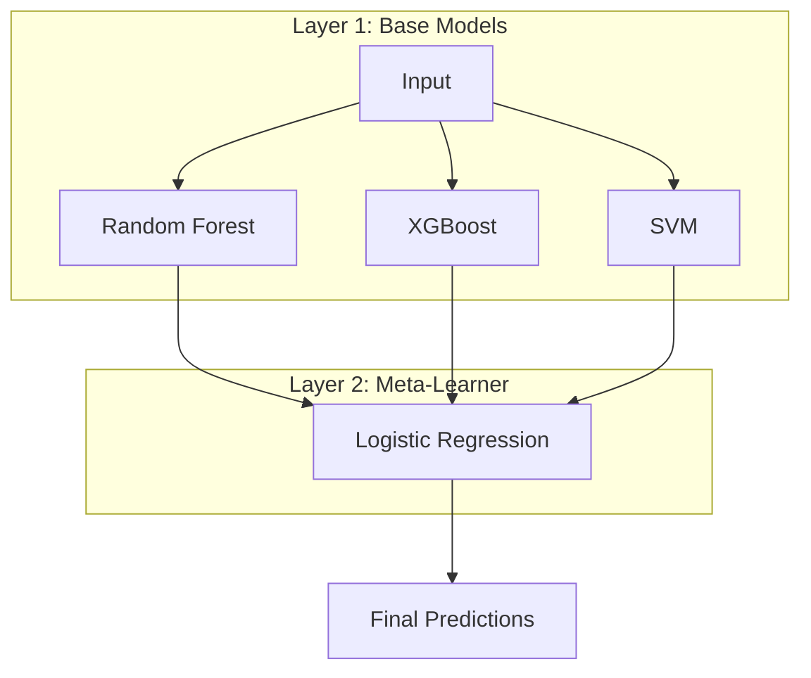

# Model Graphs

For simple stacking, use `stack()` (see [Stacking](stacking.md)). This page covers custom graph architectures -- the low-level building blocks for when you need full control over how models connect.

---

## Concepts

### NodeSpec

A `NodeSpec` represents a single model in the graph:

```python
from sklearn_meta import NodeSpec
from sklearn_meta.search.space import SearchSpace
from sklearn.ensemble import RandomForestClassifier

space = SearchSpace()
space.add_int("n_estimators", 50, 200)

node = NodeSpec(
    name="rf",                              # Unique identifier
    estimator_class=RandomForestClassifier, # sklearn-compatible estimator
    search_space=space,                     # Hyperparameters to tune
    fixed_params={"random_state": 42},      # Fixed parameters
)
```

### GraphSpec

A `GraphSpec` is a DAG of nodes and edges:

```python
from sklearn_meta import GraphSpec

graph = GraphSpec()
graph.add_node(rf_node)
graph.add_node(xgb_node)
```

### Dependencies

Edges are represented by `DependencyEdge` with a `DependencyType` enum:

```python
from sklearn_meta import DependencyEdge, DependencyType

graph.add_edge(
    DependencyEdge(source="rf", target="meta", dep_type=DependencyType.PREDICTION)
)
```

`GraphBuilder` provides shorthand for common edge types (`.stacks()`, `.stacks_proba()`). For the full set of dependency types, see the reference table below.

---

## Graph Architectures

### Single Model

One model with hyperparameter tuning:

```python
from sklearn_meta import GraphBuilder

graph = (
    GraphBuilder("single_model")
    .add_model("rf", RandomForestClassifier)
    .int_param("n_estimators", 50, 200)
    .build()
)
```

### Parallel Ensemble

Multiple independent models (no edges means parallel execution):

```python
graph = (
    GraphBuilder("parallel")
    .add_model("rf", RandomForestClassifier)
    .int_param("n_estimators", 50, 200)
    .add_model("xgb", XGBClassifier)
    .int_param("n_estimators", 50, 200)
    .add_model("lgbm", LGBMClassifier)
    .int_param("n_estimators", 50, 200)
    .build()
)
```

### Two-Level Stacking

Base models feed predictions to a meta-learner:


```mermaid
graph TB
    subgraph "Layer 1: Base Models"
        A[Input] --> B[Random Forest]
        A --> C[XGBoost]
        A --> D[SVM]
    end

    subgraph "Layer 2: Meta-Learner"
        B --> E[Logistic Regression]
        C --> E
        D --> E
    end

    E --> F[Final Predictions]
```

```python
from sklearn_meta import GraphBuilder

graph = (
    GraphBuilder("two_level_stack")
    .add_model("rf", RandomForestClassifier)
    .int_param("n_estimators", 50, 200)
    .add_model("xgb", XGBClassifier)
    .int_param("n_estimators", 50, 200)
    .add_model("svm", SVC)
    .param("C", 0.1, 10.0, log=True)
    .fixed_params(probability=True)
    .add_model("meta", LogisticRegression)
    .stacks_proba("rf", "xgb", "svm")
    .build()
)
```

For deeper stacking (3+ levels) and stacking best practices, see [Stacking](stacking.md).

---

## Dependency Types

All dependency types use `DependencyEdge(source, target, dep_type=DependencyType.X)`.

| Type | What is passed | GraphBuilder shorthand | Typical use case |
|------|---------------|----------------------|-----------------|
| `PREDICTION` | Class labels or regression values | `.stacks("src")` | Standard stacking |
| `PROBA` | Class probabilities | `.stacks_proba("src")` | Classification stacking (preferred) |
| `TRANSFORM` | Transformed feature matrix | `.depends_on("src", dep_type=DependencyType.TRANSFORM)` | PCA, other transformers |
| `FEATURE` | Selected / engineered features | -- | Feature selection steps |
| `BASE_MARGIN` | Raw margins (pre-sigmoid) | -- | Incremental boosting |
| `DISTILL` | Soft targets from a teacher | -- | Knowledge distillation |

---

## Knowledge Distillation

Train a smaller student model using soft targets from a larger teacher model. The student optimizes a blended loss: `alpha * KL_soft + (1 - alpha) * CE_hard`.

```python
from xgboost import XGBClassifier
from sklearn.ensemble import GradientBoostingClassifier
from sklearn_meta import GraphBuilder, RunConfigBuilder, fit

graph = (
    GraphBuilder("distillation")
    # Teacher: large model
    .add_model("teacher", GradientBoostingClassifier)
        .param("n_estimators", 200, 1000)
        .param("learning_rate", 0.01, 0.3, log=True)
        .param("max_depth", 4, 12)
        .output_type("proba")
    # Student: smaller model learns from teacher's soft targets
    .add_model("student", XGBClassifier)
        .param("n_estimators", 10, 100)
        .param("max_depth", 2, 6)
        .distill_from("teacher", temperature=3.0, alpha=0.5)
    .build()
)

config = (
    RunConfigBuilder()
    .cv(n_splits=5)
    .tuning(n_trials=50, metric="neg_log_loss")
    .build()
)

result = fit(graph, X_train, y_train, config)
```

- **temperature** -- Softens the teacher's probability distribution. Higher values produce smoother targets.
- **alpha** -- Blend weight. `1.0` = only soft targets, `0.0` = ignore teacher entirely.

The teacher must be in an earlier layer than the student (i.e., no dependencies flowing from student to teacher).

---

## NodeBuilder Reference

`GraphBuilder.add_model()` returns a `NodeBuilder` with these chainable methods:

### Search space

| Method | Description |
|--------|-------------|
| `.param(name, low, high)` | Numeric range (int if both bounds are ints, float otherwise) |
| `.param(name, low, high, log=True)` | Log-scaled range |
| `.param(name, [choices])` | Categorical parameter |
| `.int_param(name, low, high)` | Integer range (explicit) |
| `.cat_param(name, [choices])` | Categorical (explicit) |
| `.search_space(space)` | Attach a pre-built `SearchSpace` object |
| `.fixed_params(**kwargs)` | Non-tuned parameters passed to the estimator constructor |

### Model behavior

| Method | Description |
|--------|-------------|
| `.fit_params(**kwargs)` | Extra keyword arguments passed to `estimator.fit()` (e.g., `verbose=False`, `eval_set=...`) |
| `.output_type(t)` | Output type: `"prediction"` (default), `"proba"`, or `"transform"` |
| `.feature_cols([cols])` | Restrict this model to a subset of input features |
| `.condition(fn)` | Only include this model if `fn(data)` returns `True` |
| `.plugins("name")` | Attach model-specific plugins (see [Plugins](plugins.md)) |
| `.description("text")` | Optional human-readable description |

### Dependencies

| Method | Description |
|--------|-------------|
| `.stacks("src", ...)` | Use prediction outputs from upstream models as features |
| `.stacks_proba("src", ...)` | Use probability outputs from upstream models as features |
| `.depends_on("src", dep_type=...)` | Generic dependency with explicit `DependencyType` |
| `.distill_from("teacher", temperature=3.0, alpha=0.5)` | Knowledge distillation from a teacher model |

---

## Graph Operations

### Topological Order

Get nodes in execution order (dependencies first):

```python
order = graph.topological_order()
# ['rf', 'xgb', 'svm', 'meta']
```

### Get Layers

Group nodes by depth. Returns `List[List[str]]`:

```python
layers = graph.get_layers()
# [['rf', 'xgb', 'svm'], ['meta']]
```

### Root and Leaf Nodes

```python
roots = graph.get_root_nodes()    # Nodes with no incoming edges
leaves = graph.get_leaf_nodes()   # Nodes with no outgoing edges
```

### Upstream and Downstream

```python
upstream = graph.get_upstream("meta")      # DependencyEdge list: edges into 'meta'
downstream = graph.get_downstream("rf")    # DependencyEdge list: edges from 'rf'
```

### Ancestors and Descendants

```python
ancestors = graph.ancestors("meta")        # All transitive parents
descendants = graph.descendants("rf")      # All transitive children
```

### Validation

```python
warnings = graph.validate()  # Returns list of warnings, raises CycleError on cycles
```

Cycles are detected eagerly -- `add_edge()` raises `CycleError` immediately if the new edge would create a cycle.

---

## Best Practices

1. **Name nodes descriptively.** Use names like `"xgb_base"` or `"lr_meta"`, not `"model1"`. Graph operations return node names, so readability matters.
2. **Keep graphs shallow.** Two layers (base + meta) is the sweet spot. Three layers occasionally helps. Deeper graphs increase training time and overfitting risk with diminishing returns.
3. **Validate before training.** Always call `graph.validate()` before passing a hand-built `GraphSpec` to `fit()`.

---

## Next Steps

- [Stacking](stacking.md) -- `stack()` convenience API and stacking strategies
- [Search Spaces](search-spaces.md) -- Parameter types, conditional params, shorthand notation
- [Cross-Validation](cross-validation.md) -- CV strategies and out-of-fold predictions
- [Tuning](tuning.md) -- Optimization settings for graph hyperparameters
