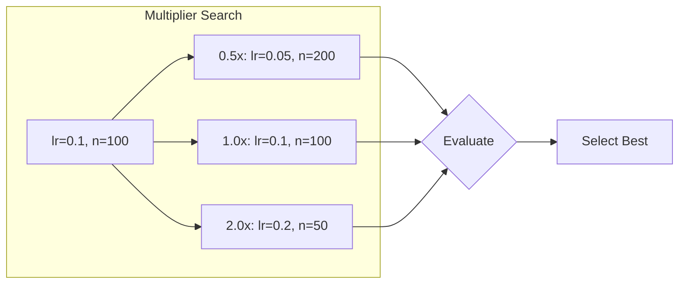

# Plugins

The plugin system extends sklearn-meta with model-specific behavior, custom parameter transformations, and specialized fitting logic. Plugins hook into the model lifecycle without modifying core code.

---

## Plugin Architecture

```mermaid
graph TB
    subgraph "Plugin Lifecycle"
        A[Search Space] --> |modify_search_space| B[Modified Space]
        B --> |modify_params| C[Sampled Params]
        C --> |modify_fit_params| D[Fit Params]
        D --> |on_fold_start| D2[Fold Start Hook]
        D2 --> |pre_fit| E[Pre-fit Hook]
        E --> F[Model.fit]
        F --> |post_fit| G[Post-fit Hook]
        G --> |on_fold_end| G2[Fold End Hook]
        G2 --> |post_tune| H[Final Params]
    end
```



---

## Creating a Plugin

### Basic Plugin

```python
from sklearn_meta.plugins.base import ModelPlugin

class MyPlugin(ModelPlugin):
    """Custom plugin for specific model behavior."""

    @property
    def name(self) -> str:
        return "my_plugin"

    def applies_to(self, estimator_class) -> bool:
        """Return True if this plugin applies to the estimator."""
        return estimator_class.__name__ == "MyCustomModel"

    def modify_params(self, params: dict, node) -> dict:
        """Modify parameters before fitting."""
        modified = params.copy()
        # Your custom logic here
        return modified
```

### Plugin Hooks

| Hook | When Called | Purpose |
|------|-------------|---------|
| `applies_to` | Registration | Check if plugin applies to model |
| `modify_search_space` | Before tuning | Add/modify search parameters |
| `modify_params` | Each trial | Transform sampled parameters |
| `modify_fit_params` | Before fit | Add fit-specific parameters |
| `on_fold_start` | Before each fold | Setup before fold execution |
| `pre_fit` | Before fit | Setup before fitting |
| `post_fit` | After fit | Cleanup after fitting |
| `on_fold_end` | After each fold | Cleanup after fold execution |
| `post_tune` | After all trials | Final parameter selection |

---

## Using Plugins with GraphBuilder

Plugins are referenced by their string name via the GraphBuilder fluent API. The `plugins` field on `ModelNode` is `list[str]`, not a list of `ModelPlugin` instances. Plugin instances are resolved from the registry at runtime.

```python
from sklearn_meta import GraphBuilder
from xgboost import XGBClassifier

fitted = (
    GraphBuilder("my_pipeline")
    .add_model("xgb", XGBClassifier)
    .with_plugins("xgboost")
    .with_search_space(
        learning_rate=(0.01, 0.3, "log"),
        max_depth=(3, 10),
        n_estimators=(50, 300),
    )
    .with_cv(n_splits=5, strategy="stratified")
    .with_tuning(n_trials=50, metric="roc_auc", greater_is_better=True)
    .fit(X_train, y_train)
)
```

---

## Built-in Plugins

### XGBMultiplierPlugin

Optimizes learning rate / n_estimators trade-off after tuning:

```python
from sklearn_meta.plugins.xgboost.multiplier import XGBMultiplierPlugin

plugin = XGBMultiplierPlugin(
    multipliers=[0.5, 1.0, 2.0],  # Test these multipliers
    cv_folds=3,                   # CV for evaluation
    enable_post_tune=True,        # Enable post-tuning optimization
)
```

**How it works:**
1. After tuning, test different learning_rate x n_estimators combinations
2. Multiplier 0.5: halve learning_rate, double n_estimators
3. Multiplier 2.0: double learning_rate, halve n_estimators
4. Select best performing combination



### XGBImportancePlugin

Extracts feature importance from XGBoost models:

```python
from sklearn_meta.plugins.xgboost.importance import XGBImportancePlugin

plugin = XGBImportancePlugin(importance_type="gain")
```

**Importance types:**
- `"gain"`: Average gain from splits using feature
- `"weight"`: Number of times feature is used
- `"cover"`: Average coverage of splits using feature

---

## Plugin Registry

### Registering Plugins

```python
from sklearn_meta.plugins.registry import PluginRegistry

registry = PluginRegistry()

# Register single plugin
registry.register(MyPlugin())

# Register with priority (lower index = runs first, -1 = append to end)
registry.register(CriticalPlugin(), priority=0)    # Runs first (inserted at position 0)
registry.register(OptionalPlugin())                # Runs last (appended to end)
```

### Getting Applicable Plugins

```python
from xgboost import XGBClassifier

# Get plugins that apply to XGBoost
plugins = registry.get_plugins_for(XGBClassifier)

for plugin in plugins:
    print(f"Plugin: {plugin.name}")
```

### Global Registry

```python
from sklearn_meta.plugins.registry import get_default_registry

registry = get_default_registry()
registry.register(MyPlugin())
```

---

## Composite Plugins

Combine multiple plugins:

```python
from sklearn_meta.plugins.base import CompositePlugin

composite = CompositePlugin([
    XGBMultiplierPlugin(),
    XGBImportancePlugin(),
    MyCustomPlugin(),
])

# All plugins execute in order
composite.modify_params(params, node)
```

---

## Example: Custom Early Stopping Plugin

```python
from sklearn_meta.plugins.base import ModelPlugin
import numpy as np

class EarlyStoppingPlugin(ModelPlugin):
    """Adds early stopping to compatible models."""

    def __init__(self, patience: int = 10, validation_fraction: float = 0.1):
        self.patience = patience
        self.validation_fraction = validation_fraction

    @property
    def name(self) -> str:
        return "early_stopping"

    def applies_to(self, estimator_class) -> bool:
        """Apply to models that support early stopping."""
        supported = ["XGBClassifier", "XGBRegressor", "LGBMClassifier", "LGBMRegressor"]
        return estimator_class.__name__ in supported

    def modify_fit_params(self, params: dict, context) -> dict:
        """Add early stopping parameters to fit kwargs."""
        modified = params.copy()

        # Create validation set from the context
        n_samples = context.n_samples
        n_val = int(n_samples * self.validation_fraction)
        indices = np.random.permutation(n_samples)

        val_indices = indices[:n_val]

        modified["eval_set"] = [(context.X.iloc[val_indices], context.y.iloc[val_indices])]
        modified["early_stopping_rounds"] = self.patience
        modified["verbose"] = False

        return modified
```

Note: `DataContext` is immutable. Plugin hooks that receive a context should not attempt to mutate its attributes directly. Instead, return modified parameters or use the `with_*` methods on DataContext to create new instances when needed.

---

## Example: Parameter Constraint Plugin

```python
class ParameterConstraintPlugin(ModelPlugin):
    """Enforces parameter constraints."""

    def __init__(self, constraints: dict):
        """
        Args:
            constraints: Dict of {param: (min, max)} bounds
        """
        self.constraints = constraints

    @property
    def name(self) -> str:
        return "param_constraints"

    def applies_to(self, estimator_class) -> bool:
        return True  # Apply to all models

    def modify_params(self, params: dict, node) -> dict:
        """Clip parameters to constraints."""
        modified = params.copy()

        for param, (min_val, max_val) in self.constraints.items():
            if param in modified:
                modified[param] = max(min_val, min(max_val, modified[param]))

        return modified
```

Usage:
```python
plugin = ParameterConstraintPlugin({
    "max_depth": (1, 20),
    "n_estimators": (10, 1000),
})

registry.register(plugin)
```

---

## Example: Logging Plugin

```python
import logging
from datetime import datetime

class LoggingPlugin(ModelPlugin):
    """Logs model training events."""

    def __init__(self, logger=None):
        self.logger = logger or logging.getLogger(__name__)

    @property
    def name(self) -> str:
        return "logging"

    def applies_to(self, estimator_class) -> bool:
        return True

    def on_fold_start(self, fold_idx, node, ctx) -> None:
        self.logger.info(f"Starting fold {fold_idx} for {node.name}")

    def pre_fit(self, model, node, ctx) -> Any:
        self.start_time = datetime.now()
        self.logger.info(f"Starting fit: {model.__class__.__name__}")
        self.logger.info(f"Data shape: {ctx.X.shape}")
        return model

    def post_fit(self, model, node, ctx) -> Any:
        duration = datetime.now() - self.start_time
        self.logger.info(f"Fit completed in {duration.total_seconds():.2f}s")
        return model

    def on_fold_end(self, fold_idx, model, score, node) -> None:
        self.logger.info(f"Finished fold {fold_idx} for {node.name} (score: {score:.4f})")

    def post_tune(self, best_params, node, ctx) -> dict:
        self.logger.info(f"Best params for {node.name}: {best_params}")
        return best_params
```

---

## Complete Example

```python
from sklearn.datasets import make_classification
import pandas as pd
import xgboost as xgb

from sklearn_meta import GraphBuilder
from sklearn_meta.core.data.context import DataContext
from sklearn_meta.core.data.cv import CVConfig, CVStrategy
from sklearn_meta.core.data.manager import DataManager
from sklearn_meta.core.model.graph import ModelGraph
from sklearn_meta.core.tuning.orchestrator import TuningConfig, TuningOrchestrator
from sklearn_meta.core.tuning.strategy import OptimizationStrategy
from sklearn_meta.search.space import SearchSpace
from sklearn_meta.search.backends.optuna import OptunaBackend
from sklearn_meta.plugins.xgboost.multiplier import XGBMultiplierPlugin
from sklearn_meta.plugins.registry import get_default_registry

# Register plugin globally
registry = get_default_registry()
registry.register(XGBMultiplierPlugin(
    multipliers=[0.5, 1.0, 2.0],
    enable_post_tune=True,
))

# --- Using GraphBuilder (recommended) ---

X, y = make_classification(n_samples=1000, n_features=20, random_state=42)
X_df = pd.DataFrame(X, columns=[f"f{i}" for i in range(20)])
y_s = pd.Series(y)

fitted = (
    GraphBuilder("xgb_pipeline")
    .add_model("xgb", xgb.XGBClassifier)
    .with_plugins("xgboost")
    .with_search_space(
        learning_rate=(0.01, 0.3, "log"),
        n_estimators=(50, 300),
        max_depth=(3, 10),
    )
    .with_fixed_params(random_state=42, eval_metric="logloss")
    .with_cv(n_splits=5, strategy="stratified")
    .with_tuning(
        n_trials=20,
        metric="roc_auc",
        greater_is_better=True,
    )
    .fit(X_df, y_s)
)

print(f"Best params: {fitted.get_node('xgb').best_params}")
print(f"Mean score: {fitted.get_node('xgb').mean_score}")

# --- Using low-level API ---

ctx = DataContext.from_Xy(X=X_df, y=y_s)

space = (
    SearchSpace()
    .add_float("learning_rate", 0.01, 0.3, log=True)
    .add_int("n_estimators", 50, 300)
    .add_int("max_depth", 3, 10)
)

from sklearn_meta.core.model.node import ModelNode
node = ModelNode(
    name="xgb",
    estimator_class=xgb.XGBClassifier,
    search_space=space,
    fixed_params={"random_state": 42, "eval_metric": "logloss"},
    plugins=["xgboost"],  # Plugin names as strings
)

graph = ModelGraph()
graph.add_node(node)

cv_config = CVConfig(n_splits=5, strategy=CVStrategy.STRATIFIED)
tuning_config = TuningConfig(
    strategy=OptimizationStrategy.LAYER_BY_LAYER,
    n_trials=20,
    cv_config=cv_config,
    metric="roc_auc",
    greater_is_better=True,  # Note: must be set explicitly for maximization
)

search_backend = OptunaBackend(direction="maximize", random_state=42)
data_manager = DataManager(cv_config)
orchestrator = TuningOrchestrator(graph, data_manager, search_backend, tuning_config)

print("Tuning with XGBMultiplierPlugin...")
fitted = orchestrator.fit(ctx)

print(f"Best params: {fitted.get_node('xgb').best_params}")
print(f"Mean score: {fitted.get_node('xgb').mean_score}")
```

---

## Best Practices

### 1. Keep Plugins Focused

```python
# Good: Single responsibility
class EarlyStoppingPlugin(ModelPlugin): ...
class ImportancePlugin(ModelPlugin): ...

# Avoid: Kitchen sink plugin
class DoEverythingPlugin(ModelPlugin): ...
```

### 2. Don't Mutate Inputs

DataContext is immutable. Never attempt to set attributes on it directly.

```python
def modify_params(self, params, node):
    # Good: Copy first
    modified = params.copy()
    modified["new_param"] = value
    return modified

    # Bad: Mutate in place
    params["new_param"] = value  # Don't do this!
    return params

def modify_fit_params(self, params, ctx):
    # Good: Read from context, return modified params dict
    modified = params.copy()
    modified["eval_set"] = [(ctx.X.iloc[:10], ctx.y.iloc[:10])]
    return modified

    # Bad: Try to mutate context
    ctx.X = ctx.X.iloc[10:]  # DataContext is frozen!
```

### 3. Use Priority Wisely

```python
# Critical setup (e.g., data validation): priority=0 (runs first)
# Parameter modification: default priority (appended)
# Logging/monitoring: default priority (appended after others)
```

### 4. Handle Missing Models Gracefully

```python
def applies_to(self, estimator_class):
    try:
        return estimator_class.__name__.startswith("XGB")
    except Exception:
        return False
```

---

## Plugin Execution Order

Plugins execute in registration order. Use the `priority` parameter to control insertion position (lower index = earlier in the list):

```python
registry.register(DefaultPlugin())                  # Appended to end
registry.register(CriticalPlugin(), priority=0)      # Inserted at position 0 (runs first)
registry.register(ImportantPlugin(), priority=1)     # Inserted at position 1 (runs second)
```

The default `priority=-1` appends to the end of the plugin order.

---

## Next Steps

- [Model Graphs](model-graphs.md) -- Integrate plugins with nodes
- [Tuning](tuning.md) -- Plugin hooks during optimization
- [Feature Selection](feature-selection.md) -- XGBoost importance extraction
