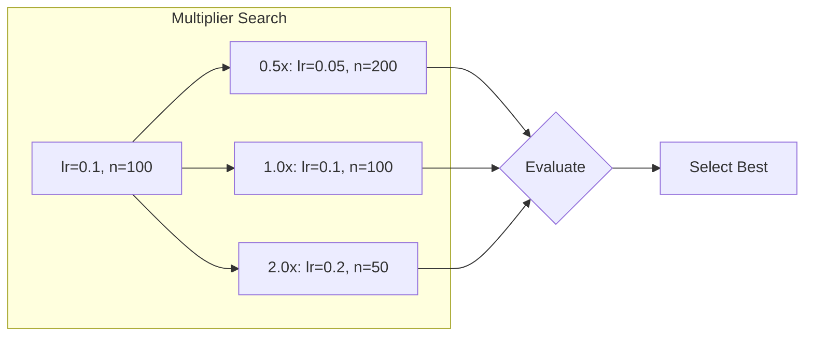

# Plugins

The plugin system extends sklearn-meta with model-specific behavior, custom parameter transformations, and specialized fitting logic. Plugins hook into the model lifecycle without modifying core code.

---

## Plugin Architecture


```mermaid
graph TB
    subgraph "Plugin Lifecycle"
        A[Search Space] --> |modify_search_space| B[Modified Space]
        B --> |modify_params| C[Sampled Params]
        C --> |modify_fit_params| D[Fit Params]
        D --> |on_fold_start| D2[Fold Start Hook]
        D2 --> |pre_fit| E[Pre-fit Hook]
        E --> F[Model.fit]
        F --> |post_fit| G[Post-fit Hook]
        G --> |on_fold_end| G2[Fold End Hook]
        G2 --> |post_tune| H[Final Params]
    end
```

---

## Creating a Plugin

### Basic Plugin

```python
from sklearn_meta.plugins.base import ModelPlugin

class MyPlugin(ModelPlugin):
    """Custom plugin for specific model behavior."""

    @property
    def name(self) -> str:
        return "my_plugin"

    def applies_to(self, estimator_class) -> bool:
        """Return True if this plugin applies to the estimator."""
        return estimator_class.__name__ == "MyCustomModel"

    def modify_params(self, params: dict, node) -> dict:
        """Modify parameters before fitting."""
        modified = params.copy()
        # Your custom logic here
        return modified
```

### Plugin Hooks

Fit-time hooks (`modify_fit_params`, `pre_fit`, `post_fit`) receive a `MaterializedBatch` -- the concrete, resolved data for the current fold. Tuning-time and fold-level hooks (`post_tune`, `on_fold_start`) receive a `DataView` -- the lazy, declarative view over the full dataset.

| Hook | Signature | When Called | Purpose |
|------|-----------|-------------|---------|
| `applies_to` | `(estimator_class)` | Registration | Check if plugin applies to model |
| `modify_search_space` | `(space, node)` | Before tuning | Add/modify search parameters |
| `modify_params` | `(params, node)` | Each trial | Transform sampled parameters |
| `modify_fit_params` | `(params, batch)` | Before fit | Add fit-specific parameters (`batch` is `MaterializedBatch`) |
| `on_fold_start` | `(fold_idx, node, data)` | Before each fold | Setup before fold execution (`data` is `DataView`) |
| `pre_fit` | `(model, node, batch)` | Before fit | Setup before fitting (`batch` is `MaterializedBatch`) |
| `post_fit` | `(model, node, batch)` | After fit | Cleanup after fitting (`batch` is `MaterializedBatch`) |
| `on_fold_end` | `(fold_idx, model, score, node)` | After each fold | Cleanup after fold execution |
| `post_tune` | `(best_params, node, data)` | After all trials | Final parameter selection (`data` is `DataView`) |

---

## Using Plugins with GraphBuilder

Plugins are referenced by their string name via the GraphBuilder fluent API. The `plugins` field on `NodeSpec` is `list[str]`, not a list of `ModelPlugin` instances. Plugin instances are resolved from the `PluginRegistry` at runtime via `RuntimeServices`.

```python
from sklearn_meta import (
    GraphBuilder, RunConfigBuilder, RuntimeServices, GraphRunner, DataView, OptunaBackend,
)
from sklearn_meta.plugins.registry import get_default_registry
from xgboost import XGBClassifier

# Build the graph spec
graph = (
    GraphBuilder("my_pipeline")
    .add_model("xgb", XGBClassifier)
        .plugins("xgboost")
        .param("learning_rate", 0.01, 0.3, log=True)
        .int_param("max_depth", 3, 10)
        .int_param("n_estimators", 50, 300)
    .compile()
)

# Configure and run
config = (
    RunConfigBuilder()
    .cv(n_splits=5, strategy="stratified")
    .tuning(n_trials=50, metric="roc_auc", greater_is_better=True)
    .build()
)

data = DataView.from_Xy(X=X_train, y=y_train)
registry = get_default_registry()
services = RuntimeServices(
    search_backend=OptunaBackend(direction="maximize"),
    plugin_registry=registry,
)
training_run = GraphRunner(services).fit(graph, data, config)
```

---

## Built-in Plugins

### XGBMultiplierPlugin

Optimizes learning rate / n_estimators trade-off after tuning:

```python
from sklearn_meta.plugins.xgboost.multiplier import XGBMultiplierPlugin

plugin = XGBMultiplierPlugin(
    multipliers=[0.5, 1.0, 2.0],  # Test these multipliers
    cv_folds=3,                   # CV for evaluation
    enable_post_tune=True,        # Enable post-tuning optimization
)
```

**How it works:**
1. After tuning, test different learning_rate x n_estimators combinations
2. Multiplier 0.5: halve learning_rate, double n_estimators
3. Multiplier 2.0: double learning_rate, halve n_estimators
4. Select best performing combination


```mermaid
graph LR
    subgraph "Multiplier Search"
        A[lr=0.1, n=100] --> B[0.5x: lr=0.05, n=200]
        A --> C[1.0x: lr=0.1, n=100]
        A --> D[2.0x: lr=0.2, n=50]
    end

    B --> E{Evaluate}
    C --> E
    D --> E
    E --> F[Select Best]
```

### XGBImportancePlugin

Extracts feature importance from XGBoost models:

```python
from sklearn_meta.plugins.xgboost.importance import XGBImportancePlugin

plugin = XGBImportancePlugin(importance_type="total_gain")
```

**Importance types:**
- `"total_gain"`: Total gain from splits using feature **(default)**
- `"gain"`: Average gain from splits using feature
- `"weight"`: Number of times feature is used
- `"cover"`: Average coverage of splits using feature

### OrderSearchPlugin (Joint Quantile)

Searches for the optimal property ordering in joint quantile regression via local swap search with random restarts:

```python
from sklearn_meta.plugins.joint_quantile.order_search import (
    OrderSearchPlugin, OrderSearchConfig
)

search_config = OrderSearchConfig(
    max_iterations=20,      # Max iterations per local search
    n_random_restarts=3,    # Random restarts to escape local optima
    verbose=1,
)

plugin = OrderSearchPlugin(config=search_config)
result = plugin.search_order(
    graph=joint_quantile_graph,
    data=data,
    targets=targets,
    runner=runner,
)

print(f"Best order: {result.best_order}")
print(f"Best score: {result.best_score}")
```

The plugin evaluates all valid adjacent swaps at each iteration, accepts the best improvement, and repeats until no swap improves the score. Random restarts help avoid local optima. See [Joint Quantile Regression](joint-quantile-regression.md) for full details.

---

## Plugin Registry

### Registering Plugins

```python
from sklearn_meta.plugins.registry import PluginRegistry

registry = PluginRegistry()

# Register single plugin
registry.register(MyPlugin())

# Register with priority (lower index = runs first, -1 = append to end)
registry.register(CriticalPlugin(), priority=0)    # Runs first (inserted at position 0)
registry.register(OptionalPlugin())                # Runs last (appended to end)
```

### Getting Applicable Plugins

```python
from xgboost import XGBClassifier

# Get plugins that apply to XGBoost
plugins = registry.get_plugins_for(XGBClassifier)

for plugin in plugins:
    print(f"Plugin: {plugin.name}")
```

### Global Registry

```python
from sklearn_meta.plugins.registry import get_default_registry

registry = get_default_registry()
registry.register(MyPlugin())
```

Note: When `xgboost` is installed, `XGBMultiplierPlugin` and `XGBImportancePlugin` are automatically registered in the global registry. Calling `register()` with the same plugin name again will raise a `ValueError`. Use `registry.unregister("xgb_multiplier")` first if you need to replace the default instance.

### Wiring the Registry into RuntimeServices

The plugin registry is passed to `RuntimeServices`, which makes it available during the training run:

```python
from sklearn_meta import RuntimeServices, OptunaBackend

services = RuntimeServices(
    search_backend=OptunaBackend(direction="maximize"),
    plugin_registry=registry,
)
```

---

## Composite Plugins

Combine multiple plugins:

```python
from sklearn_meta.plugins.base import CompositePlugin

composite = CompositePlugin([
    XGBMultiplierPlugin(),
    XGBImportancePlugin(),
    MyCustomPlugin(),
])

# All plugins execute in order
composite.modify_params(params, node)
```

---

## Example: Custom Early Stopping Plugin

```python
from sklearn_meta.plugins.base import ModelPlugin
from sklearn_meta.data.batch import MaterializedBatch
import numpy as np

class EarlyStoppingPlugin(ModelPlugin):
    """Adds early stopping to compatible models."""

    def __init__(self, patience: int = 10, validation_fraction: float = 0.1):
        self.patience = patience
        self.validation_fraction = validation_fraction

    @property
    def name(self) -> str:
        return "early_stopping"

    def applies_to(self, estimator_class) -> bool:
        """Apply to models that support early stopping."""
        supported = ["XGBClassifier", "XGBRegressor", "LGBMClassifier", "LGBMRegressor"]
        return estimator_class.__name__ in supported

    def modify_fit_params(self, params: dict, batch: MaterializedBatch) -> dict:
        """Add early stopping parameters to fit kwargs."""
        modified = params.copy()

        # Create validation set from the materialized batch
        n_samples = batch.n_samples
        n_val = int(n_samples * self.validation_fraction)
        indices = np.random.permutation(n_samples)

        val_indices = indices[:n_val]

        modified["eval_set"] = [(batch.X.iloc[val_indices], batch.y[val_indices])]
        modified["early_stopping_rounds"] = self.patience
        modified["verbose"] = False

        return modified
```

Note: `MaterializedBatch` contains the resolved data for the current fold. Access features via `batch.X`, the default target via `batch.y`, and auxiliary channels via `batch.aux`. `DataView` is immutable -- plugin hooks that receive a `DataView` should not attempt to mutate its attributes directly.

---

## Example: Parameter Constraint Plugin

```python
class ParameterConstraintPlugin(ModelPlugin):
    """Enforces parameter constraints."""

    def __init__(self, constraints: dict):
        """
        Args:
            constraints: Dict of {param: (min, max)} bounds
        """
        self.constraints = constraints

    @property
    def name(self) -> str:
        return "param_constraints"

    def applies_to(self, estimator_class) -> bool:
        return True  # Apply to all models

    def modify_params(self, params: dict, node) -> dict:
        """Clip parameters to constraints."""
        modified = params.copy()

        for param, (min_val, max_val) in self.constraints.items():
            if param in modified:
                modified[param] = max(min_val, min(max_val, modified[param]))

        return modified
```

Usage:
```python
plugin = ParameterConstraintPlugin({
    "max_depth": (1, 20),
    "n_estimators": (10, 1000),
})

registry.register(plugin)
```

---

## Example: Logging Plugin

```python
import logging
from datetime import datetime
from sklearn_meta.plugins.base import ModelPlugin
from sklearn_meta.data.view import DataView
from sklearn_meta.data.batch import MaterializedBatch

class LoggingPlugin(ModelPlugin):
    """Logs model training events."""

    def __init__(self, logger=None):
        self.logger = logger or logging.getLogger(__name__)

    @property
    def name(self) -> str:
        return "logging"

    def applies_to(self, estimator_class) -> bool:
        return True

    def on_fold_start(self, fold_idx, node, data: DataView) -> None:
        self.logger.info(f"Starting fold {fold_idx} for {node.name}")

    def pre_fit(self, model, node, batch: MaterializedBatch):
        self.start_time = datetime.now()
        self.logger.info(f"Starting fit: {model.__class__.__name__}")
        self.logger.info(f"Data shape: {batch.X.shape}")
        return model

    def post_fit(self, model, node, batch: MaterializedBatch):
        duration = datetime.now() - self.start_time
        self.logger.info(f"Fit completed in {duration.total_seconds():.2f}s")
        return model

    def on_fold_end(self, fold_idx, model, score, node) -> None:
        self.logger.info(f"Finished fold {fold_idx} for {node.name} (score: {score:.4f})")

    def post_tune(self, best_params, node, data: DataView) -> dict:
        self.logger.info(f"Best params for {node.name}: {best_params}")
        return best_params
```

---

## Complete Example

```python
from sklearn.datasets import make_classification
import pandas as pd
import xgboost as xgb

from sklearn_meta import (
    GraphBuilder, RunConfigBuilder, RuntimeServices, GraphRunner,
    DataView, OptunaBackend,
)
from sklearn_meta.plugins.xgboost.multiplier import XGBMultiplierPlugin
from sklearn_meta.plugins.registry import get_default_registry

# Replace the auto-registered default with a custom configuration
registry = get_default_registry()
registry.unregister("xgb_multiplier")
registry.register(XGBMultiplierPlugin(
    multipliers=[0.5, 1.0, 2.0],
    enable_post_tune=True,
))

# --- Using GraphBuilder (recommended) ---

X, y = make_classification(n_samples=1000, n_features=20, random_state=42)
X_df = pd.DataFrame(X, columns=[f"f{i}" for i in range(20)])
y_s = pd.Series(y)

graph = (
    GraphBuilder("xgb_pipeline")
    .add_model("xgb", xgb.XGBClassifier)
        .plugins("xgboost")
        .param("learning_rate", 0.01, 0.3, log=True)
        .int_param("n_estimators", 50, 300)
        .int_param("max_depth", 3, 10)
        .fixed_params(random_state=42, eval_metric="logloss")
    .compile()
)

config = (
    RunConfigBuilder()
    .cv(n_splits=5, strategy="stratified")
    .tuning(n_trials=20, metric="roc_auc", greater_is_better=True)
    .build()
)

data = DataView.from_Xy(X=X_df, y=y_s)
services = RuntimeServices(
    search_backend=OptunaBackend(direction="maximize"),
    plugin_registry=registry,
)

training_run = GraphRunner(services).fit(graph, data, config)

xgb_result = training_run.node_results["xgb"]
print(f"Best params: {xgb_result.best_params}")
print(f"Mean score: {xgb_result.mean_score}")

# --- Using low-level API ---

from sklearn_meta import NodeSpec, GraphSpec, RunConfig, CVConfig, CVStrategy, TuningConfig
from sklearn_meta.search.space import SearchSpace

space = (
    SearchSpace()
    .add_float("learning_rate", 0.01, 0.3, log=True)
    .add_int("n_estimators", 50, 300)
    .add_int("max_depth", 3, 10)
)

node = NodeSpec(
    name="xgb",
    estimator_class=xgb.XGBClassifier,
    search_space=space,
    fixed_params={"random_state": 42, "eval_metric": "logloss"},
    plugins=["xgboost"],  # Plugin names as strings
)

graph = GraphSpec()
graph.add_node(node)

config = RunConfig(
    cv=CVConfig(n_splits=5, strategy=CVStrategy.STRATIFIED),
    tuning=TuningConfig(
        n_trials=20,
        metric="roc_auc",
        greater_is_better=True,
    ),
)

data = DataView.from_Xy(X=X_df, y=y_s)
services = RuntimeServices(
    search_backend=OptunaBackend(direction="maximize"),
    plugin_registry=registry,
)

print("Tuning with XGBMultiplierPlugin...")
training_run = GraphRunner(services).fit(graph, data, config)

xgb_result = training_run.node_results["xgb"]
print(f"Best params: {xgb_result.best_params}")
print(f"Mean score: {xgb_result.mean_score}")
```

---

## Best Practices

### 1. Keep Plugins Focused

```python
# Good: Single responsibility
class EarlyStoppingPlugin(ModelPlugin): ...
class ImportancePlugin(ModelPlugin): ...

# Avoid: Kitchen sink plugin
class DoEverythingPlugin(ModelPlugin): ...
```

### 2. Don't Mutate Inputs

`DataView` is immutable (frozen dataclass). `MaterializedBatch` contains the resolved data for the current fold. Never attempt to set attributes on a `DataView` directly.

```python
def modify_params(self, params, node):
    # Good: Copy first
    modified = params.copy()
    modified["new_param"] = value
    return modified

    # Bad: Mutate in place
    params["new_param"] = value  # Don't do this!
    return params

def modify_fit_params(self, params, batch: MaterializedBatch):
    # Good: Read from batch, return modified params dict
    modified = params.copy()
    modified["eval_set"] = [(batch.X.iloc[:10], batch.y[:10])]
    return modified
```

### 3. Use Priority Wisely

```python
# Critical setup (e.g., data validation): priority=0 (runs first)
# Parameter modification: default priority (appended)
# Logging/monitoring: default priority (appended after others)
```

### 4. Handle Missing Models Gracefully

```python
def applies_to(self, estimator_class):
    try:
        return estimator_class.__name__.startswith("XGB")
    except Exception:
        return False
```

---

## Plugin Execution Order

Plugins execute in registration order. Use the `priority` parameter to control insertion position (lower index = earlier in the list):

```python
registry.register(DefaultPlugin())                  # Appended to end
registry.register(CriticalPlugin(), priority=0)      # Inserted at position 0 (runs first)
registry.register(ImportantPlugin(), priority=1)     # Inserted at position 1 (runs second)
```

The default `priority=-1` appends to the end of the plugin order.

---

## Next Steps

- [Model Graphs](model-graphs.md) -- Integrate plugins with nodes
- [Tuning](tuning.md) -- Plugin hooks during optimization
- [Feature Selection](feature-selection.md) -- XGBoost importance extraction
