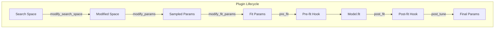

# Plugins

The plugin system extends sklearn-meta with model-specific behavior. Plugins hook into the training lifecycle without modifying core code.

---

## Plugin Lifecycle


```mermaid
graph TB
    subgraph "Plugin Lifecycle"
        A[Search Space] --> |modify_search_space| B[Modified Space]
        B --> |modify_params| C[Sampled Params]
        C --> |modify_fit_params| D[Fit Params]
        D --> |pre_fit| E[Pre-fit Hook]
        E --> F[Model.fit]
        F --> |post_fit| G[Post-fit Hook]
        G --> |post_tune| H[Final Params]
    end
```

### Hooks

| Hook | When | Purpose |
|------|------|---------|
| `applies_to(estimator_class)` | Registration | Check if plugin applies to model |
| `modify_search_space(space, node)` | Before tuning | Add/modify search parameters |
| `modify_params(params, node)` | Each trial | Transform sampled parameters |
| `modify_fit_params(params, batch)` | Before fit | Add fit-specific parameters |
| `on_fold_start(fold_idx, node, data)` | Before each fold | Setup before fold |
| `pre_fit(model, node, batch)` | Before fit | Setup before fitting |
| `post_fit(model, node, batch)` | After fit | Cleanup after fitting |
| `on_fold_end(fold_idx, model, score, node)` | After each fold | Cleanup after fold |
| `post_tune(best_params, node, data)` | After all trials | Final parameter selection |

Fit-time hooks (`modify_fit_params`, `pre_fit`, `post_fit`) receive a `MaterializedBatch` (the resolved data for the current fold). Tuning-time hooks receive a `DataView`.

---

## Using Plugins with GraphBuilder

Plugins are referenced by name via `.plugins()`. Instances are resolved from the `PluginRegistry` at runtime:

```python
from sklearn_meta import GraphBuilder, RunConfigBuilder, RuntimeServices, GraphRunner, DataView, OptunaBackend
from sklearn_meta.plugins.registry import get_default_registry
from xgboost import XGBClassifier

graph = (
    GraphBuilder("my_pipeline")
    .add_model("xgb", XGBClassifier)
        .plugins("xgboost")
        .param("learning_rate", 0.01, 0.3, log=True)
        .int_param("max_depth", 3, 10)
    .build()
)

config = (
    RunConfigBuilder()
    .cv(n_splits=5, strategy="stratified")
    .tuning(n_trials=50, metric="roc_auc")
    .build()
)

data = DataView.from_Xy(X=X_train, y=y_train)
registry = get_default_registry()
services = RuntimeServices(
    search_backend=OptunaBackend(direction="maximize"),
    plugin_registry=registry,
)
result = GraphRunner(services).fit(graph, data, config)
```

---

## Built-in Plugins

### XGBMultiplierPlugin

Optimizes the learning rate / n_estimators trade-off after tuning. Tests different multipliers (e.g., halve learning rate and double estimators) and picks the best combination.

```python
from sklearn_meta.plugins.xgboost.multiplier import XGBMultiplierPlugin

plugin = XGBMultiplierPlugin(
    multipliers=[0.5, 1.0, 2.0],
    enable_post_tune=True,
)
```

### XGBImportancePlugin

Extracts feature importance from XGBoost models. Supports `"total_gain"` (default), `"gain"`, `"weight"`, and `"cover"`.

```python
from sklearn_meta.plugins.xgboost.importance import XGBImportancePlugin
plugin = XGBImportancePlugin(importance_type="total_gain")
```

### OrderSearchPlugin (Joint Quantile)

Searches for optimal property ordering in joint quantile regression via local swap search with random restarts. See [Joint Quantile Regression](joint-quantile-regression.md) for details.

When `xgboost` is installed, `XGBMultiplierPlugin` and `XGBImportancePlugin` are automatically registered in the global registry.

---

## Creating a Custom Plugin

```python
from sklearn_meta.plugins.base import ModelPlugin

class MyPlugin(ModelPlugin):
    @property
    def name(self) -> str:
        return "my_plugin"

    def applies_to(self, estimator_class) -> bool:
        return estimator_class.__name__ == "MyModel"

    def modify_params(self, params: dict, node) -> dict:
        modified = params.copy()
        # your logic here
        return modified
```

### Example: Early Stopping Plugin

```python
from sklearn_meta.plugins.base import ModelPlugin
from sklearn_meta.data.batch import MaterializedBatch
import numpy as np

class EarlyStoppingPlugin(ModelPlugin):
    def __init__(self, patience: int = 10, validation_fraction: float = 0.1):
        self.patience = patience
        self.validation_fraction = validation_fraction

    @property
    def name(self) -> str:
        return "early_stopping"

    def applies_to(self, estimator_class) -> bool:
        return estimator_class.__name__ in [
            "XGBClassifier", "XGBRegressor", "LGBMClassifier", "LGBMRegressor"
        ]

    def modify_fit_params(self, params: dict, batch: MaterializedBatch) -> dict:
        modified = params.copy()
        n_val = int(batch.n_samples * self.validation_fraction)
        indices = np.random.permutation(batch.n_samples)
        val_idx = indices[:n_val]
        modified["eval_set"] = [(batch.X.iloc[val_idx], batch.y[val_idx])]
        modified["early_stopping_rounds"] = self.patience
        modified["verbose"] = False
        return modified
```

---

## Plugin Registry

```python
from sklearn_meta.plugins.registry import PluginRegistry, get_default_registry

# Use the global registry (auto-registers XGBoost plugins when xgboost is installed)
registry = get_default_registry()

# Register a custom plugin
registry.register(MyPlugin())

# Control execution order with priority (lower index = runs first)
registry.register(CriticalPlugin(), priority=0)

# Wire into RuntimeServices
from sklearn_meta import RuntimeServices, OptunaBackend
services = RuntimeServices(
    search_backend=OptunaBackend(direction="maximize"),
    plugin_registry=registry,
)
```

To replace an auto-registered plugin, unregister it first:

```python
registry.unregister("xgb_multiplier")
registry.register(XGBMultiplierPlugin(multipliers=[0.5, 1.0, 2.0]))
```

---

## Best Practices

1. **Keep plugins focused** -- One plugin per concern (early stopping, importance extraction, etc.).
2. **Don't mutate inputs** -- Always copy `params` before modifying. `DataView` is immutable.
3. **Use `applies_to` narrowly** -- Only match the specific estimator classes your plugin supports.

---

## Next Steps

- [Model Graphs](model-graphs.md) -- Attach plugins to graph nodes
- [Tuning](tuning.md) -- Plugin hooks during optimization
- [API Reference](api-reference.md) -- Full plugin API
