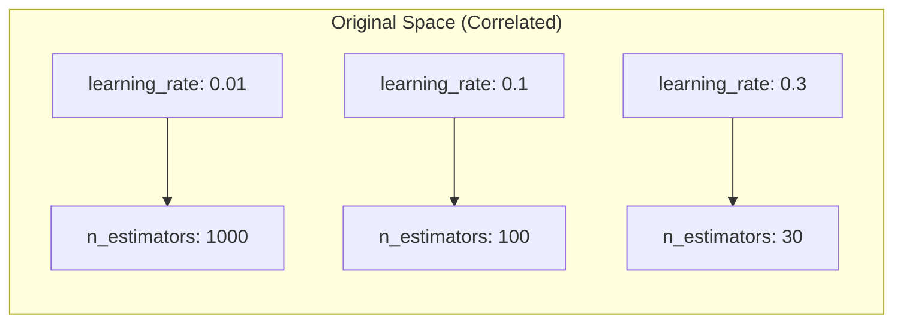
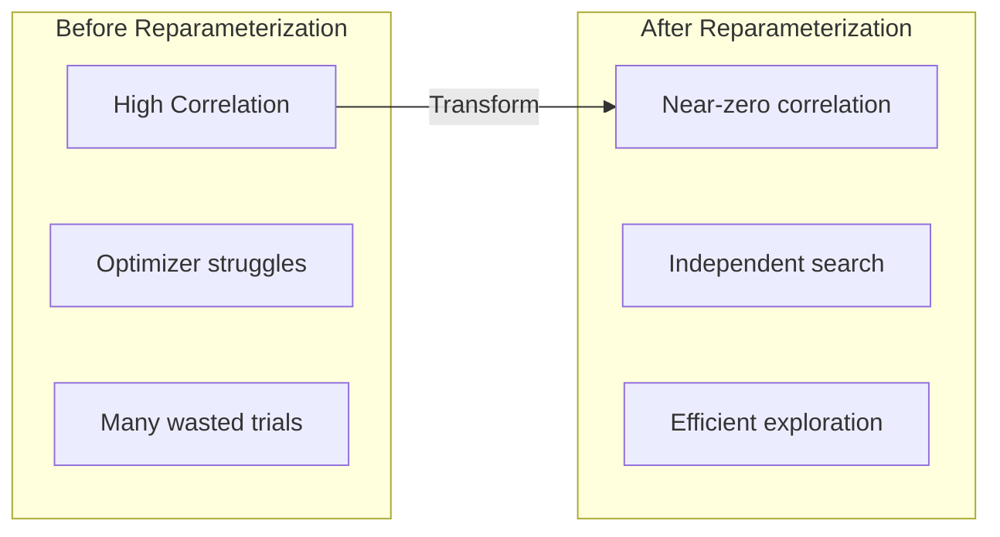

# Reparameterization

Reparameterization transforms correlated hyperparameters into orthogonal (uncorrelated) search dimensions, enabling faster and more efficient optimization.

---

## The Problem: Correlated Parameters

Many hyperparameters are inherently correlated. For example, in gradient boosting:

- **Lower learning rate** -> needs **more estimators** to converge
- **Higher learning rate** -> needs **fewer estimators**



Optimizers searching this space waste trials exploring invalid combinations (e.g., high learning rate + many estimators = overfitting).

---

## The Solution: Orthogonal Transforms

Reparameterization transforms correlated parameters into independent dimensions:

```mermaid
graph TB
    subgraph "Original Space"
        LR[learning_rate]
        NE[n_estimators]
    end

    subgraph "Transformed Space"
        LP[log_product<br/>= log(lr) + log(n)]
        LRat[log_ratio<br/>= log(lr) - log(n)]
    end

    LR --> LP
    NE --> LP
    LR --> LRat
    NE --> LRat
```

**Benefits:**
- Search dimensions are independent
- Optimizer explores meaningful regions
- Faster convergence
- Fewer wasted trials

---

## Quick Start

The recommended way to use reparameterization is through the `GraphBuilder` fluent API:

```python
from sklearn_meta.api import GraphBuilder
from sklearn_meta.core.data.context import DataContext
import xgboost as xgb
import pandas as pd

ctx = DataContext.from_Xy(X=pd.DataFrame(X), y=pd.Series(y))

result = (
    GraphBuilder("my_pipeline")
    .add_model("xgb", xgb.XGBClassifier)
    .with_search_space(
        learning_rate=(0.01, 0.3, "log"),
        n_estimators=(50, 500),
        max_depth=(3, 10),
        subsample=(0.6, 1.0),
    )
    .with_fixed_params(random_state=42, eval_metric="logloss")
    .with_reparameterization(use_prebaked=True)
    .with_tuning(n_trials=50, metric="roc_auc", greater_is_better=True)
    .with_cv(n_splits=5)
    .fit(ctx)
)

print(f"Best params: {result.fitted_nodes['xgb'].best_params}")
```

With `use_prebaked=True`, sklearn-meta automatically applies known reparameterizations for the model type (e.g., `learning_rate x n_estimators` for XGBoost).

---

## Available Reparameterizations

All reparameterization classes live in `sklearn_meta.meta.reparameterization` and provide `.forward(params)` and `.inverse(params)` methods.

### LogProductReparameterization

For parameters with an inverse relationship (like learning rate x iterations):

```python
from sklearn_meta.meta.reparameterization import LogProductReparameterization

reparam = LogProductReparameterization(
    name="learning_budget",
    param1="learning_rate",
    param2="n_estimators",
)
```

**Mathematical transform:**
```
log_product = log(a) + log(b)  # Total "budget"
log_ratio = log(a) - log(b)    # Balance between params
```

**Inverse transform:**
```
a = exp((log_product + log_ratio) / 2)
b = exp((log_product - log_ratio) / 2)
```

**Properties:**
- Product `a x b` is preserved
- Dimensions are orthogonal

### RatioReparameterization

For parameters that should sum to a constant (like regularization weights):

```python
from sklearn_meta.meta.reparameterization import RatioReparameterization

reparam = RatioReparameterization(
    name="regularization",
    param1="l1_ratio",
    param2="l2_ratio",
)
```

**Mathematical transform:**
```
total = a + b
ratio = a / (a + b)
```

**Inverse transform:**
```
a = total * ratio
b = total * (1 - ratio)
```

**Properties:**
- Sum `a + b` is preserved
- Ratio is bounded [0, 1]

### LinearReparameterization

For weighted combinations of multiple parameters:

```python
from sklearn_meta.meta.reparameterization import LinearReparameterization

reparam = LinearReparameterization(
    name="complexity",
    params=["depth", "leaves", "samples"],
    weights=[1.0, 0.5, 0.1],
)
```

**Mathematical transform:**
```
total = w1*a + w2*b + w3*c
frac1 = a / total
frac2 = b / total
# frac3 = 1 - frac1 - frac2 (implicit)
```

---

## Using the Fluent API

### Prebaked Reparameterizations (recommended)

The simplest approach -- let sklearn-meta apply known-good reparameterizations automatically:

```python
(
    GraphBuilder("pipeline")
    .add_model("xgb", XGBClassifier)
    .with_search_space(
        learning_rate=(0.01, 0.3, "log"),
        n_estimators=(50, 500),
    )
    .with_reparameterization(use_prebaked=True)
    .with_tuning(n_trials=50, metric="roc_auc", greater_is_better=True)
    .with_cv(n_splits=5)
    .fit(ctx)
)
```

### Custom Reparameterizations

Pass your own reparameterization objects:

```python
from sklearn_meta.meta.reparameterization import LogProductReparameterization

reparam = LogProductReparameterization(
    name="learning_budget",
    param1="learning_rate",
    param2="n_estimators",
)

(
    GraphBuilder("pipeline")
    .add_model("xgb", XGBClassifier)
    .with_search_space(
        learning_rate=(0.01, 0.3, "log"),
        n_estimators=(50, 500),
        max_depth=(3, 10),
    )
    .with_reparameterization(
        reparameterizations=[reparam],
        use_prebaked=False,
    )
    .with_tuning(n_trials=50, metric="roc_auc", greater_is_better=True)
    .with_cv(n_splits=5)
    .fit(ctx)
)
```

### Combining Custom and Prebaked

You can provide custom reparameterizations while also enabling prebaked ones:

```python
.with_reparameterization(
    reparameterizations=[my_custom_reparam],
    use_prebaked=True,  # Also apply prebaked for known param pairs
)
```

---

## Prebaked Reparameterizations

sklearn-meta includes ready-to-use reparameterizations for common models. These are applied automatically when `use_prebaked=True`.

```python
from sklearn_meta.meta.prebaked import get_prebaked_reparameterization
```

### Available Prebaked Configs

| Model | Reparameterization | Parameters | Transform |
|-------|-------------------|------------|-----------|
| XGBoost/LGBM/GradientBoosting | `xgb_learning_budget` | learning_rate, n_estimators | LogProduct |
| XGBoost | `xgb_regularization` | reg_alpha, reg_lambda | Ratio |
| LightGBM | `lgbm_regularization` | reg_alpha, reg_lambda | Ratio |
| LGBM/CatBoost | `gbm_depth_leaves` | max_depth, num_leaves | LogProduct |
| MLP/Neural | `nn_learning_epochs` | learning_rate, epochs | LogProduct |
| MLP/Neural | `nn_dropout` | dropout1, dropout2 | Linear |
| MLP/Neural/Torch | `nn_weight_decay_dropout` | weight_decay, dropout | Ratio |
| ElasticNet/SGD/Linear | `elastic_net` | alpha/C, l1_ratio | Ratio |
| RandomForest/ExtraTrees | `rf_complexity` | max_depth, min_samples_split | LogProduct |
| RandomForest/ExtraTrees/Bagging | `rf_sampling` | max_features, max_samples | LogProduct |
| SVC/SVR/SVM | `svm_kernel` | C, gamma | LogProduct |
| CatBoost | `catboost_regularization` | l2_leaf_reg, random_strength | Ratio |

---

## Forward and Inverse Transforms

All reparameterizations provide `.forward()` and `.inverse()` methods for converting between original and transformed parameter spaces:

```python
from sklearn_meta.meta.reparameterization import LogProductReparameterization

reparam = LogProductReparameterization(
    name="learning_budget",
    param1="learning_rate",
    param2="n_estimators",
)

# Forward transform (original -> transformed)
original = {"learning_rate": 0.1, "n_estimators": 100}
transformed = reparam.forward(original)
# {'log_product': 2.302..., 'log_ratio': -4.605...}

# Inverse transform (transformed -> original)
recovered = reparam.inverse(transformed)
# {'learning_rate': 0.1, 'n_estimators': 100}
```

---

## Visualization

### Correlation Before/After



### Search Space Comparison

**Original Space:**
```
learning_rate: [0.01 ----------------------- 0.3]
n_estimators:  [50 -------------------------- 500]

Correlation: -0.85 (highly negative)
```

**Transformed Space:**
```
log_product: [3.9 ------------------------- 7.2]
log_ratio:   [-6.2 ------------------------ -0.5]

Correlation: ~0.0 (independent)
```

---

## Mathematical Properties

### Roundtrip Identity

All reparameterizations satisfy:
```
inverse(forward(x)) = x
forward(inverse(y)) = y
```

### Jacobian Non-Singularity

The transformation Jacobian has non-zero determinant, ensuring:
- Bijective mapping (one-to-one)
- No information loss
- Reversible transformation

### Numerical Stability

Implementations handle:
- Very small values (e.g., 1e-8)
- Very large values (e.g., 1e8)
- Edge cases (log of small numbers)

```python
# Safe even with extreme values
reparam = LogProductReparameterization("test", "a", "b")

small = {"a": 1e-8, "b": 1e-8}
transformed = reparam.forward(small)   # No overflow
recovered = reparam.inverse(transformed)  # Accurate recovery
```

---

## Complete Example

```python
from sklearn.datasets import make_classification
import pandas as pd
import xgboost as xgb

from sklearn_meta.api import GraphBuilder
from sklearn_meta.core.data.context import DataContext
from sklearn_meta.meta.reparameterization import LogProductReparameterization

# Data
X, y = make_classification(n_samples=1000, n_features=20, random_state=42)
ctx = DataContext.from_Xy(X=pd.DataFrame(X), y=pd.Series(y))

# Custom reparameterization
reparam = LogProductReparameterization(
    name="learning_budget",
    param1="learning_rate",
    param2="n_estimators",
)

# Build and fit with reparameterization
result = (
    GraphBuilder("reparam_demo")
    .add_model("xgb", xgb.XGBClassifier)
    .with_search_space(
        learning_rate=(0.01, 0.3, "log"),
        n_estimators=(50, 500),
        max_depth=(3, 10),
        subsample=(0.6, 1.0),
    )
    .with_fixed_params(random_state=42, eval_metric="logloss")
    .with_reparameterization(
        reparameterizations=[reparam],
        use_prebaked=False,
    )
    .with_tuning(n_trials=30, metric="roc_auc", greater_is_better=True)
    .with_cv(n_splits=5, strategy="stratified")
    .fit(ctx)
)

fitted = result.fitted_nodes["xgb"]
print(f"Best params: {fitted.best_params}")
```

---

## Best Practices

### 1. Start with Prebaked

Use prebaked configurations when available -- they encode domain knowledge about known parameter correlations:

```python
.with_reparameterization(use_prebaked=True)
```

### 2. Use for Known Correlations

Only apply custom reparameterization when you know parameters are correlated:

```python
# Good: learning_rate and n_estimators are inversely correlated
LogProductReparameterization("budget", "learning_rate", "n_estimators")

# Questionable: max_depth and min_samples_split may not be strongly correlated
```

### 3. Log Scale for Product Reparameterization

When using `LogProductReparameterization`, the underlying parameters should span multiplicative ranges:

```python
# Good: log scale makes sense
.with_search_space(
    learning_rate=(0.001, 0.3, "log"),
    n_estimators=(10, 1000),
)

# Less effective: linear scale with narrow range
.with_search_space(
    learning_rate=(0.1, 0.2),  # Only 2x range
)
```

### 4. Verify Improvement

Compare optimization with and without reparameterization:

```python
# Without reparameterization
result_plain = (
    GraphBuilder("baseline")
    .add_model("xgb", XGBClassifier)
    .with_search_space(...)
    .with_tuning(n_trials=50, metric="roc_auc", greater_is_better=True)
    .with_cv(n_splits=5)
    .fit(ctx)
)

# With reparameterization
result_reparam = (
    GraphBuilder("with_reparam")
    .add_model("xgb", XGBClassifier)
    .with_search_space(...)
    .with_reparameterization(use_prebaked=True)
    .with_tuning(n_trials=50, metric="roc_auc", greater_is_better=True)
    .with_cv(n_splits=5)
    .fit(ctx)
)

# result_reparam should converge faster or find better params
```

---

## Next Steps

- [Search Spaces](search-spaces.md) -- Define parameter ranges
- [Tuning](tuning.md) -- Optimization configuration
- [Feature Selection](feature-selection.md) -- Automated feature pruning
- [Model Graphs](model-graphs.md) -- Multi-model pipelines
