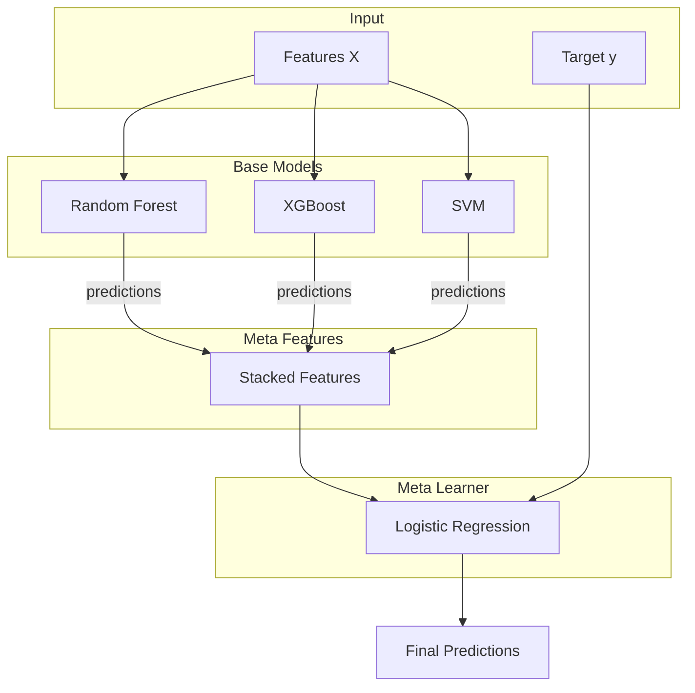
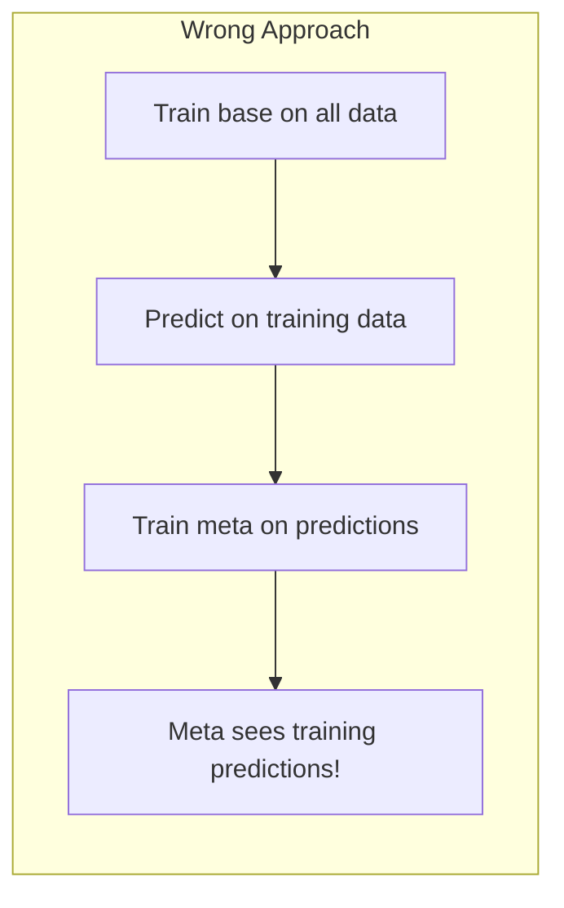
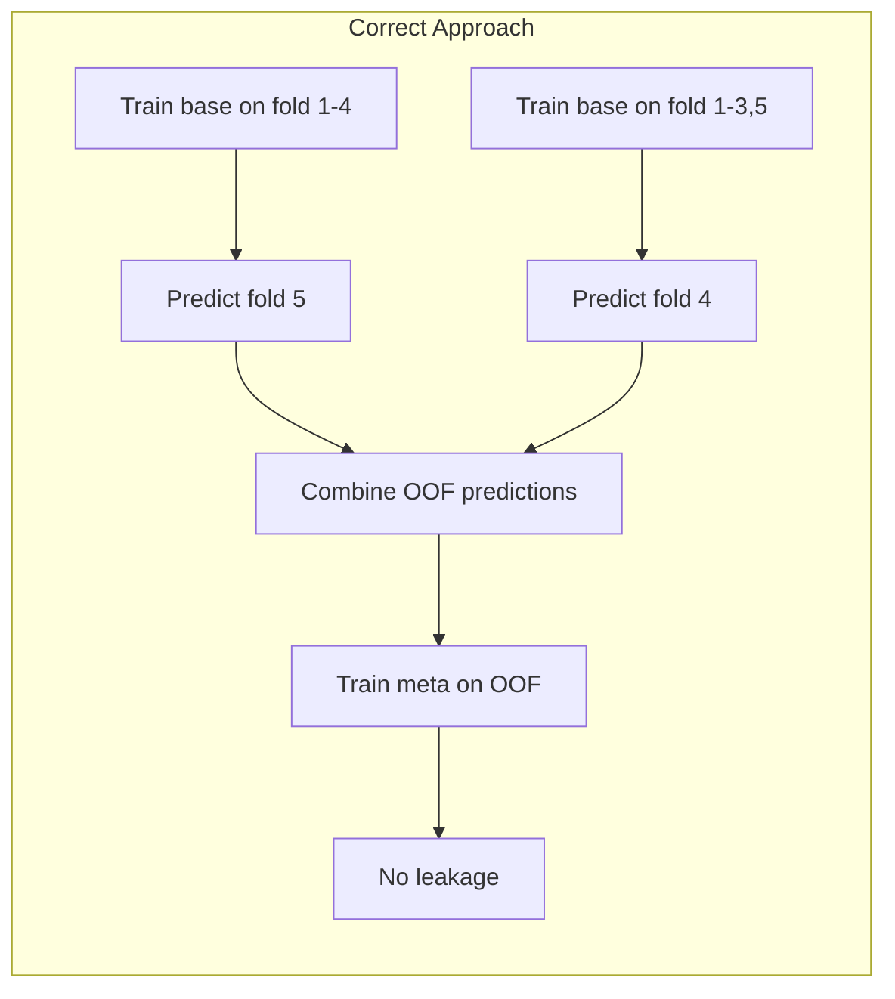
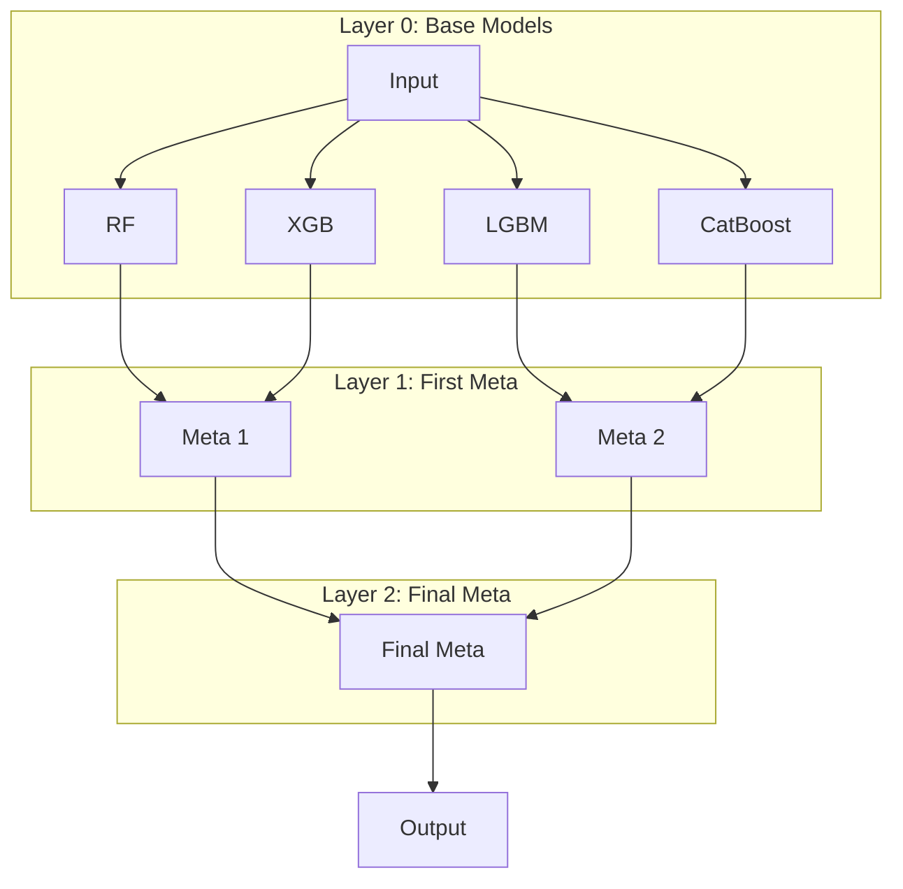
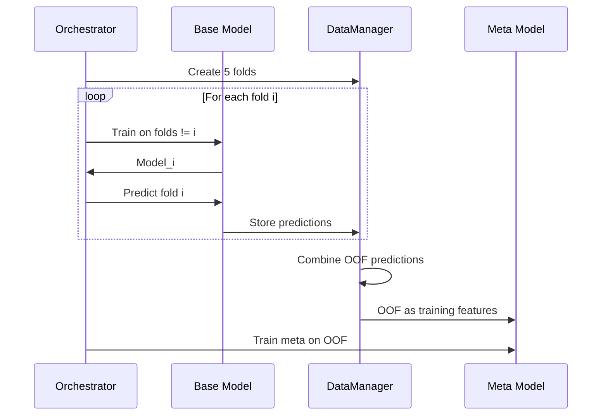
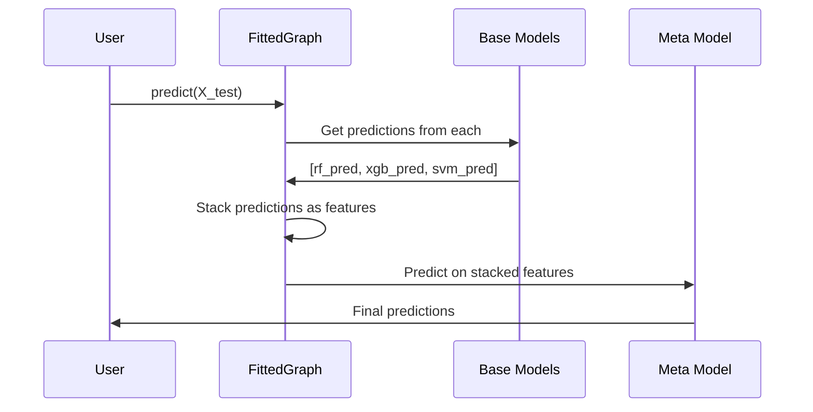

# Model Stacking

Stacking (stacked generalization) combines multiple models by training a meta-learner on their predictions. sklearn-meta provides robust stacking with automatic out-of-fold prediction handling to prevent data leakage.

---

## What is Stacking?

Stacking trains a "meta-learner" on the predictions of "base models":



**Why stacking works:**
- Different models capture different patterns
- Meta-learner learns optimal combination
- Often outperforms individual models

---

## The Leakage Problem

**Naive stacking leaks information:**



Base models see training data, so predictions are overfit, and the meta-learner learns overfit patterns.

**Solution: Out-of-Fold (OOF) predictions:**



Each sample's prediction comes from a model that **never saw that sample**.

---

## Quick Start with GraphBuilder

The `GraphBuilder` fluent API is the easiest way to build stacking pipelines:

```python
from sklearn.ensemble import RandomForestClassifier, GradientBoostingClassifier
from sklearn.svm import SVC
from sklearn.linear_model import LogisticRegression
from sklearn_meta.api import GraphBuilder

fitted = (
    GraphBuilder("stacking_pipeline")
    # Base models
    .add_model("rf", RandomForestClassifier)
    .with_search_space(n_estimators=(50, 200), max_depth=(3, 15))
    .add_model("gb", GradientBoostingClassifier)
    .with_search_space(n_estimators=(50, 200), learning_rate=(0.01, 0.3))
    .add_model("svm", SVC)
    .with_search_space(C=(0.1, 10.0))
    # Meta-learner stacking on base model probabilities
    .add_model("meta", LogisticRegression)
    .with_search_space(C=(0.01, 100.0))
    .stacks_proba("rf")
    .stacks_proba("gb")
    .stacks_proba("svm")
    # Configuration
    .with_cv(n_splits=5, strategy="stratified")
    .with_tuning(
        n_trials=50,
        metric="roc_auc",
        greater_is_better=True,
        early_stopping_rounds=20,
        show_progress=True,
    )
    .fit(X_train, y_train)
)

predictions = fitted.predict(X_test)
```

### GraphBuilder Dependency Methods

| Method | Description |
|--------|-------------|
| `.stacks("node_name")` | Prediction dependency (class labels or regression values) |
| `.stacks_proba("node_name")` | Probability dependency (class probabilities) |

---

## Building a Stacking Pipeline (Low-Level API)

### Step 1: Define Base Models

```python
from sklearn.ensemble import RandomForestClassifier, GradientBoostingClassifier
from sklearn.svm import SVC
from sklearn_meta.core.model.node import ModelNode
from sklearn_meta.search.space import SearchSpace

# Random Forest
rf_space = SearchSpace().add_int("n_estimators", 50, 200).add_int("max_depth", 3, 15)
rf_node = ModelNode(name="rf", estimator_class=RandomForestClassifier, search_space=rf_space, fixed_params={"random_state": 42})

# Gradient Boosting
gb_space = SearchSpace().add_int("n_estimators", 50, 200).add_float("learning_rate", 0.01, 0.3, log=True)
gb_node = ModelNode(name="gb", estimator_class=GradientBoostingClassifier, search_space=gb_space, fixed_params={"random_state": 42})

# SVM
svm_space = SearchSpace().add_float("C", 0.1, 10, log=True)
svm_node = ModelNode(name="svm", estimator_class=SVC, search_space=svm_space, fixed_params={"probability": True, "random_state": 42})
```

### Step 2: Define Meta-Learner

```python
from sklearn.linear_model import LogisticRegression

meta_space = SearchSpace().add_float("C", 0.01, 100, log=True)
meta_node = ModelNode(name="meta", estimator_class=LogisticRegression, search_space=meta_space, fixed_params={"random_state": 42})
```

### Step 3: Create Graph with Dependencies

```python
from sklearn_meta.core.model.graph import ModelGraph
from sklearn_meta.core.model.dependency import DependencyEdge, DependencyType

graph = ModelGraph()

# Add nodes
graph.add_node(rf_node)
graph.add_node(gb_node)
graph.add_node(svm_node)
graph.add_node(meta_node)

# Connect base models to meta-learner using DependencyEdge
graph.add_edge(DependencyEdge(source="rf", target="meta", dep_type=DependencyType.PROBA))
graph.add_edge(DependencyEdge(source="gb", target="meta", dep_type=DependencyType.PROBA))
graph.add_edge(DependencyEdge(source="svm", target="meta", dep_type=DependencyType.PROBA))
```

### Step 4: Tune and Fit

```python
from sklearn_meta.core.data.context import DataContext
from sklearn_meta.core.data.cv import CVConfig, CVStrategy
from sklearn_meta.core.data.manager import DataManager
from sklearn_meta.core.tuning.orchestrator import TuningConfig, TuningOrchestrator
from sklearn_meta.core.tuning.strategy import OptimizationStrategy
from sklearn_meta.search.backends.optuna import OptunaBackend

ctx = DataContext.from_Xy(X=X_train, y=y_train)
cv_config = CVConfig(n_splits=5, strategy=CVStrategy.STRATIFIED)

tuning_config = TuningConfig(
    strategy=OptimizationStrategy.LAYER_BY_LAYER,
    n_trials=30,
    cv_config=cv_config,
    metric="roc_auc",
    greater_is_better=True,
    show_progress=True,
)

backend = OptunaBackend(direction="maximize", random_state=42)

orchestrator = TuningOrchestrator(
    graph=graph,
    data_manager=DataManager(cv_config),
    search_backend=backend,
    tuning_config=tuning_config,
)

fitted_graph = orchestrator.fit(ctx)
```

### Step 5: Predict

```python
predictions = fitted_graph.predict(X_test)
```

---

## Dependency Types

All dependencies use `DependencyEdge` with a `DependencyType` enum:

```python
from sklearn_meta.core.model.dependency import DependencyEdge, DependencyType
```

### Prediction Dependency

Pass class predictions (0, 1, 2, ...) or regression values:

```python
edge = DependencyEdge(source="base", target="meta", dep_type=DependencyType.PREDICTION)
graph.add_edge(edge)
```

**Meta-learner input:** One feature per base model (binary) or k features per model (k-class).

### Probability Dependency

Pass probability predictions:

```python
edge = DependencyEdge(source="base", target="meta", dep_type=DependencyType.PROBA)
graph.add_edge(edge)
```

**Meta-learner input:** k features per base model (k = number of classes).

**Usually better** because:
- Preserves confidence information
- More information for meta-learner
- Better calibration opportunities

### With GraphBuilder

```python
# Prediction dependency
builder.stacks("base_model")

# Probability dependency
builder.stacks_proba("base_model")
```

---

## Multi-Level Stacking

Stack multiple layers deep:



### Low-Level API

```python
from sklearn_meta.core.model.dependency import DependencyEdge, DependencyType

# Layer 0
graph.add_node(rf_node)
graph.add_node(xgb_node)
graph.add_node(lgbm_node)
graph.add_node(cat_node)

# Layer 1
graph.add_node(meta1_node)
graph.add_node(meta2_node)

graph.add_edge(DependencyEdge(source="rf", target="meta1", dep_type=DependencyType.PROBA))
graph.add_edge(DependencyEdge(source="xgb", target="meta1", dep_type=DependencyType.PROBA))
graph.add_edge(DependencyEdge(source="lgbm", target="meta2", dep_type=DependencyType.PROBA))
graph.add_edge(DependencyEdge(source="cat", target="meta2", dep_type=DependencyType.PROBA))

# Layer 2
graph.add_node(final_node)
graph.add_edge(DependencyEdge(source="meta1", target="final", dep_type=DependencyType.PROBA))
graph.add_edge(DependencyEdge(source="meta2", target="final", dep_type=DependencyType.PROBA))
```

### GraphBuilder API

```python
fitted = (
    GraphBuilder("deep_stack")
    # Layer 0
    .add_model("rf", RandomForestClassifier)
    .with_search_space(n_estimators=(50, 200))
    .add_model("xgb", XGBClassifier)
    .with_search_space(n_estimators=(50, 200))
    .add_model("lgbm", LGBMClassifier)
    .with_search_space(n_estimators=(50, 200))
    .add_model("cat", CatBoostClassifier)
    .with_search_space(iterations=(50, 200))
    # Layer 1
    .add_model("meta1", LogisticRegression)
    .with_search_space(C=(0.01, 100.0))
    .stacks_proba("rf")
    .stacks_proba("xgb")
    .add_model("meta2", LogisticRegression)
    .with_search_space(C=(0.01, 100.0))
    .stacks_proba("lgbm")
    .stacks_proba("cat")
    # Layer 2
    .add_model("final", Ridge)
    .with_search_space(alpha=(0.01, 100.0))
    .stacks_proba("meta1")
    .stacks_proba("meta2")
    # Config
    .with_cv(n_splits=5, strategy="stratified")
    .with_tuning(n_trials=50, metric="roc_auc", greater_is_better=True, show_progress=True)
    .fit(X_train, y_train)
)
```

---

## How OOF Predictions Work

### During Training



### Prediction Time



---

## Working with Results

### FittedGraph

```python
# Predict through the full graph recursively
predictions = fitted_graph.predict(X_test)

# Predict from a specific node
rf_predictions = fitted_graph.predict(X_test, node_name="rf")

# Access a fitted node
rf_fitted = fitted_graph.get_node("rf")

# Get OOF predictions for a node
rf_oof = fitted_graph.get_oof_predictions("rf")
```

### FittedNode

```python
rf_fitted = fitted_graph.get_node("rf")

rf_fitted.best_params          # best hyperparameters dict
rf_fitted.mean_score           # mean CV score
rf_fitted.oof_predictions      # out-of-fold predictions
rf_fitted.models               # list of fitted model objects
rf_fitted.cv_result            # cross-validation result
rf_fitted.optimization_result  # full optimization result
rf_fitted.selected_features    # selected features (if feature selection enabled)
rf_fitted.node                 # original ModelNode
```

---

## Stacking Strategies

### Simple Stacking

One layer of base models + one meta-learner:

```
Base Layer -> Meta Layer
```

**Pros:** Simple, less overfitting risk
**Cons:** Limited expressiveness

### Deep Stacking

Multiple meta-learner layers:

```
Base Layer -> Meta Layer 1 -> Meta Layer 2 -> Final
```

**Pros:** More expressive
**Cons:** Overfitting risk, longer training

### Blending

No OOF -- use holdout set instead:

```
Train base on 70% -> Predict 30% holdout -> Train meta on holdout predictions
```

**Pros:** Faster (single train per model)
**Cons:** Wastes data, higher variance

### Feature-Weighted Linear Stacking (FWLS)

Meta-learner is constrained to linear combination:

```python
from sklearn.linear_model import Ridge

fitted = (
    GraphBuilder("fwls")
    .add_model("rf", RandomForestClassifier)
    .with_search_space(n_estimators=(50, 200))
    .add_model("xgb", XGBClassifier)
    .with_search_space(n_estimators=(50, 200))
    .add_model("meta", Ridge)
    .with_search_space(alpha=(0.01, 100.0))
    .stacks_proba("rf")
    .stacks_proba("xgb")
    .with_tuning(n_trials=50, metric="roc_auc", greater_is_better=True)
    .fit(X_train, y_train)
)
```

**Pros:** Interpretable, less overfitting
**Cons:** May underfit complex relationships

---

## Complete Example

```python
from sklearn.datasets import make_classification
from sklearn.model_selection import train_test_split
from sklearn.ensemble import RandomForestClassifier, GradientBoostingClassifier
from sklearn.linear_model import LogisticRegression
from sklearn.svm import SVC
from sklearn.metrics import accuracy_score, roc_auc_score
import pandas as pd

from sklearn_meta.core.data.context import DataContext
from sklearn_meta.core.data.cv import CVConfig, CVStrategy
from sklearn_meta.core.data.manager import DataManager
from sklearn_meta.core.model.node import ModelNode
from sklearn_meta.core.model.graph import ModelGraph
from sklearn_meta.core.model.dependency import DependencyEdge, DependencyType
from sklearn_meta.core.tuning.orchestrator import TuningConfig, TuningOrchestrator
from sklearn_meta.core.tuning.strategy import OptimizationStrategy
from sklearn_meta.search.backends.optuna import OptunaBackend
from sklearn_meta.search.space import SearchSpace

# === Data ===
X, y = make_classification(
    n_samples=2000, n_features=20,
    n_informative=10, n_redundant=5,
    random_state=42
)
X_train, X_test, y_train, y_test = train_test_split(X, y, test_size=0.2, random_state=42)
X_train, X_test = pd.DataFrame(X_train), pd.DataFrame(X_test)
y_train, y_test = pd.Series(y_train), pd.Series(y_test)

# === Base Model 1: Random Forest ===
rf_space = (
    SearchSpace()
    .add_int("n_estimators", 50, 300)
    .add_int("max_depth", 3, 15)
    .add_float("min_samples_split", 0.01, 0.1)
)
rf_node = ModelNode(name="rf", estimator_class=RandomForestClassifier, search_space=rf_space, fixed_params={"random_state": 42, "n_jobs": -1})

# === Base Model 2: Gradient Boosting ===
gb_space = (
    SearchSpace()
    .add_int("n_estimators", 50, 300)
    .add_float("learning_rate", 0.01, 0.3, log=True)
    .add_int("max_depth", 3, 8)
)
gb_node = ModelNode(name="gb", estimator_class=GradientBoostingClassifier, search_space=gb_space, fixed_params={"random_state": 42})

# === Base Model 3: SVM ===
svm_space = (
    SearchSpace()
    .add_float("C", 0.1, 100, log=True)
    .add_categorical("kernel", ["rbf", "poly"])
)
svm_node = ModelNode(name="svm", estimator_class=SVC, search_space=svm_space, fixed_params={"probability": True, "random_state": 42})

# === Meta-Learner: Logistic Regression ===
meta_space = SearchSpace().add_float("C", 0.01, 100, log=True)
meta_node = ModelNode(name="meta", estimator_class=LogisticRegression, search_space=meta_space, fixed_params={"random_state": 42, "max_iter": 1000})

# === Build Stacking Graph ===
graph = ModelGraph()

# Add all nodes
graph.add_node(rf_node)
graph.add_node(gb_node)
graph.add_node(svm_node)
graph.add_node(meta_node)

# Connect base models to meta-learner with DependencyEdge
graph.add_edge(DependencyEdge(source="rf", target="meta", dep_type=DependencyType.PROBA))
graph.add_edge(DependencyEdge(source="gb", target="meta", dep_type=DependencyType.PROBA))
graph.add_edge(DependencyEdge(source="svm", target="meta", dep_type=DependencyType.PROBA))

# Validate
graph.validate()
print(f"Execution order: {graph.topological_order()}")

# === Configure Tuning ===
cv_config = CVConfig(n_splits=5, strategy=CVStrategy.STRATIFIED)

tuning_config = TuningConfig(
    strategy=OptimizationStrategy.LAYER_BY_LAYER,
    n_trials=30,
    cv_config=cv_config,
    metric="roc_auc",
    greater_is_better=True,
    early_stopping_rounds=15,
    show_progress=True,
)

backend = OptunaBackend(direction="maximize", random_state=42)

# === Run Stacking Pipeline ===
ctx = DataContext.from_Xy(X=X_train, y=y_train)
orchestrator = TuningOrchestrator(
    graph=graph,
    data_manager=DataManager(cv_config),
    search_backend=backend,
    tuning_config=tuning_config,
)

print("\nTuning stacking pipeline...")
fitted_graph = orchestrator.fit(ctx)

# === Evaluate ===
print("\n=== Results ===")
print("\nBest parameters per node:")
for name in ["rf", "gb", "svm", "meta"]:
    node = fitted_graph.get_node(name)
    print(f"  {name}: {node.best_params} (score: {node.mean_score:.4f})")

# Predictions
predictions = fitted_graph.predict(X_test)
print(f"\nStacking Accuracy: {accuracy_score(y_test, predictions):.4f}")

# Compare individual models
print("\nIndividual Model Performance (for comparison):")
for name in ["rf", "gb", "svm"]:
    node_pred = fitted_graph.predict(X_test, node_name=name)
    print(f"  {name}: Accuracy={accuracy_score(y_test, node_pred):.4f}")
```

---

## Best Practices

### 1. Use Diverse Base Models

```python
# Good: Different model families
base_models = [
    RandomForestClassifier,     # Tree-based, bagging
    GradientBoostingClassifier, # Tree-based, boosting
    SVC,                        # Kernel-based
    LogisticRegression,         # Linear
    KNeighborsClassifier,       # Instance-based
]

# Less effective: All similar models
base_models = [
    RandomForestClassifier,
    ExtraTreesClassifier,
    BaggingClassifier,  # All tree-based bagging
]
```

### 2. Use Simple Meta-Learner

```python
# Recommended: Linear models
LogisticRegression
Ridge
ElasticNet

# Use with caution: Complex models can overfit
GradientBoostingClassifier
RandomForestClassifier
```

### 3. Use Probability Dependencies

```python
# Better for classification (more information)
builder.stacks_proba("base")
# or
graph.add_edge(DependencyEdge(source="base", target="meta", dep_type=DependencyType.PROBA))

# Less information
builder.stacks("base")
# or
graph.add_edge(DependencyEdge(source="base", target="meta", dep_type=DependencyType.PREDICTION))
```

### 4. Don't Stack Too Deep

```
Recommended: 2 layers (base + meta)
Maximum: 3 layers (base + meta + final)
Avoid: 4+ layers (overfitting, diminishing returns)
```

### 5. Ensure Sufficient Data

Stacking requires enough data for:
- OOF predictions (N samples for each of K base models)
- Meta-learner training

```
Minimum: ~1000 samples
Recommended: 5000+ samples
```

---

## Next Steps

- [Model Graphs](model-graphs.md) -- Graph architecture details
- [Cross-Validation](cross-validation.md) -- How OOF is generated
- [Tuning](tuning.md) -- Layer-by-layer optimization
