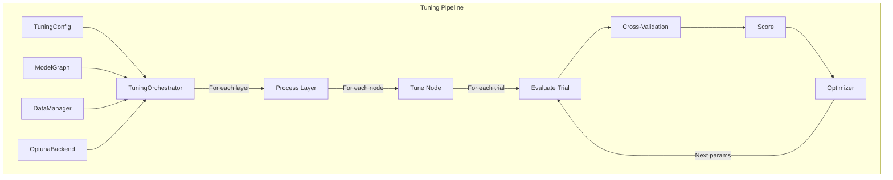
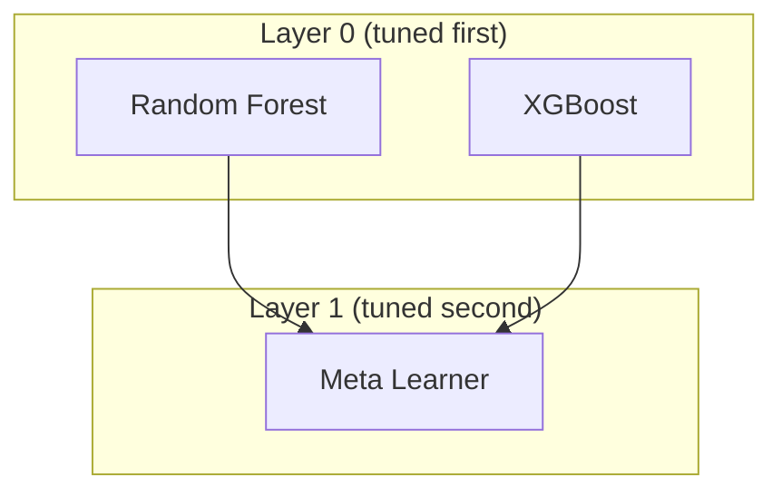

# Tuning & Optimization

The tuning system orchestrates hyperparameter optimization across your model graph, coordinating search strategies, cross-validation, and model fitting.

---

## Architecture Overview



---

## Quick Start with GraphBuilder

The `GraphBuilder` fluent API is the recommended way to configure and run tuning:

```python
from sklearn.ensemble import RandomForestClassifier, GradientBoostingClassifier
from sklearn.linear_model import LogisticRegression
from sklearn_meta.api import GraphBuilder

fitted = (
    GraphBuilder("my_stack")
    # Base model 1
    .add_model("rf", RandomForestClassifier)
    .with_search_space(n_estimators=(50, 300), max_depth=(3, 15))
    # Base model 2
    .add_model("gb", GradientBoostingClassifier)
    .with_search_space(n_estimators=(50, 300), learning_rate=(0.01, 0.3), max_depth=(3, 10))
    # Meta-learner stacking on base models
    .add_model("meta", LogisticRegression)
    .with_search_space(C=(0.01, 100.0))
    .stacks_proba("rf")
    .stacks_proba("gb")
    # CV and tuning configuration
    .with_cv(n_splits=5, strategy="stratified")
    .with_tuning(
        n_trials=100,
        metric="roc_auc",
        greater_is_better=True,
        early_stopping_rounds=20,
        show_progress=True,
    )
    .fit(X_train, y_train)
)

predictions = fitted.predict(X_test)
```

---

## TuningConfig

Configure the optimization process:

```python
from sklearn_meta.core.tuning.orchestrator import TuningConfig
from sklearn_meta.core.tuning.strategy import OptimizationStrategy
from sklearn_meta.core.data.cv import CVConfig, CVStrategy

tuning_config = TuningConfig(
    strategy=OptimizationStrategy.LAYER_BY_LAYER,
    n_trials=100,
    timeout=3600,  # seconds
    early_stopping_rounds=20,
    cv_config=CVConfig(n_splits=5, strategy=CVStrategy.STRATIFIED),
    metric="roc_auc",
    greater_is_better=True,
    feature_selection=None,
    use_reparameterization=False,
    custom_reparameterizations=None,
    verbose=1,
    tuning_n_estimators=100,
    final_n_estimators=500,
    estimator_scaling_search=False,
    estimator_scaling_factors=None,
    show_progress=True,
)
```

### Configuration Options

| Parameter | Description | Default |
|-----------|-------------|---------|
| `strategy` | Graph traversal strategy | `LAYER_BY_LAYER` |
| `n_trials` | Maximum number of trials | 100 |
| `timeout` | Time limit in seconds | None |
| `early_stopping_rounds` | Stop if no improvement for N trials | None |
| `cv_config` | Cross-validation configuration | None |
| `metric` | Scoring metric name | `"neg_mean_squared_error"` |
| `greater_is_better` | Maximize or minimize | False |
| `feature_selection` | Feature selection configuration | None |
| `use_reparameterization` | Enable reparameterization | False |
| `custom_reparameterizations` | Custom reparameterization functions | None |
| `verbose` | Verbosity level | 1 |
| `tuning_n_estimators` | n_estimators used during tuning (faster) | None |
| `final_n_estimators` | n_estimators for final model (after tuning) | None |
| `estimator_scaling_search` | Search for optimal n_estimators scaling | False |
| `estimator_scaling_factors` | Custom scaling factors to try | None |
| `show_progress` | Display progress bar during tuning | False |

---

## Optimization Strategy vs. Search Backend

A key architectural concept: **strategy** and **search backend** are separate concerns.

### Strategy (Graph Traversal)

`OptimizationStrategy` controls how the graph's layers are processed during tuning:

```python
from sklearn_meta.core.tuning.strategy import OptimizationStrategy
```

| Strategy | Description |
|----------|-------------|
| `LAYER_BY_LAYER` | Tune nodes one layer at a time (default). Base models are tuned first, then meta-learners use their OOF predictions. |
| `GREEDY` | Tune each node greedily in topological order. |
| `NONE` | Skip tuning; use default or provided parameters. |

There are **no** `OPTUNA`, `RANDOM`, or `GRID` strategy values. These are not strategies.

### Search Backend (Optuna)

The search backend controls *how* individual nodes are optimized (the algorithm that suggests hyperparameter configurations). `OptunaBackend` is the default and uses Optuna's TPE sampler:

```python
from sklearn_meta.search.backends.optuna import OptunaBackend

backend = OptunaBackend(
    direction="minimize",
    random_state=42,
    sampler=None,         # defaults to TPE
    pruner=None,
    n_jobs=1,
    show_progress_bar=False,
    verbosity=None,
)
```

**OptunaBackend features:**
- Tree-structured Parzen Estimator (TPE) by default
- Automatic pruning of unpromising trials
- Handles conditional parameters
- Efficient parallelization via `n_jobs`
- Custom Optuna samplers and pruners supported

---

## TuningOrchestrator

The orchestrator coordinates the entire tuning process:

```python
from sklearn_meta.core.tuning.orchestrator import TuningOrchestrator
from sklearn_meta.search.backends.optuna import OptunaBackend

backend = OptunaBackend(direction="maximize", random_state=42)

orchestrator = TuningOrchestrator(
    graph=model_graph,
    data_manager=data_manager,
    search_backend=backend,
    tuning_config=tuning_config,
    executor=None,
)

# Run optimization
fitted_graph = orchestrator.fit(ctx)
```

### Constructor Parameters

| Parameter | Description | Default |
|-----------|-------------|---------|
| `graph` | The `ModelGraph` to tune | required |
| `data_manager` | `DataManager` instance | required |
| `search_backend` | Search backend (e.g. `OptunaBackend`) | OptunaBackend |
| `tuning_config` | `TuningConfig` instance | required |
| `executor` | Optional executor for parallel node tuning | None |

### Execution Flow

```mermaid
sequenceDiagram
    participant U as User
    participant TO as TuningOrchestrator
    participant OPT as OptunaBackend
    participant CV as CrossValidator
    participant M as Model

    U->>TO: fit(ctx)
    TO->>TO: Get layers (topological order)

    loop For each layer
        loop For each node in layer
            TO->>OPT: Create study
            loop For n_trials
                OPT->>TO: Suggest params
                TO->>CV: Evaluate with CV
                loop For each fold
                    CV->>M: fit(train)
                    M->>CV: predict(val)
                end
                CV->>TO: Mean score
                TO->>OPT: Report score
            end
            OPT->>TO: Best params
            TO->>TO: Store best params
        end
    end

    TO->>U: FittedGraph
```

---

## Layer-by-Layer Tuning

For stacking graphs, nodes are tuned layer by layer (the default strategy):



1. **Layer 0:** Tune base models independently
2. **Generate OOF:** Create out-of-fold predictions
3. **Layer 1:** Tune meta-learner on OOF predictions

```python
# Automatic layer-by-layer execution
fitted_graph = orchestrator.fit(ctx)

# Layers processed in order:
# 1. rf, xgb (parallel, no dependencies)
# 2. meta (depends on rf, xgb OOF predictions)
```

---

## Estimator Scaling

For boosting models (XGBoost, LightGBM, GradientBoosting), you often want to tune with fewer estimators for speed, then train the final model with more. `TuningConfig` supports this directly:

### Fixed Scaling

```python
tuning_config = TuningConfig(
    n_trials=100,
    metric="roc_auc",
    greater_is_better=True,
    tuning_n_estimators=100,     # use 100 trees during tuning (fast)
    final_n_estimators=1000,     # use 1000 trees for the final model
)
```

### Automatic Scaling Search

Automatically search for the best `n_estimators` value after hyperparameters are found:

```python
tuning_config = TuningConfig(
    n_trials=100,
    metric="roc_auc",
    greater_is_better=True,
    tuning_n_estimators=100,
    estimator_scaling_search=True,
    # Optionally provide custom factors to try:
    estimator_scaling_factors=[1.0, 2.0, 5.0, 10.0],
)
```

### With GraphBuilder

```python
fitted = (
    GraphBuilder("boosting_pipeline")
    .add_model("xgb", XGBClassifier)
    .with_search_space(max_depth=(3, 10), learning_rate=(0.01, 0.3))
    .with_tuning(
        n_trials=100,
        metric="roc_auc",
        greater_is_better=True,
        tuning_n_estimators=100,
        final_n_estimators=1000,
        estimator_scaling_search=True,
    )
    .fit(X_train, y_train)
)
```

---

## Progress Monitoring

### Show Progress Bar

Enable a progress bar during tuning:

```python
tuning_config = TuningConfig(
    n_trials=100,
    show_progress=True,
)
```

Or with the GraphBuilder:

```python
fitted = (
    GraphBuilder("pipeline")
    .add_model("rf", RandomForestClassifier)
    .with_search_space(n_estimators=(50, 300))
    .with_tuning(n_trials=100, show_progress=True)
    .fit(X_train, y_train)
)
```

### Verbosity

Control log output detail with `verbose`:

```python
tuning_config = TuningConfig(
    n_trials=100,
    verbose=0,  # silent
    # verbose=1,  # summary (default)
    # verbose=2,  # detailed
)
```

---

## Early Stopping

### Early Stopping Rounds

Stop tuning a node when no improvement is found for N consecutive trials:

```python
tuning_config = TuningConfig(
    n_trials=1000,
    early_stopping_rounds=20,  # stop if no improvement for 20 trials
)
```

### Timeout

Stop tuning after a time limit:

```python
tuning_config = TuningConfig(
    n_trials=1000,
    timeout=3600,  # stop after 1 hour
)
```

---

## Metrics

### Built-in Metrics

| Metric | Task | Direction |
|--------|------|-----------|
| `accuracy` | Classification | Maximize |
| `roc_auc` | Binary classification | Maximize |
| `f1` | Classification | Maximize |
| `precision` | Classification | Maximize |
| `recall` | Classification | Maximize |
| `log_loss` | Classification | Minimize |
| `neg_mean_squared_error` | Regression | Minimize |
| `rmse` | Regression | Minimize |
| `mae` | Regression | Minimize |
| `r2` | Regression | Maximize |

### Usage

```python
# Classification
config = TuningConfig(metric="roc_auc", greater_is_better=True)

# Regression (default)
config = TuningConfig(metric="neg_mean_squared_error", greater_is_better=False)
```

### Custom Metrics

```python
from sklearn.metrics import make_scorer

def custom_metric(y_true, y_pred):
    # Your metric logic
    return score

config = TuningConfig(
    metric=make_scorer(custom_metric),
    greater_is_better=True,
)
```

---

## Working with Results

### FittedGraph

After tuning, the orchestrator returns a `FittedGraph`:

```python
fitted_graph = orchestrator.fit(ctx)

# Predict through the full graph (recursive)
predictions = fitted_graph.predict(X_test)

# Predict from a specific node
rf_predictions = fitted_graph.predict(X_test, node_name="rf")

# Access a specific fitted node
rf_fitted = fitted_graph.get_node("rf")

# Get out-of-fold predictions for a node
rf_oof = fitted_graph.get_oof_predictions("rf")
```

### FittedNode

Each fitted node contains detailed results:

```python
rf_fitted = fitted_graph.get_node("rf")

rf_fitted.node               # original ModelNode
rf_fitted.best_params        # best hyperparameters dict
rf_fitted.cv_result          # cross-validation result
rf_fitted.optimization_result  # full optimization result
rf_fitted.selected_features  # features selected (if feature selection enabled)
rf_fitted.oof_predictions    # out-of-fold predictions
rf_fitted.models             # list of fitted model objects
rf_fitted.mean_score         # mean CV score
```

---

## Dependencies

Connect models using `DependencyEdge` and `DependencyType`:

```python
from sklearn_meta.core.model.dependency import DependencyEdge, DependencyType

# Prediction dependency (class labels or regression values)
edge = DependencyEdge(source="rf", target="meta", dep_type=DependencyType.PREDICTION)
graph.add_edge(edge)

# Probability dependency (class probabilities)
edge = DependencyEdge(source="gb", target="meta", dep_type=DependencyType.PROBA)
graph.add_edge(edge)
```

With GraphBuilder, dependencies are simpler:

```python
(
    GraphBuilder("stack")
    .add_model("rf", RandomForestClassifier)
    .with_search_space(n_estimators=(50, 200))
    .add_model("meta", LogisticRegression)
    .with_search_space(C=(0.01, 100.0))
    .stacks("rf")          # prediction dependency
    # or
    .stacks_proba("rf")    # probability dependency
)
```

---

## Complete Example

```python
from sklearn.ensemble import RandomForestClassifier, GradientBoostingClassifier
from sklearn.linear_model import LogisticRegression
from sklearn.datasets import make_classification
from sklearn.metrics import accuracy_score
import pandas as pd

from sklearn_meta.core.data.context import DataContext
from sklearn_meta.core.data.cv import CVConfig, CVStrategy
from sklearn_meta.core.data.manager import DataManager
from sklearn_meta.core.model.node import ModelNode
from sklearn_meta.core.model.graph import ModelGraph
from sklearn_meta.core.model.dependency import DependencyEdge, DependencyType
from sklearn_meta.core.tuning.orchestrator import TuningConfig, TuningOrchestrator
from sklearn_meta.core.tuning.strategy import OptimizationStrategy
from sklearn_meta.search.backends.optuna import OptunaBackend
from sklearn_meta.search.space import SearchSpace

# === Data ===
X, y = make_classification(n_samples=2000, n_features=20, random_state=42)
X = pd.DataFrame(X)
y = pd.Series(y)
ctx = DataContext.from_Xy(X=X, y=y)

# === Search Spaces ===
rf_space = (
    SearchSpace()
    .add_int("n_estimators", 50, 300)
    .add_int("max_depth", 3, 15)
    .add_float("min_samples_split", 0.01, 0.2)
)

gb_space = (
    SearchSpace()
    .add_int("n_estimators", 50, 300)
    .add_float("learning_rate", 0.01, 0.3, log=True)
    .add_int("max_depth", 3, 10)
)

meta_space = (
    SearchSpace()
    .add_float("C", 0.01, 100, log=True)
)

# === Model Nodes ===
rf_node = ModelNode(name="rf", estimator_class=RandomForestClassifier, search_space=rf_space, fixed_params={"random_state": 42})
gb_node = ModelNode(name="gb", estimator_class=GradientBoostingClassifier, search_space=gb_space, fixed_params={"random_state": 42})
meta_node = ModelNode(name="meta", estimator_class=LogisticRegression, search_space=meta_space, fixed_params={"random_state": 42})

# === Graph ===
graph = ModelGraph()
graph.add_node(rf_node)
graph.add_node(gb_node)
graph.add_node(meta_node)
graph.add_edge(DependencyEdge(source="rf", target="meta", dep_type=DependencyType.PROBA))
graph.add_edge(DependencyEdge(source="gb", target="meta", dep_type=DependencyType.PROBA))

# === Tuning Config ===
cv_config = CVConfig(n_splits=5, strategy=CVStrategy.STRATIFIED)

tuning_config = TuningConfig(
    strategy=OptimizationStrategy.LAYER_BY_LAYER,
    n_trials=50,
    cv_config=cv_config,
    metric="roc_auc",
    greater_is_better=True,
    early_stopping_rounds=15,
    show_progress=True,
)

# === Search Backend ===
backend = OptunaBackend(direction="maximize", random_state=42)

# === Run Tuning ===
data_manager = DataManager(cv_config)
orchestrator = TuningOrchestrator(
    graph=graph,
    data_manager=data_manager,
    search_backend=backend,
    tuning_config=tuning_config,
)

print("Starting hyperparameter optimization...")
fitted_graph = orchestrator.fit(ctx)

# === Results ===
print("\nBest parameters per node:")
for name in ["rf", "gb", "meta"]:
    node = fitted_graph.get_node(name)
    print(f"  {name}: {node.best_params} (mean score: {node.mean_score:.4f})")

# === Predict ===
X_test, y_test = make_classification(n_samples=500, n_features=20, random_state=123)
X_test = pd.DataFrame(X_test)
predictions = fitted_graph.predict(X_test)

print(f"\nTest Accuracy: {accuracy_score(y_test, predictions):.4f}")
```

### Equivalent with GraphBuilder

```python
from sklearn_meta.api import GraphBuilder

fitted = (
    GraphBuilder("stacking_pipeline")
    .add_model("rf", RandomForestClassifier)
    .with_search_space(n_estimators=(50, 300), max_depth=(3, 15), min_samples_split=(0.01, 0.2))
    .add_model("gb", GradientBoostingClassifier)
    .with_search_space(n_estimators=(50, 300), learning_rate=(0.01, 0.3), max_depth=(3, 10))
    .add_model("meta", LogisticRegression)
    .with_search_space(C=(0.01, 100.0))
    .stacks_proba("rf")
    .stacks_proba("gb")
    .with_cv(n_splits=5, strategy="stratified")
    .with_tuning(
        n_trials=50,
        metric="roc_auc",
        greater_is_better=True,
        early_stopping_rounds=15,
        show_progress=True,
    )
    .fit(X_train, y_train)
)

predictions = fitted.predict(X_test)
```

---

## Best Practices

### 1. Start with Few Trials

```python
# Development
config = TuningConfig(n_trials=20)

# Production
config = TuningConfig(n_trials=200)
```

### 2. Use Appropriate Timeouts

```python
config = TuningConfig(
    n_trials=1000,
    timeout=3600,  # 1 hour max
    early_stopping_rounds=30,
)
```

### 3. Use Estimator Scaling for Boosting Models

```python
config = TuningConfig(
    n_trials=100,
    tuning_n_estimators=100,
    final_n_estimators=1000,
    estimator_scaling_search=True,
)
```

### 4. Use Reparameterization for Correlated Parameters

```python
# See reparameterization.md for details
config = TuningConfig(
    n_trials=100,
    use_reparameterization=True,
)
```

---

## Next Steps

- [Reparameterization](reparameterization.md) -- Improve optimization efficiency
- [Stacking](stacking.md) -- Multi-layer model stacking
- [Cross-Validation](cross-validation.md) -- CV strategies in detail
