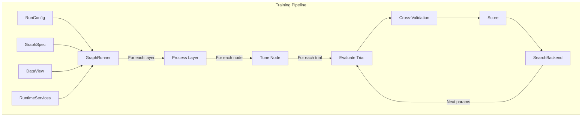
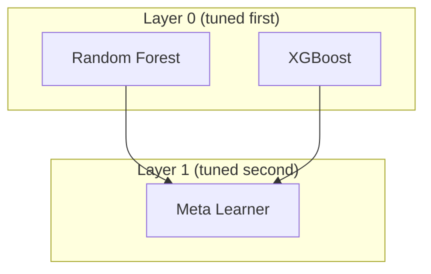

# Tuning & Optimization

The tuning system orchestrates hyperparameter optimization across your model graph, coordinating search strategies, cross-validation, and model fitting.

---

## Architecture Overview


```mermaid
graph TB
    subgraph "Training Pipeline"
        RC[RunConfig] --> GR[GraphRunner]
        GS[GraphSpec] --> GR
        DV[DataView] --> GR
        RS[RuntimeServices] --> GR

        GR --> |For each layer| L[Process Layer]
        L --> |For each node| N[Tune Node]
        N --> |For each trial| T[Evaluate Trial]

        T --> CV[Cross-Validation]
        CV --> S[Score]
        S --> OPT[SearchBackend]
        OPT --> |Next params| T
    end
```

---

## Quick Start with GraphBuilder

The `GraphBuilder` fluent API is the recommended way to define model graphs. Graph definition and training execution are separate steps in v2:

```python
from sklearn.ensemble import RandomForestClassifier, GradientBoostingClassifier
from sklearn.linear_model import LogisticRegression
from sklearn_meta.spec.builder import GraphBuilder
from sklearn_meta.engine.runner import GraphRunner
from sklearn_meta.runtime.config import RunConfigBuilder
from sklearn_meta.runtime.services import RuntimeServices
from sklearn_meta.data.view import DataView

# 1. Define the graph
graph = (
    GraphBuilder("my_stack")
    # Base model 1
    .add_model("rf", RandomForestClassifier)
        .int_param("n_estimators", 50, 300)
        .int_param("max_depth", 3, 15)
    # Base model 2
    .add_model("gb", GradientBoostingClassifier)
        .int_param("n_estimators", 50, 300)
        .param("learning_rate", 0.01, 0.3, log=True)
        .int_param("max_depth", 3, 10)
    # Meta-learner stacking on base models
    .add_model("meta", LogisticRegression)
        .param("C", 0.01, 100.0, log=True)
        .stacks_proba("rf", "gb")
    .compile()
)

# 2. Configure the run
config = (
    RunConfigBuilder()
    .cv(n_splits=5, strategy="stratified")
    .tuning(
        n_trials=100,
        metric="roc_auc",
        early_stopping_rounds=20,
        show_progress=True,
    )
    .verbosity(2)
    .build()
)

# 3. Build services and data, then fit
services = RuntimeServices.default()
data = DataView.from_Xy(X_train, y_train)
run = GraphRunner(services).fit(graph, data, config)

# 4. Get predictions via an InferenceGraph
inference = run.compile_inference()
predictions = inference.predict(X_test)
```

---

## RunConfig

`RunConfig` is the unified configuration object for a training run. It composes separate config objects for each concern:

```python
from sklearn_meta.runtime.config import (
    RunConfig,
    CVConfig,
    CVStrategy,
    TuningConfig,
    FeatureSelectionConfig,
)
from sklearn_meta.engine.strategy import OptimizationStrategy

config = RunConfig(
    cv=CVConfig(
        n_splits=5,
        n_repeats=1,
        strategy=CVStrategy.STRATIFIED,
        shuffle=True,
        random_state=42,
    ),
    tuning=TuningConfig(
        n_trials=100,
        timeout=3600,           # seconds
        early_stopping_rounds=20,
        metric="roc_auc",
        strategy=OptimizationStrategy.LAYER_BY_LAYER,
        show_progress=True,
    ),
    feature_selection=FeatureSelectionConfig(
        method="shadow",
        n_shadows=5,
    ),
    verbosity=2,
)
```

### RunConfig Fields

| Field | Type | Description |
|-------|------|-------------|
| `cv` | `CVConfig` | Cross-validation settings |
| `tuning` | `TuningConfig` | Hyperparameter tuning settings |
| `feature_selection` | `FeatureSelectionConfig` or `None` | Feature selection settings |
| `reparameterization` | `ReparameterizationConfig` or `None` | Reparameterization settings |
| `estimator_scaling` | `EstimatorScalingConfig` or `None` | Estimator scaling settings |
| `verbosity` | `int` | Log output level (0=silent, 1=summary, 2=detailed) |

---

## TuningConfig

`TuningConfig` contains only the hyperparameter search settings:

```python
from sklearn_meta.runtime.config import TuningConfig
from sklearn_meta.engine.strategy import OptimizationStrategy

tuning = TuningConfig(
    n_trials=100,
    timeout=3600,
    early_stopping_rounds=20,
    metric="roc_auc",
    strategy=OptimizationStrategy.LAYER_BY_LAYER,
    show_progress=True,
)
```

### TuningConfig Options

| Parameter | Description | Default |
|-----------|-------------|---------|
| `n_trials` | Maximum number of trials | 100 |
| `timeout` | Time limit in seconds | None |
| `early_stopping_rounds` | Stop if no improvement for N trials | None |
| `metric` | Scoring metric name | `"neg_mean_squared_error"` |
| `greater_is_better` | Maximize or minimize. Optional -- automatically inferred for all standard sklearn scorer names (e.g. `"roc_auc"`, `"neg_mean_squared_error"`). Only required for custom metrics. | `None` (auto) |
| `strategy` | Graph traversal strategy | `LAYER_BY_LAYER` |
| `show_progress` | Display progress bar during tuning | False |

---

## Optimization Strategy vs. Search Backend

A key architectural concept: **strategy** and **search backend** are separate concerns.

### Strategy (Graph Traversal)

`OptimizationStrategy` controls how the graph's layers are processed during tuning:

```python
from sklearn_meta.engine.strategy import OptimizationStrategy
```

| Strategy | Description |
|----------|-------------|
| `LAYER_BY_LAYER` | Tune nodes one layer at a time (default). Base models are tuned first, then meta-learners use their OOF predictions. |
| `GREEDY` | Tune each node greedily in topological order. |
| `NONE` | Skip tuning; use default or provided parameters. |

There are **no** `OPTUNA`, `RANDOM`, or `GRID` strategy values. These are not strategies.

### Search Backend (Optuna)

The search backend controls *how* individual nodes are optimized (the algorithm that suggests hyperparameter configurations). `OptunaBackend` is the default and uses Optuna's TPE sampler:

```python
from sklearn_meta.search.backends.optuna import OptunaBackend

backend = OptunaBackend(
    direction="minimize",
    random_state=42,
    sampler=None,         # defaults to TPE
    pruner=None,
    n_jobs=1,
    show_progress_bar=False,
    verbosity=None,
)
```

**OptunaBackend features:**
- Tree-structured Parzen Estimator (TPE) by default
- Automatic pruning of unpromising trials
- Handles conditional parameters
- Efficient parallelization via `n_jobs`
- Custom Optuna samplers and pruners supported

---

## GraphRunner

The `GraphRunner` orchestrates the entire training process:

```python
from sklearn_meta.engine.runner import GraphRunner
from sklearn_meta.runtime.services import RuntimeServices
from sklearn_meta.search.backends.optuna import OptunaBackend

services = RuntimeServices(
    search_backend=OptunaBackend(direction="maximize", random_state=42),
)

runner = GraphRunner(services)
run = runner.fit(graph, data, config)
```

### Constructor Parameters

| Parameter | Description |
|-----------|-------------|
| `services` | `RuntimeServices` instance (search backend, executor, etc.) |

### `fit()` Parameters

| Parameter | Description |
|-----------|-------------|
| `graph` | The `GraphSpec` to train |
| `data` | `DataView` with features, targets, and optional groups |
| `config` | `RunConfig` with CV, tuning, feature selection settings |

### Execution Flow

```mermaid
sequenceDiagram
    participant U as User
    participant GR as GraphRunner
    participant OPT as SearchBackend
    participant CV as CVEngine
    participant M as Model

    U->>GR: fit(graph, data, config)
    GR->>GR: Get layers (topological order)

    loop For each layer
        loop For each node in layer
            GR->>OPT: Create study
            loop For n_trials
                OPT->>GR: Suggest params
                GR->>CV: Evaluate with CV
                loop For each fold
                    CV->>M: fit(train)
                    M->>CV: predict(val)
                end
                CV->>GR: Mean score
                GR->>OPT: Report score
            end
            OPT->>GR: Best params
            GR->>GR: Store best params
        end
    end

    GR->>U: TrainingRun
```

---

## Layer-by-Layer Tuning

For stacking graphs, nodes are tuned layer by layer (the default strategy):


```mermaid
graph TB
    subgraph "Layer 0 (tuned first)"
        RF[Random Forest]
        XGB[XGBoost]
    end

    subgraph "Layer 1 (tuned second)"
        META[Meta Learner]
    end

    RF --> META
    XGB --> META
```

1. **Layer 0:** Tune base models independently
2. **Generate OOF:** Create out-of-fold predictions
3. **Layer 1:** Tune meta-learner on OOF predictions

```python
run = GraphRunner(services).fit(graph, data, config)

# Layers processed in order:
# 1. rf, xgb (parallel, no dependencies)
# 2. meta (depends on rf, xgb OOF predictions)
```

---

## Estimator Scaling

For boosting models (XGBoost, LightGBM, GradientBoosting), you often want to tune with fewer estimators for speed, then use more estimators in the final CV pass. Configure this via `EstimatorScalingConfig` within `RunConfig`:

### Fixed Scaling

```python
from sklearn_meta.runtime.config import RunConfig, TuningConfig
from sklearn_meta.engine.estimator_scaling import EstimatorScalingConfig

config = RunConfig(
    tuning=TuningConfig(
        n_trials=100,
        metric="roc_auc",
    ),
    estimator_scaling=EstimatorScalingConfig(
        tuning_n_estimators=100,     # use 100 trees during tuning (fast)
        final_n_estimators=1000,     # use 1000 trees in the final CV pass
    ),
)
```

### Automatic Scaling Search

Automatically search for the best `n_estimators` value after hyperparameters are found:

```python
config = RunConfig(
    tuning=TuningConfig(
        n_trials=100,
        metric="roc_auc",
    ),
    estimator_scaling=EstimatorScalingConfig(
        tuning_n_estimators=100,
        scaling_search=True,
        # Optionally provide custom factors to try:
        scaling_factors=[2, 5, 10, 20],
    ),
)
```

### With GraphBuilder

```python
graph = (
    GraphBuilder("boosting_pipeline")
    .add_model("xgb", XGBClassifier)
        .int_param("max_depth", 3, 10)
        .param("learning_rate", 0.01, 0.3, log=True)
    .compile()
)

config = RunConfig(
    tuning=TuningConfig(
        n_trials=100,
        metric="roc_auc",
    ),
    estimator_scaling=EstimatorScalingConfig(
        tuning_n_estimators=100,
        final_n_estimators=1000,
        scaling_search=True,
    ),
)

run = GraphRunner(services).fit(graph, data, config)
```

---

## Progress Monitoring

### Show Progress Bar

Enable a progress bar during tuning:

```python
config = RunConfig(
    tuning=TuningConfig(n_trials=100, show_progress=True),
)
```

### Verbosity

Control log output detail with the top-level `verbosity` field on `RunConfig`:

```python
config = RunConfig(
    tuning=TuningConfig(n_trials=100),
    verbosity=0,  # silent
    # verbosity=1,  # summary (default)
    # verbosity=2,  # detailed
)
```

---

## Early Stopping

### Early Stopping Rounds

Stop tuning a node when no improvement is found for N consecutive trials:

```python
config = RunConfig(
    tuning=TuningConfig(
        n_trials=1000,
        early_stopping_rounds=20,  # stop if no improvement for 20 trials
    ),
)
```

### Timeout

Stop tuning after a time limit:

```python
config = RunConfig(
    tuning=TuningConfig(
        n_trials=1000,
        timeout=3600,  # stop after 1 hour
    ),
)
```

---

## Metrics

### Built-in Metrics

| Metric | Task | Direction |
|--------|------|-----------|
| `accuracy` | Classification | Maximize |
| `roc_auc` | Binary classification | Maximize |
| `f1` | Classification | Maximize |
| `precision` | Classification | Maximize |
| `recall` | Classification | Maximize |
| `log_loss` | Classification | Minimize |
| `neg_mean_squared_error` | Regression | Minimize |
| `rmse` | Regression | Minimize |
| `mae` | Regression | Minimize |
| `r2` | Regression | Maximize |

### Usage

```python
# Classification
config = RunConfig(
    tuning=TuningConfig(metric="roc_auc"),
)

# Regression (default)
config = RunConfig(
    tuning=TuningConfig(metric="neg_mean_squared_error"),
)
```

### Custom Metrics

```python
from sklearn.metrics import make_scorer

def custom_metric(y_true, y_pred):
    # Your metric logic
    return score

config = RunConfig(
    tuning=TuningConfig(
        metric=make_scorer(custom_metric),
        greater_is_better=True,
    ),
)
```

---

## Working with Results

### TrainingRun

After fitting, the `GraphRunner` returns a `TrainingRun`:

```python
run = GraphRunner(services).fit(graph, data, config)

# Compile to an InferenceGraph for prediction
inference = run.compile_inference()
predictions = inference.predict(X_test)

# Predict from a specific node
rf_predictions = inference.predict(X_test, node_name="rf")

# Access per-node training results
rf_result = run.node_results["rf"]

# Save and load
run.save("path/to/run")
loaded = TrainingRun.load("path/to/run")
```

### NodeRunResult

Each node's result contains detailed training information:

```python
rf_result = run.node_results["rf"]

rf_result.node_name          # "rf"
rf_result.best_params        # best hyperparameters dict
rf_result.cv_result          # CVResult with fold-level details
rf_result.optimization_result  # full optimization result from backend
rf_result.selected_features  # features selected (if feature selection enabled)
rf_result.oof_predictions    # out-of-fold predictions
rf_result.models             # list of fitted model objects (one per fold)
rf_result.mean_score         # mean CV score
```

### InferenceGraph

The `InferenceGraph` is a lightweight prediction-only artifact:

```python
inference = run.compile_inference()

# Predict through the full graph
predictions = inference.predict(X_test)

# Save and load independently
inference.save("path/to/inference")
loaded = InferenceGraph.load("path/to/inference")
```

---

## Dependencies

Connect models using `DependencyEdge` and `DependencyType`:

```python
from sklearn_meta.spec.dependency import DependencyEdge, DependencyType

# Prediction dependency (class labels or regression values)
edge = DependencyEdge(source="rf", target="meta", dep_type=DependencyType.PREDICTION)
graph.add_edge(edge)

# Probability dependency (class probabilities)
edge = DependencyEdge(source="gb", target="meta", dep_type=DependencyType.PROBA)
graph.add_edge(edge)
```

With `GraphBuilder`, dependencies are simpler:

```python
graph = (
    GraphBuilder("stack")
    .add_model("rf", RandomForestClassifier)
        .int_param("n_estimators", 50, 200)
    .add_model("meta", LogisticRegression)
        .param("C", 0.01, 100.0, log=True)
        .stacks("rf")          # prediction dependency
        # or
        # .stacks_proba("rf")  # probability dependency
    .compile()
)
```

---

## Complete Example

```python
from sklearn.ensemble import RandomForestClassifier, GradientBoostingClassifier
from sklearn.linear_model import LogisticRegression
from sklearn.datasets import make_classification
from sklearn.metrics import accuracy_score
import pandas as pd

from sklearn_meta.data.view import DataView
from sklearn_meta.runtime.config import (
    RunConfig, CVConfig, CVStrategy, TuningConfig,
)
from sklearn_meta.engine.strategy import OptimizationStrategy
from sklearn_meta.engine.runner import GraphRunner
from sklearn_meta.runtime.services import RuntimeServices
from sklearn_meta.search.backends.optuna import OptunaBackend
from sklearn_meta.search.space import SearchSpace
from sklearn_meta.spec.builder import GraphBuilder
from sklearn_meta.spec.dependency import DependencyEdge, DependencyType
from sklearn_meta.spec.graph import GraphSpec
from sklearn_meta.spec.node import NodeSpec

# === Data ===
X, y = make_classification(n_samples=2000, n_features=20, random_state=42)
X = pd.DataFrame(X)
y = pd.Series(y)
data = DataView.from_Xy(X=X, y=y)

# === Search Spaces ===
rf_space = (
    SearchSpace()
    .add_int("n_estimators", 50, 300)
    .add_int("max_depth", 3, 15)
    .add_float("min_samples_split", 0.01, 0.2)
)

gb_space = (
    SearchSpace()
    .add_int("n_estimators", 50, 300)
    .add_float("learning_rate", 0.01, 0.3, log=True)
    .add_int("max_depth", 3, 10)
)

meta_space = (
    SearchSpace()
    .add_float("C", 0.01, 100, log=True)
)

# === Model Nodes ===
rf_node = NodeSpec(name="rf", estimator_class=RandomForestClassifier, search_space=rf_space, fixed_params={"random_state": 42})
gb_node = NodeSpec(name="gb", estimator_class=GradientBoostingClassifier, search_space=gb_space, fixed_params={"random_state": 42})
meta_node = NodeSpec(name="meta", estimator_class=LogisticRegression, search_space=meta_space, fixed_params={"random_state": 42})

# === Graph ===
graph = GraphSpec()
graph.add_node(rf_node)
graph.add_node(gb_node)
graph.add_node(meta_node)
graph.add_edge(DependencyEdge(source="rf", target="meta", dep_type=DependencyType.PROBA))
graph.add_edge(DependencyEdge(source="gb", target="meta", dep_type=DependencyType.PROBA))

# === RunConfig ===
config = RunConfig(
    cv=CVConfig(n_splits=5, strategy=CVStrategy.STRATIFIED),
    tuning=TuningConfig(
        strategy=OptimizationStrategy.LAYER_BY_LAYER,
        n_trials=50,
        metric="roc_auc",
        greater_is_better=True,
        early_stopping_rounds=15,
        show_progress=True,
    ),
    verbosity=2,
)

# === Services ===
services = RuntimeServices(
    search_backend=OptunaBackend(direction="maximize", random_state=42),
)

# === Run Training ===
print("Starting hyperparameter optimization...")
run = GraphRunner(services).fit(graph, data, config)

# === Results ===
print("\nBest parameters per node:")
for name in ["rf", "gb", "meta"]:
    result = run.node_results[name]
    print(f"  {name}: {result.best_params} (mean score: {result.mean_score:.4f})")

# === Predict ===
X_test, y_test = make_classification(n_samples=500, n_features=20, random_state=123)
X_test = pd.DataFrame(X_test)

inference = run.compile_inference()
predictions = inference.predict(X_test)

print(f"\nTest Accuracy: {accuracy_score(y_test, predictions):.4f}")
```

### Equivalent with GraphBuilder

```python
from sklearn_meta.spec.builder import GraphBuilder
from sklearn_meta.engine.runner import GraphRunner
from sklearn_meta.runtime.config import RunConfigBuilder
from sklearn_meta.runtime.services import RuntimeServices
from sklearn_meta.data.view import DataView

graph = (
    GraphBuilder("stacking_pipeline")
    .add_model("rf", RandomForestClassifier)
        .int_param("n_estimators", 50, 300)
        .int_param("max_depth", 3, 15)
        .param("min_samples_split", 0.01, 0.2)
    .add_model("gb", GradientBoostingClassifier)
        .int_param("n_estimators", 50, 300)
        .param("learning_rate", 0.01, 0.3, log=True)
        .int_param("max_depth", 3, 10)
    .add_model("meta", LogisticRegression)
        .param("C", 0.01, 100.0, log=True)
        .stacks_proba("rf", "gb")
    .compile()
)

config = (
    RunConfigBuilder()
    .cv(n_splits=5, strategy="stratified")
    .tuning(
        n_trials=50,
        metric="roc_auc",
        early_stopping_rounds=15,
        show_progress=True,
    )
    .verbosity(2)
    .build()
)

services = RuntimeServices.default()
data = DataView.from_Xy(X_train, y_train)

run = GraphRunner(services).fit(graph, data, config)

inference = run.compile_inference()
predictions = inference.predict(X_test)
```

---

## Parallel Execution

By default, nodes within the same graph layer are tuned sequentially. You can parallelize layer-level node tuning by passing an `Executor` via `RuntimeServices`:

```python
from sklearn_meta.execution.local import LocalExecutor

services = RuntimeServices(
    search_backend=OptunaBackend(direction="maximize", random_state=42),
    executor=LocalExecutor(n_jobs=4),
)

graph = (
    GraphBuilder("parallel_pipeline")
    .add_model("rf", RandomForestClassifier)
        .int_param("n_estimators", 50, 200)
    .add_model("xgb", XGBClassifier)
        .int_param("n_estimators", 50, 200)
    .add_model("meta", LogisticRegression)
        .stacks("rf", "xgb")
    .compile()
)

run = GraphRunner(services).fit(graph, data, config)
```

Or with sequential execution (the default):

```python
from sklearn_meta.execution.local import SequentialExecutor

services = RuntimeServices(
    search_backend=OptunaBackend(direction="maximize"),
    executor=SequentialExecutor(),
)
```

**When to use parallel execution:**
- Multiple independent base models in the same layer
- Sufficient CPU cores and memory for concurrent model training
- Models that don't already use internal parallelism (e.g., `n_jobs=-1`)

**When to avoid it:**
- Models already using `n_jobs=-1` internally (CPU contention)
- Memory-constrained environments (each parallel node loads data independently)
- Single-model graphs (no parallelism opportunity)

---

## RunConfigBuilder

For complex configurations, use the fluent `RunConfigBuilder`:

```python
from sklearn_meta.runtime.config import RunConfigBuilder

config = (
    RunConfigBuilder()
    .cv(n_splits=5, strategy="stratified")
    .tuning(
        n_trials=100,
        metric="roc_auc",
        early_stopping_rounds=20,
        show_progress=True,
    )
    .feature_selection(method="shadow", n_shadows=5)
    .estimator_scaling(tuning_n_estimators=100, final_n_estimators=1000)
    .reparameterization(enabled=True, use_prebaked=True)
    .verbosity(2)
    .build()
)
```

---

## Best Practices

### 1. Start with Few Trials

```python
# Development
config = RunConfig(tuning=TuningConfig(n_trials=20))

# Production
config = RunConfig(tuning=TuningConfig(n_trials=200))
```

### 2. Use Appropriate Timeouts

```python
config = RunConfig(
    tuning=TuningConfig(
        n_trials=1000,
        timeout=3600,  # 1 hour max
        early_stopping_rounds=30,
    ),
)
```

### 3. Use Estimator Scaling for Boosting Models

```python
from sklearn_meta.engine.estimator_scaling import EstimatorScalingConfig

config = RunConfig(
    tuning=TuningConfig(n_trials=100),
    estimator_scaling=EstimatorScalingConfig(
        tuning_n_estimators=100,
        final_n_estimators=1000,
        scaling_search=True,
    ),
)
```

### 4. Use Reparameterization for Correlated Parameters

```python
from sklearn_meta.runtime.config import ReparameterizationConfig

# See reparameterization.md for details
config = RunConfig(
    tuning=TuningConfig(n_trials=100),
    reparameterization=ReparameterizationConfig(enabled=True, use_prebaked=True),
)
```

---

## Next Steps

- [Reparameterization](reparameterization.md) -- Improve optimization efficiency
- [Stacking](stacking.md) -- Multi-layer model stacking
- [Cross-Validation](cross-validation.md) -- CV strategies in detail
